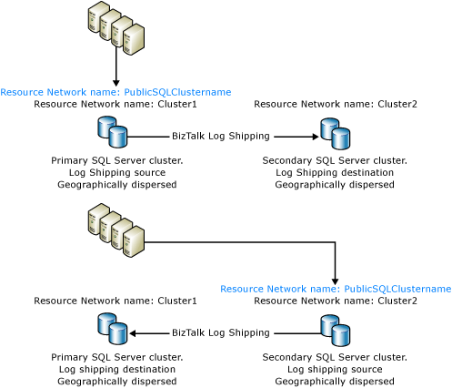

# BizTalk Server Log Shipping Using a Windows Cluster Name and IP Address
It is possible to simplify [!INCLUDE[btsBizTalkServerNoVersion](../includes/btsbiztalkservernoversion-md.md)] log shipping by using two instances of a [!INCLUDE[btsSQLServerNoVersion](../includes/btssqlservernoversion-md.md)] cluster as the source and destination servers in a [!INCLUDE[btsBizTalkServerNoVersion](../includes/btsbiztalkservernoversion-md.md)] log shipping scenario. Then, in the event of a disaster recovery event, database recovery is simplified by merely switching the name and IP address resources associated with the clustered [!INCLUDE[btsSQLServerNoVersion](../includes/btssqlservernoversion-md.md)] instances as described below. When using this approach there is no need to run the UpdateDatabase.vbs script as described in the topic [How to Restore Databases in the Backup BizTalk Server Job](../technical-guides/how-to-restore-databases-in-the-backup-biztalk-server-job.md) because the database name is unchanged.  
  
> [!NOTE]
>  To increase fault tolerance for the clustered [!INCLUDE[btsSQLServerNoVersion](../includes/btssqlservernoversion-md.md)] instances, the clustered [!INCLUDE[btsSQLServerNoVersion](../includes/btssqlservernoversion-md.md)] instances should be geographically separated.  
  
### To implement BizTalk Server log shipping using a Windows Server Cluster name and IP address resource  
  
1. Stop the production BizTalk servers.  
  
2. Perform a [!INCLUDE[btsBizTalkServerNoVersion](../includes/btsbiztalkservernoversion-md.md)] log shipping restore to the secondary [!INCLUDE[btsSQLServerNoVersion](../includes/btssqlservernoversion-md.md)] cluster.  
  
3. Follow the steps described in the topic [Configuring BizTalk Server Log Shipping](../technical-guides/configuring-biztalk-server-log-shipping.md) to reconfigure [!INCLUDE[btsBizTalkServerNoVersion](../includes/btsbiztalkservernoversion-md.md)] log shipping so that the secondary [!INCLUDE[btsSQLServerNoVersion](../includes/btssqlservernoversion-md.md)] cluster instance is now the source group and the primary [!INCLUDE[btsSQLServerNoVersion](../includes/btssqlservernoversion-md.md)] cluster instance is now the destination group.  
  
4. Stop the IP and network name resource PublicSQLClustername on the primary [!INCLUDE[btsSQLServerNoVersion](../includes/btssqlservernoversion-md.md)] cluster instance.  
  
5. Configure and start the PublicSQLClustername IP and network name cluster resources on the secondary [!INCLUDE[btsSQLServerNoVersion](../includes/btssqlservernoversion-md.md)] cluster instance.  
  
6. Start the production BizTalk servers.  
  
7. Verify the log-shipping restore.  
  
8. Start [!INCLUDE[btsBizTalkServerNoVersion](../includes/btsbiztalkservernoversion-md.md)] related services on the production site.  
  
   After performing these steps, the BizTalk group is pointing to the secondary [!INCLUDE[btsSQLServerNoVersion](../includes/btssqlservernoversion-md.md)] cluster instance as illustrated in the following figure.  
  
   The following figure illustrates how to configure [!INCLUDE[btsBizTalkServerNoVersion](../includes/btsbiztalkservernoversion-md.md)] log shipping by using two clustered instances of [!INCLUDE[btsSQLServerNoVersion](../includes/btssqlservernoversion-md.md)] and moving the clustered name and IP address resource.  
  
     
  
   **BizTalk Server Log Shipping implementation using Windows Server cluster name and IP address resources**  
  
## See Also  
 [High Availability for Databases](../technical-guides/high-availability-for-databases.md)   
 [Configuring BizTalk Server Log Shipping](../technical-guides/configuring-biztalk-server-log-shipping.md)   
 [How to Restore Databases in the Backup BizTalk Server Job](../technical-guides/how-to-restore-databases-in-the-backup-biztalk-server-job.md)