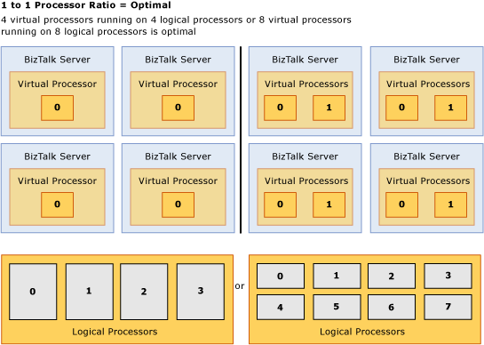

# Checklist: Optimizing Performance on Hyper-V
The following considerations apply when running BizTalk Server and/or the [!INCLUDE[btsSQLServerNoVersion](../includes/btssqlservernoversion-md.md)] instance(s) that have the BizTalk Server databases on Hyper-V virtual machines.  

## Allocate 110%–125% of CPU and Disk Resources to the Hyper-V Virtual Machines  
 Plan to allocate 110% to 125% of the CPU resources and 105% - 110% of the disk resources required by a physical hardware solution to the Hyper-V virtual machines used for the solution. By configuring the Hyper-V virtual machine with additional resources, you will ensure that it can provide performance on par with physical hardware while accommodating any overhead required by Hyper-V virtualization technology.  

|                                                                                      Step                                                                                       |                                                                                                                                                                                                                                                                                                                                                                                                                                                                                                                                                                                                                                                                                                                                                                                                    Reference                                                                                                                                                                                                                                                                                                                                                                                                                                                                                                                                                                                                                                                                                                                                                                                                     |
|---------------------------------------------------------------------------------------------------------------------------------------------------------------------------------|------------------------------------------------------------------------------------------------------------------------------------------------------------------------------------------------------------------------------------------------------------------------------------------------------------------------------------------------------------------------------------------------------------------------------------------------------------------------------------------------------------------------------------------------------------------------------------------------------------------------------------------------------------------------------------------------------------------------------------------------------------------------------------------------------------------------------------------------------------------------------------------------------------------------------------------------------------------------------------------------------------------------------------------------------------------------------------------------------------------------------------------------------------------------------------------------------------------------------------------------------------------------------------------------------------------------------------------------------------------------------------------------------------------------------------------------------------------------------------------------------------------------------------------------------------------------------------------------------------------|
|                      Scope the hardware requirements for the [!INCLUDE[btsBizTalkServerNoVersion](../includes/btsbiztalkservernoversion-md.md)] solution.                       | -   Follow the guidance in the “Planning the Environment for BizTalk Server” section of the [!INCLUDE[btsBizTalkServerNoVersion](../includes/btsbiztalkservernoversion-md.md)] Operations Guide at [http://go.microsoft.com/fwlink/?LinkId=122399](http://go.microsoft.com/fwlink/?LinkId=122399) to scope the hardware requirements for the solution. -   To scope the edition and number of BizTalk Servers that will be required by the solution review BizTalk Server planning considerations documented in “Planning the BizTalk Server Tier” at [http://go.microsoft.com/fwlink/?LinkId=122401](http://go.microsoft.com/fwlink/?LinkId=122401). -   To scope the version and number of [!INCLUDE[btsSQLServerNoVersion](../includes/btssqlservernoversion-md.md)] computers that will be required by the solution, review database planning considerations documented in “Planning the Database Tier” at [http://go.microsoft.com/fwlink/?LinkId=122402](http://go.microsoft.com/fwlink/?LinkId=122402) and the “Performance Overhead of Running SQL Server in Hyper-V” section of the “Running SQL Server 2008 in a Hyper-V Environment Best Practices and Performance Considerations” whitepaper available at [http://go.microsoft.com/fwlink/?LinkId=144622](http://go.microsoft.com/fwlink/?LinkId=144622). -   To complete planning for development, testing, staging, and production environments review “Planning the Development, Testing, Staging, and Production Environments” at [http://go.microsoft.com/fwlink/?LinkId=122403](http://go.microsoft.com/fwlink/?LinkId=122403). |
| After scoping the hardware requirements of your BizTalk Server solution, plan to configure the Hyper-V machines with **110% – 125%** of the CPU and disk resources if possible. |                                                                                                                                                                                                                                                                                                                                                                                                                                                                                                                                                                                            For example, if the hardware requirements for a physical BizTalk Server computer used by the solution is determined to be 2GB RAM, a dual core CPU running at 2GHZ, and 2x 500 GB physical disks, then ideally, the Hyper-V virtual machine used by the solution would be configured with 2 or more virtual processors running >= 2.2 GHZ, and faster physical disks (typically by adding spindles or using faster disks).                                                                                                                                                                                                                                                                                                                                                                                                                                                                                                                                                                                            |

## Optimize Hyper-V Performance  
 Use the following general guidelines to configure Hyper-V for optimal performance.  

|Step|Reference|  
|----------|---------------|  
|Apply recommended guidance for performance tuning virtualization servers. **Note:**  For the test scenarios described in [Testing BizTalk Server Virtualization Performance](~/technical-guides/testing-biztalk-server-virtualization-performance.md), the configuration options that were applied are described in the “Physical Infrastructure Specifics” and the “Virtualization Specifics” sections of the [Test Scenario Overview](~/technical-guides/test-scenario-overview.md) topic.|“Performance Tuning for Virtualization Servers” section of the “Performance Tuning Guidelines for Windows Server 2008 R2” document available at [http://go.microsoft.com/fwlink/?LinkID=202087](http://go.microsoft.com/fwlink/?LinkID=202087).|  
|Close any Virtual Machine Connection windows that aren’t being used.|The Virtual Machine Connection window(s) displayed when double-clicking a virtual machine name in the Hyper-V manager consume resources that could be otherwise utilized.|  
|Close or minimize the Hyper-V manager.|The Hyper-V manager consumes resources by continually polling each running virtual machine for CPU utilization and uptime. Closing or minimizing the Hyper-V manager will free up these resources.|  

## Optimize Performance of Disk, Memory, Network, and Processor in a Hyper-V Environment  
 Use the following guidelines to optimize performance of disk, memory, network, and processor in a Hyper-V virtual environment.  

### Optimize Processor Performance  
 Follow these guidelines to optimize processor performance of guest operating systems running in a Hyper-V virtual environment:  

- **Configure a 1-to-1 allocation of virtual processors to available logical processors for best performance -** When running a CPU intensive application, the best configuration is a 1-to-1 ratio of virtual processors in the guest operating system(s) to the logical processors available to the host operating system. Any other configuration such as 2:1 or 1:2 is less efficient. The following graphic illustrates a 1-to-1 allocation of virtual processor cores in the guest operating system(s) to logical processors available to the host operating system:  

     
  Virtual to logical processor ratio  

- **Be aware of the virtual processor limit for different guest operating systems and plan accordingly -** The number of processor cores that are available to the guest operating system running in a Hyper-V virtual machine can impact the overall performance of the hosted application. Therefore, consideration should be made as to which guest operating system will be installed on the Hyper-V virtual machine to host the BizTalk Server and/or [!INCLUDE[btsSQLServerNoVersion](../includes/btssqlservernoversion-md.md)] instance(s) that host the BizTalk Server databases. Hyper-V accommodates the following number of virtual processors for the specified guest operating system:  

|                                                                      Operating system                                                                       | Virtual processor limit |
|-------------------------------------------------------------------------------------------------------------------------------------------------------------|-------------------------|
| [!INCLUDE[btsWinSvr2k8R2](../includes/btswinsvr2k8r2-md.md)]. All editions of [!INCLUDE[btsWinSvr2k8R2](../includes/btswinsvr2k8r2-md.md)] are 64-bit only. |            4            |
|                                               [!INCLUDE[btsWinSvr2k8](../includes/btswinsvr2k8-md.md)] 64-bit                                               |            4            |
|                                               [!INCLUDE[btsWinSvr2k8](../includes/btswinsvr2k8-md.md)] 32-bit                                               |            4            |
|                                                                      Windows 7 64-bit                                                                       |            4            |
|                                                                      Windows 7 32-bit                                                                       |            4            |
|                                                                    Windows Vista 64-bit                                                                     |            2            |
|                                                                    Windows Vista  32-bit                                                                    |            2            |

> [!NOTE]
>  For more information about the guest operating systems that are supported on Hyper-V, see [http://go.microsoft.com/fwlink/?LinkID=118347](http://go.microsoft.com/fwlink/?LinkID=118347).  

### Optimize Disk Performance  
 Follow these guidelines to optimize disk performance of guest operating systems running in a Hyper-V virtual environment:  

|Step|Reference|  
|----------|---------------|  
|Configure virtual disks for use with the Hyper-V virtual machines using the fixed-size virtual hard disk (VHD) option. Fixed-size VHD offers performance approaching that of physical disks together with the flexibility of features such as clustering support and snapshot disk support.|Disk storage in a Hyper-V environment is accessible through a virtual IDE controller or a virtual SCSI controller. Unlike previous versions of Microsoft virtualization technology, there is no performance difference between using a virtual IDE controller or a virtual SCSI controller when accessing virtual hard disks. The following disk storage options are available for use in a Hyper-V environment:   -   **Fixed size disks -** A fixed-size virtual hard disk (VHD) is one for which data blocks are pre-allocated on a physical disk based on the maximum disk size defined at the time of creation. For example, if you create a 100 GB fixed-size VHD, Hyper-V will allocate all 100 GB of data block storage in addition to the overhead required for the VHD headers and footers when it creates the new VHD. -   **Dynamically expanding disks -** A dynamically expanding VHD is one for which the initial virtual hard disk contains no data blocks. Instead space is dynamically allocated as data is written to the VHD, up to the maximum size specified when the VHD was created. For example, a 100-GB dynamically expanding disk initially contains only VHD headers and requires less than 2 MB of physical storage space. As new data is written by the virtual machine to the dynamically expanding VHD, additional physical data blocks are allocated in 2-MB increments to the VHD file, up to a maximum of 100 GB. -   **Differencing Disks -** A differencing disk is a special type of dynamically expanding VHD file that is associated with a “parent” VHD. In this parent/child storage topology, the parent disk remains unchanged and any write operations made to the “child” differencing disk only. Any read operations are first checked against the differencing disk to see whether updated content was written to the differencing disk; if the content isn’t in the differencing disk, then the content is read from the parent VHD. Differencing disks are useful for scenarios where you need to maintain a particular baseline configuration and would like to easily test and then rollback changes to the baseline. While the flexibility of the parent/child storage topology provided through differencing disks is useful for testing, this is not the optimal configuration for performance because there is overhead associated with maintaining the parent/child topology required when using differencing disks. -   **Passthrough disks –** The passthrough disk feature allows the guest operating system to bypass the Hyper-V Host file system and access the disk directly. Disks that are made available to guest operating systems via passthrough must be set to “offline” in the Hyper-V host to ensure that both the host and guest operating system do not attempt to access the disk simultaneously. The passthrough disk does offer a marginal performance advantage over other disk storage options but does not support certain functionality of virtual disks, such as Virtual machine snapshots and clustering support. Therefore use of the passthrough disk feature is not recommended in a BizTalk or SQL Server environment because the marginal performance benefits are more than offset by the missing functionality.   For more information about the relative performance of disk storage choices provided with Hyper-V, see the blog entry “Hyper-V Storage Analysis”, at [http://go.microsoft.com/fwlink/?LinkID=132848](http://go.microsoft.com/fwlink/?LinkID=132848).|  
|Configure disks for data volumes using the SCSI controller|This is recommended because the SCSI controller can only be installed if Hyper-V integration services are installed whereas the emulated IDE controller is available without installing Hyper-V integration services. Disk I/O performed using the IDE filter driver provided with integration services is significantly better than disk I/O performance provided with the emulated IDE controller. Therefore, to ensure optimal disk I/O performance for the data files in a Hyper-V virtualized environment, install integration services on both the host and guest operating system and configure disks for data volumes with the synthetic SCSI controller. For highly intensive storage I/O workloads that span multiple data drives, each VHD should be attached to a separate synthetic SCSI controller for better overall performance. In addition, each VHD should be stored on separate physical disks. **Important:**  Do not attach a system disk to a SCSI controller. A virtual hard disk that contains an operating system must be attached to an IDE controller.|  

### Optimize Memory Performance  
 Follow these guidelines to optimize memory performance of guest operating systems running in a Hyper-V virtual environment:  

|Step|Reference|  
|----------|---------------|  
|Ensure there is sufficient memory installed on the physical computer that hosts the Hyper-V virtual machines|-   Available physical memory is often the most significant performance factor for BizTalk Server running on a Hyper-V virtual machine. This is because each virtual machine must reside in non-paged-pool memory, or memory that cannot be paged to the disk. Because non-paged-pool memory cannot be paged to disk, the physical computer that hosts the virtual machines should have available physical memory equal to the sum of the memory allocated for each virtual machine plus the following:      300 MB for the Hypervisor                         plus 32 MB for the first GB of RAM allocated to each virtual machine                         plus another 8 MB for every additional GB of RAM allocated to each virtual machine                         plus 512 MB for the host operating system running on the root partition      For example, if a Hyper-V virtual machine is allocated 2 GB of memory in the Hyper-V Manager, the actual physical memory used when running that Hyper-V virtual machine would be approximately 2388MB (300MB for the hypervisor +2GB allocated for the virtual machine + 32MB + 8MB = 2388MB). Because the hypervisor only needs to be loaded once, initialization of subsequent virtual machines does not incur the 300 MB overhead associated with loading the hypervisor. Therefore, if two Hyper-V virtual machines are each allocated 2 GB of memory in the Hyper-V Manager, the actual physical memory used when running these Hyper-V virtual machines would be approximately 4476MB (300MB for the hypervisor +4GB allocated for the virtual machines + 64 MB + 16MB = 4476MB). **Note:**      As a general rule of thumb, plan to allocate at least 512 MB memory for the root partition to provide services such as I/O virtualization, snapshot files support, and child partition management. -   **Use a 64-bit guest operating system when possible** – Consider using a 64-bit operating system for each guest operating system. This should be done because by default, 32-bit Windows operating systems can only address up to 2GB of virtual address space per process. Installation of a 64-bit operating system allows applications to take full advantage of the memory installed on the physical computer that hosts the Hyper-V virtual machines.|  

### Optimize Network Performance  
 Hyper-V supports synthetic and emulated network adapters in virtual machines, but the synthetic devices offer significantly better performance and reduced CPU overhead. Each of these adapters is connected to a virtual network switch, which can be connected to a physical network adapter if external network connectivity is needed. Follow the recommendations in this section to optimize network performance of guest operating systems running in a Hyper-V virtual environment.  

> [!NOTE]
>  These recommendations are from the “Performance Tuning for Virtualization Servers” section of the “Performance Tuning Guidelines for Windows Server 2008 R2” whitepaper available for download at [http://go.microsoft.com/fwlink/?LinkID=202087](http://go.microsoft.com/fwlink/?LinkID=202087). For how to tune the network adapter in the root partition, including interrupt moderation, refer to the “Performance Tuning for Networking Subsystem” section of this guide. The TCP tunings in that section should be applied, if required, to the child partitions.  

|                                                                            Step                                                                            |                                                                                                                                                                                                                                                                                                                                                                                                                                                 Reference                                                                                                                                                                                                                                                                                                                                                                                                                                                 |
|------------------------------------------------------------------------------------------------------------------------------------------------------------|-----------------------------------------------------------------------------------------------------------------------------------------------------------------------------------------------------------------------------------------------------------------------------------------------------------------------------------------------------------------------------------------------------------------------------------------------------------------------------------------------------------------------------------------------------------------------------------------------------------------------------------------------------------------------------------------------------------------------------------------------------------------------------------------------------------------------------------------------------------------------------------------------------------|
|                   Configure Hyper-V Virtual Machines that are Running on the same Hyper-V host computer to use a Private Virtual Network                   |                                                                                                                                                                                                                                                                                                                                  Follow recommendations in the “Configure Hyper-V Virtual Machines that are Running on the same Hyper-V host computer to use a Private Virtual Network” section of [Network Optimizations](~/technical-guides/network-optimizations.md).                                                                                                                                                                                                                                                                                                                                  |
|                                                Disable TCP Offloading for the Virtual Machine Network Cards                                                |                                                                                                                                                                                                                                                                                                                                                               Follow recommendations in the “Disable TCP Offloading for the Virtual Machine Network Cards” section of [Network Optimizations](~/technical-guides/network-optimizations.md).                                                                                                                                                                                                                                                                                                                                                               |
|                                      Configure guest operating systems to use the Hyper-V synthetic network adapter.                                       |                                                                                                                                                   Hyper-V features a synthetic network adapter that is designed specifically for VMs to achieve significantly reduced CPU overhead on network I/O when it is compared to the emulated network adapter that mimics existing hardware. The synthetic network adapter communicates between the child and root partitions over the VMBus by using shared memory for more efficient data transfer.  The emulated network adapter should be removed through the VM settings dialog box and replaced with a synthetic network adapter. The guest requires that the VM integration services be installed.                                                                                                                                                    |
|                          If available, enable offload capabilities for the physical network adapter driver in the root partition.                          | As with the native scenario, offload capabilities in the physical network adapter reduce the CPU usage of network I/Os in VM scenarios. Hyper-V currently uses LSOv1 and TCPv4 checksum offload. The offload capabilities must be enabled in the driver for the physical network adapter in the root partition. For details on offload capabilities in network adapters, refer to the “Choosing a Network Adapter” section of the “Performance Tuning for Virtualization Servers” section of the “Performance Tuning Guidelines for Windows Server 2008 R2” whitepaper available for download at [http://go.microsoft.com/fwlink/?LinkID=202087](http://go.microsoft.com/fwlink/?LinkID=202087). Drivers for certain network adapters disable LSOv1 but enable LSOv2 by default. System administrators must explicitly enable LSOv1 by using the driver **Properties** dialog box in Device Manager. |
|                                        Configure network switch topology to make use of multiple network adapters.                                         |                                                                                                                                                                                                                                             Hyper-V supports creating multiple virtual network switches, each of which can be attached to a physical network adapter if needed. Each network adapter in a VM can be connected to a virtual network switch. If the physical server has multiple network adapters, VMs with network-intensive loads can benefit from being connected to different virtual switches to better use the physical network adapters.                                                                                                                                                                                                                                             |
| If multiple physical network cards are installed on the Hyper-V host computer, bind device interrupts for each network card to a single logical processor. |                                                                                                                                                                                            Under certain workloads, binding the device interrupts for a single network adapter to a single logical processor can improve performance for Hyper-V. We recommend this advanced tuning only to address specific problems in fully using network bandwidth. System administrators can use the IntPolicy tool to bind device interrupts to specific processors. For more information about the IntPolicy tool, see [http://go.microsoft.com/fwlink/?LinkID=129773](http://go.microsoft.com/fwlink/?LinkID=129773).                                                                                                                                                                                             |
|                                        If possible, enable VLAN tagging for the Hyper-V synthetic network adapter.                                         |                                                                                                                                                                                                                                                 The Hyper-V synthetic network adapter supports VLAN tagging. It provides significantly better network performance if the physical network adapter supports NDIS_ENCAPSULATION_IEEE_802_3_P_AND_Q_IN_OOB encapsulation for both large send and checksum offload. Without this support, Hyper-V cannot use hardware offload for packets that require VLAN tagging and network performance can be decreased.                                                                                                                                                                                                                                                 |
|                           Install high speed network adapter on the Hyper-V host computer and configure for maximum performance.                           |                                                                                                                                                                                                                                                                                   Consider installing 1-GB network adapters on the Hyper-V host computer and configure the network adapters with a fixed speed as opposed to using “auto negotiate” - It is very important that the network speed, duplex, and flow control parameters are set to correspond to the settings on the switch to which they are connected.                                                                                                                                                                                                                                                                                   |
|                                                 Follow best practices for optimizing network performance.                                                  |                                                                                                                                                                The topic [Network Optimizations](~/technical-guides/network-optimizations.md) offers general guidance for optimizing network performance. While this topic does not offer specific recommendations for optimizing performance of [!INCLUDE[btsBizTalkServerNoVersion](../includes/btsbiztalkservernoversion-md.md)] in a Hyper-V virtualized environment, the techniques are applicable to any [!INCLUDE[btsBizTalkServerNoVersion](../includes/btsbiztalkservernoversion-md.md)] solution, whether running on physical hardware or on a Hyper-V virtualized environment.                                                                                                                                                                 |

## Optimize SQL Server Performance  
 Follow the recommendations in the topic [SQL Server Optimizations](~/technical-guides/sql-server-optimizations.md) to optimize SQL Server performance for the BizTalk Server solution. While this topic does not offer specific recommendations for optimizing performance of [!INCLUDE[btsBizTalkServerNoVersion](../includes/btsbiztalkservernoversion-md.md)] in a Hyper-V virtualized environment, the techniques are applicable to any [!INCLUDE[btsBizTalkServerNoVersion](../includes/btsbiztalkservernoversion-md.md)] solution, whether running on physical hardware or on a Hyper-V virtualized environment.  

## Optimize BizTalk Server Solution  
 Follow the recommendations in the topic [BizTalk Server Optimizations](~/technical-guides/biztalk-server-optimizations.md) to optimize performance of the BizTalk Server solution. While this topic does not offer specific recommendations for optimizing performance of [!INCLUDE[btsBizTalkServerNoVersion](../includes/btsbiztalkservernoversion-md.md)] in a Hyper-V virtualized environment, the techniques are applicable to any [!INCLUDE[btsBizTalkServerNoVersion](../includes/btsbiztalkservernoversion-md.md)] solution, whether running on physical hardware or on a Hyper-V virtualized environment.