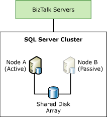

# Clustering the BizTalk Server Databases
If the BizTalk Server databases become unavailable, the BizTalk Server environment will not function correctly. To provide high availability, you can create a Microsoft SQL Server cluster for the BizTalk Server databases, as shown in the following figure.  
  
   
  
 To create a highly available solution for the BizTalk Server databases, you must have at least two computers that are running SQL Server and a shared disk array in the cluster.  
  
## Clustering Options  
 Determine the best cluster configuration for the BizTalk Server databases for your business needs. Here is a list of the options:  
  
-   **Active/passive**. High availability for the BizTalk Server databases typically consists of two or more database computers configured in an active/passive server cluster configuration. These computers share a common disk resource (such as a RAID 1+0 SCSI disk array or storage area network) and use Windows Clustering to provide backup redundancy and fault tolerance.  
  
-   **Active/active**. Windows Clustering and SQL Server allow you to run SQL Server in Active/Active mode where each node of the cluster is “active” and running one or more SQL Server instances. For example, this would allow you to have the MessageBox database on one node and all other BizTalk Server databases on the other node. This allows you to maximize cluster hardware usage, but an active/active SQL Server configuration should be used with care.  
  
     Can each node simultaneously handle the load of all SQL Server instances during a SQL Server cluster node failover scenario? Are there enough CPU resources? Is there sufficient memory? What about network bandwidth? How about disk I/O contention?  
  
     These are just some of the questions that need to be answered in order to determine if an active/active SQL Server cluster is right for your BizTalk applications. If it is determined that one node cannot handle all SQL Server instances in a failover scenario, an alternative is to use active/active/passive clustering.  
  
-   **Active/active/passive**. The run-time processes write to the BizTalk Management database, MessageBox databases, Tracking Analysis Services database, BAM Analysis database, BAM Star Schema database, BAM Primary Import database, and BAM Archive database. Therefore, these databases are especially important if a disaster occurs, and must have greater priority when determining what databases to cluster. Only users or tools write to the other databases. For the MessageBox databases, you can consider an active/active/passive or active/active/active/passive configuration to minimize the hardware needed.  
  
> [!NOTE]  
>  SQL Server Standard Edition supports 2-node failover clusters. If you decide to use the active/active/passive configuration on SQL Server, you must use the Enterprise Edition.  
  
## Procedures for Clustering the Databases  
 Make sure you meet the following prerequisites before you start clustering the BizTalk Server databases.  
  
-   When you create the domain groups for your BizTalk Server environment, you must create global domain accounts.  
  
-   Configure the SQL Server cluster before you install and configure BizTalk Server. See [Windows Server Failover Clustering (WSFC) with SQL Server](https://docs.microsoft.com/sql/sql-server/failover-clusters/windows/windows-server-failover-clustering-wsfc-with-sql-server) or [Always On Failover Cluster Instances (SQL Server)](https://docs.microsoft.com/sql/sql-server/failover-clusters/windows/always-on-failover-cluster-instances-sql-server).  
  
-   If you are also clustering the master secret server, configure that server first. See [High Availability for the Master Secret Server](../technical-guides/high-availability-for-the-master-secret-server.md).  
  
#### Run BizTalk Configuration  
  
1. Install BizTalk Server on a runtime server.  
  
2. Open **BizTalk Server Configuration**.  
  
3. To apply a custom configuration, see [Import and Export BizTalk Server Configuration](../install-and-config-guides/import-and-export-biztalk-server-configuration.md). To specify the SQL Server cluster for the BizTalk Server databases enter the name of the SQL Server cluster in the **Databases** dialog of the configuration.  
  
4. Complete the BizTalk Server configuration using a [Custom Configuration](../install-and-config-guides/configure-biztalk-server.md).
  
   For more information about clustering BizTalk Server databases, see [Improving Fault Tolerance in BizTalk Server by Using a Windows Server 2008 Failover Cluster or Windows Server 2003 Server Cluster](https://www.microsoft.com/download/details.aspx?id=2290).  
  
## Behavior of BizTalk Host Instances During SQL Server Failover  
 For more information about behavior of BizTalk host instances during SQL Server failover, see [Behavior of BizTalk Server Host Instances during SQL Server Failover](../core/behavior-of-biztalk-server-host-instances-during-sql-server-failover.md).  
  
## Using SQL Server Database Mirroring  
 For more information about using SQL Server database mirroring with respect to BizTalk Server database clustering, see [SQL Server database mirroring, Volume Shadow Copy service and AlwaysOn](../core/sql-server-database-mirroring-volume-shadow-copy-service-and-alwayson.md).  
  
## See Also  
 [Scaling Out the BizTalk Server Databases](../technical-guides/scaling-out-the-biztalk-server-databases.md)