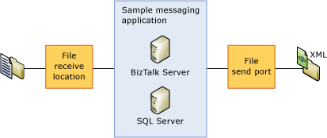

# Defining Testing Using an XML Configuration File
BizUnit offers two ways to define tests: via an XML configuration file and via an Excel worksheet. This topic focuses on using an XML configuration file to define tests; however, you should also look at the BizUnit SDK, since it provides an interesting example of how to define BizUnit test cases using Excel. In addition, you may wish to investigate the BizUnit Designer tool, which provides a GUI that allows for rapid creation of BizUnit test cases. This topic provides an overview of how to define test cases using XML configuration using a very simplified scenario.  
  
## Overview of defining a BizUnit test case using XML configuration  
 As just stated, this scenario is simplified for purposes of illustration. Consider a sample messaging application such as the one illustrated below. Let’s assume that normal functional behavior for this application is that BizTalk receives an XML file via a file receive location, it then sends it to an appropriate subscriber based on a subscription. To validate this scenario effectively it is important that we perform the following steps in the test:  
  
1. Set up the environment to ensure that it is in a consistent state and ready for the test to be run:  
  
   -   This is done by deleting any files that are present in the two file locations used.  
  
2. Run the test to verify functionality:  
  
   -   Create a valid XML message in the folder that the file receive location polls.  
  
   -   Validate that the correct XML message is placed in the outbound folder location.  
  
   -   The validation should cover both the schema and the payload information for the message. (Typically a couple of the key fields should be examined.)  
  
3. Clean up the environment to ensure that the environment is in the same state as before the test executed:  
  
   -   Delete any files that are present in the two file locations used.  
  
     
   Sample BizTalk Messaging application  
  
   Each test case begins and ends with the TestCase XML tag; the testName parameter is passed into this as indicated here.  
  
```  
<TestCase testName="Test_01_FILECopyWithXmlValidation">  
```  
  
 Then we enter the TestSetup phase, in which we ensure that the environment is in a consistent state to run the test. In this example, we delete any XML messages that are contained in our TestData directory. This is done using the **FileDeleteMultipleStep**.  
  
```  
<TestSetup>  
   <TestStep assemblyPath="" typeName="Microsoft.Services.BizTalkApplicationFramework.BizUnit.FileDeleteMultipleStep">  
      <Directory>..\..\..\TestData\</Directory>  
         <SearchPattern>*.xml</SearchPattern>   
      </TestStep>  
</TestSetup>  
```  
  
 We then enter what is the most critical section of the test, the test execution stage. This stage can contain multiple test steps. In this example we use the FileCreateStep to copy a document (InDoc1.xml which can be seen in the \<SourcePath\> tag) to a file drop which is used by our receive location. It’s important to note that BizUnit supports using unique identifiers for filenames in this step; this can be seen with the %Guid% reference in the CreationPath tag.  
  
 After this has been completed, we need to use the **FileValidateStep** to validate the outbound message has been created. You will notice this step allows you to specify a timeout value (this is in milliseconds), the directory and the search pattern. In addition to this, the **DeleteFile** tag enables you to specify whether you want the file to be removed after it has been validated. Finally, you should also note the validation includes an XPath query, which validates the PONumber node within the XML message (it checks that the value is PONumber_0.) Examination and validation of the payload of any outbound messages is another example of a guiding principle that you should follow when using BizUnit.  
  
```  
<TestExecution>  
   <TestStep assemblyPath="" typeName="Microsoft.Services.BizTalkApplicationFramework.BizUnit.FileCreateStep">  
      <SourcePath>..\..\..\TestData\InDoc1.xml</SourcePath>  
      <CreationPath>..\..\..\Rec_03\TransactionId_%Guid%.xml</CreationPath>  
   </TestStep>  
   <TestStep assemblyPath="" typeName="Microsoft.Services.BizTalkApplicationFramework.BizUnit.FileValidateStep">  
      <Timeout>3000</Timeout>  
      <Directory>..\..\..\Rec_03\</Directory>  
      <SearchPattern>TransactionId_*.xml</SearchPattern>  
      <DeleteFile>true</DeleteFile>  
      <ValidationStep assemblyPath="" typeName="Microsoft.Services.BizTalkApplicationFramework.BizUnit.XmlValidationStep">  
         <XmlSchemaPath>..\..\..\TestData\PurchaseOrder.xsd</XmlSchemaPath>  
         <XmlSchemaNameSpace>http://SendMail.PurchaseOrder</XmlSchemaNameSpace>  
         <XPathList>  
            <XPathValidation query="/*[local-name()='PurchaseOrder' and namespace-uri()='http://SendMail.PurchaseOrder']/*[local-name()='PONumber' and namespace-uri()='']">PONumber_0</XPathValidation>  
         </XPathList>  
      </ValidationStep>  
   </TestStep>  
</TestExecution>  
```  
  
 The final stage of the test case is the cleanup. As can be seen here, the **FileDelete** test step is used to clean up the directories used by the test.  
  
```  
<TestCleanup>  
   <TestStep assemblyPath="" typeName="Microsoft.Services.BizTalkApplicationFramework.BizUnit.FileDeleteMultipleStep">  
      <Directory>..\..\..\TestData\</Directory>  
      <SearchPattern>*.xml</SearchPattern>   
   </TestStep>  
   <TestStep assemblyPath="" typeName="Microsoft.Services.BizTalkApplicationFramework.BizUnit.FileDeleteMultipleStep">  
      <Directory>..\..\..\Rec_03\</Directory>  
      <SearchPattern>*.xml</SearchPattern>   
   </TestStep>  
</TestCleanup>  
```  
  
 Hopefully this example illustrates that defining tests in BizUnit is relatively straightforward and that by using this test framework, you will be able to rapidly develop test cases to provide functional testing of your application.  
  
### Full test case example  
 The full test case configuration file contents are included here for your reference:  
  
```  
<TestCase testName="Test_01_FILECopyWithXmlValidation">  
   <TestSetup>  
      <TestStep assemblyPath="" typeName="Microsoft.Services.BizTalkApplicationFramework.BizUnit.FileDeleteMultipleStep">  
         <Directory>..\..\..\TestData\</Directory>  
            <SearchPattern>*.xml</SearchPattern>   
         </TestStep>  
   </TestSetup>  
   <TestExecution>  
      <TestStep assemblyPath="" typeName="Microsoft.Services.BizTalkApplicationFramework.BizUnit.FileCreateStep">  
         <SourcePath>..\..\..\TestData\InDoc1.xml</SourcePath>  
         <CreationPath>..\..\..\Rec_03\TransactionId_%Guid%.xml</CreationPath>  
      </TestStep>  
      <TestStep assemblyPath="" typeName="Microsoft.Services.BizTalkApplicationFramework.BizUnit.FileValidateStep">  
         <Timeout>3000</Timeout>  
         <Directory>..\..\..\Rec_03\</Directory>  
         <SearchPattern>TransactionId_*.xml</SearchPattern>  
         <DeleteFile>true</DeleteFile>  
         <ValidationStep assemblyPath="" typeName="Microsoft.Services.BizTalkApplicationFramework.BizUnit.XmlValidationStep">  
            <XmlSchemaPath>..\..\..\TestData\PurchaseOrder.xsd</XmlSchemaPath>  
            <XmlSchemaNameSpace>http://SendMail.PurchaseOrder</XmlSchemaNameSpace>  
            <XPathList>  
               <XPathValidation query="/*[local-name()='PurchaseOrder' and namespace-uri()='http://SendMail.PurchaseOrder']/*[local-name()='PONumber' and namespace-uri()='']">PONumber_0</XPathValidation>  
            </XPathList>  
         </ValidationStep>  
      </TestStep>  
   </TestExecution>  
   <!-- Test cleanup: test cases should always leave the system in the state they found it -->  
   <TestCleanup>  
      <TestStep assemblyPath="" typeName="Microsoft.Services.BizTalkApplicationFramework.BizUnit.FileDeleteMultipleStep">  
         <Directory>..\..\..\TestData\</Directory>  
         <SearchPattern>*.xml</SearchPattern>   
      </TestStep>  
      <TestStep assemblyPath="" typeName="Microsoft.Services.BizTalkApplicationFramework.BizUnit.FileDeleteMultipleStep">  
         <Directory>..\..\..\Rec_03\</Directory>  
         <SearchPattern>*.xml</SearchPattern>   
      </TestStep>  
   </TestCleanup>  
</TestCase>  
```  
  
## See Also  
 [Using BizUnit to Facilitate Automated Testing](../technical-guides/using-bizunit-to-facilitate-automated-testing.md)