# Extending BizTalk ESB Toolkit Capabilities with SOA Governance
The [!INCLUDE[esbToolkit](../includes/esbtoolkit-md.md)] is shipped with [!INCLUDE[btsBizTalkServerNoVersion](../includes/btsbiztalkservernoversion-md.md)] and is a collection of tools and libraries that extend [!INCLUDE[btsBizTalkServerNoVersion](../includes/btsbiztalkservernoversion-md.md)] capabilities of supporting a loosely coupled and dynamic messaging architecture. It functions as middleware that provides tools for rapid mediation between services and their consumers. Enabling maximum flexibility at run time, the [!INCLUDE[esbToolkit_short](../includes/esbtoolkit-short-md.md)] simplifies loosely coupled composition of service endpoints and management of service interactions.  
  
 Sentinet BizTalk Server Extensions enhance the capabilities of [!INCLUDE[esbToolkit_short](../includes/esbtoolkit-short-md.md)] by integrating it with Sentinet, an SOA governance and API management software solution for the Microsoft platform. The first release of the Sentinet [!INCLUDE[btsBizTalkServerNoVersion](../includes/btsbiztalkservernoversion-md.md)] Extensions offers a [!INCLUDE[esbToolkit_short](../includes/esbtoolkit-short-md.md)] SOA Repository Resolver that integrates with BizTalk Server 2013, [!INCLUDE[esbToolkit_short](../includes/esbtoolkit-short-md.md)], and Visual Studio 2012.  
  
 This whitepaper talks about the how Sentinet SOA Resolver extends [!INCLUDE[esbToolkit_short](../includes/esbtoolkit-short-md.md)] capabilities, how to configure the Sentinet SOA Resolver, and finally a sample demonstrating how to use the Sentinet SOA Resolver.  
  
## ESB Toolkit and Sentinet SOA Resolver  
 Among other things, an ESB Toolkit Resolver must provide the following:  
  
- Runtime resolution of service endpoints and their configurations  
  
- BizTalk ESB solutions with loosely coupled messaging.  
  
  Sentinet offers a robust and comprehensive [SOA Repository](http://www.nevatech.com/sentinet/soa-repository) that provides SOA integration solutions along with advanced SOA governance and runtime management capabilities. Combined with Sentinet SOA Repository, Sentinet SOA Resolver provides [!INCLUDE[btsBizTalkServerNoVersion](../includes/btsbiztalkservernoversion-md.md)] ESB architectures with advanced and easy to use ESB configurations, dynamic message routing, and message security implementation capabilities.  
  
  A high-level diagram below shows how the Sentinet SOA Resolver fits in the [!INCLUDE[esbToolkit_short](../includes/esbtoolkit-short-md.md)] architecture.  
  
    
  
  At runtime, the **Endpoint Resolution and Routing** component in the illustration above (which is part of the ESB Toolkit Resolver Framework) uses an Itinerary document (created in Visual Studio Itinerary Designer) to instantiate specific Resolver and to request Resolver to provide service endpoint and its configuration. Itinerary itself has to be configured with the reference to the service endpoint, so that resolver can use this reference to find requested endpoint in the Registry or Repository. At design-time (when Itinerary is created), actual physical address of the service endpoint is not known, and neither are the security policies that the service requires. At later stages, ESB Toolkit runtime uses resolved service endpoint to configure Off-Ramp dynamic Send Port to send the message to the actual physical service address with required service security settings. If service endpoint address, communication protocols, or security requirements change only the registry/repository configuration has to be updated. The runtime configuration of the ESB or BizTalk Server artifacts does not require to be updated.  
  
## How does the Sentinet Resolver add value to an ESB Toolkit application?  
 The two key benefits of using the Sentinet Resolver along with the SOA repository are:  
  
- Assigning client identities to the resolved external service endpoint – Most of the time, the resolved ESB endpoint requires specific client identity to call external service (like username/password, specific Windows account credentials or specific X.509 certificate). This is a very common security requirement which is not appropriately handled by other ESB resolvers/registries.  
  
- Restricting access to security information – To work around the previous limitation, other resolvers might use manual configuration of tModels to include complex XML with the required security identities. However, saving the security information as part of registries/repositories is not the right approach. This provides service consumers easy access to the security details such as username, password, etc. to access the service.  
  
  Sentinet Resolver and Sentinet SOA Repository provide capabilities to flexibly and securely assign any specific client identity to the resolved ESB endpoint via standard or custom WCF endpoint behaviors. Sentinet achieves this by configuring Sentinet Resolver, and not the Sentinet SOA Repository with the security information. All client credentials that are configured with the Sentinet Resolver are stored in an encrypted form.  
  
  Over and above this, following are some of the other benefits of using the Sentinet Resolver and Sentinet SOA Repository.  
  
- Provides a comprehensive SOA repository. The repository provides access to service metadata content, service identities and policies, support for service versions, etc.  
  
- Ease of registering physical services in the Sentinet registry by uploading service WSDL.  
  
- Comprehensive and easy-to-use Sentinet Administrative Console. The console provides management access to all service metadata and associated artifacts, with simple user interface to access service operations and their data schemas, service endpoints, security policies, etc.  
  
- Management and configuration of custom behaviors for resolved endpoints. Sentinet Resolver provides fully customizable and easily configurable endpoint behaviors for the resolved endpoints.  
  
- Option to configure the Sentinet Resolver with a variety of search criteria. Itineraries can define any keyword that is assigned to a service endpoint, or use a service path that points to a service in the Repository services hierarchy.  
  
- Advanced resolver testing capabilities. Sentinet Resolver configurations can be tested straight from the Visual Studio Itinerary Designer. While other resolvers can only provide information about basic properties of the endpoint, Sentinet Resolver provides extended information about resolved endpoints. In addition to endpoint basic properties, Sentinet Resolver reveals the properties that identify resolved service and endpoint location in the Sentinet Repository. Itinerary designers can test how Sentinet Resolver and its different search criteria affect resolution results before Itinerary itself is used at runtime.  
  
## Installing the Sentinet BizTalk Server Extensions  
 You can download and install the Sentinet BizTalk Extensions from [here](http://www.nevatech.com/download). Installing the extension installs the Sentinet Resolver for ESB Toolkit, documentation, and samples on how to use the extension.  
  
 A document detailing how to install and configure the Sentinet BizTalk Server extension is available as part of the product download.  
  
## Using the Sentinet BizTalk Server Extensions  
 In this section, we look at how to use the Sentinet BizTalk Server extensions and showcase the capabilities mentioned above.  
  
### Prerequisites  
 Instructions in this whitepaper assume that you have the following installed and configured:  
  
-   Visual Studio 2012.  
  
-   BizTalk Server 2013. For instructions, see [Installing BizTalk Server 2013](http://msdn.microsoft.com/library/jj248688\(v=bts.80\).aspx).  
  
-   BizTalk Server ESB Toolkit. For instructions, see [Install and Configure the Microsoft BizTalk ESB Toolkit](http://msdn.microsoft.com/library/jj684558\(v=bts.80\).aspx).  
  
-   Sentinet BizTalk Server Extensions. For instructions, refer to the documentation available as part of the product download available [here](http://www.nevatech.com/download).  
  
### Register a web service  
 Web services that are managed by the Sentinet infrastructure must be registered in the Repository. This whitepaper uses a WCF Customer Search sample service that is shipped with the Sentinet installation package.  
  
1. Start the **Customer Search** sample service installed by the Sentinet installation package. Launch the Customer Search sample as an administrator, select a policy binding (e.g. **wsHttpBinding**) and then click **Start**.  
  
2. Once the service is running, click the **View Wsdl** link to open a browser with the service metadata URL and the service WSDL. Copy the metadata URL from the browser address bar.  
  
3. Open a browser and enter the URL (`https://[computer-name]/sentinet`) to start the Sentinet Administrative Console. Login and select the **Repository** root element in the **Repository** view panel. Right-click the **Repository** root element and click the **Add > Service > SOAP** menu option.  
  
4. In the **Add Service** dialog box, for the **WSDL from URL** option, paste the service metadata URL you copied earlier, and then click **Next**.  
  
    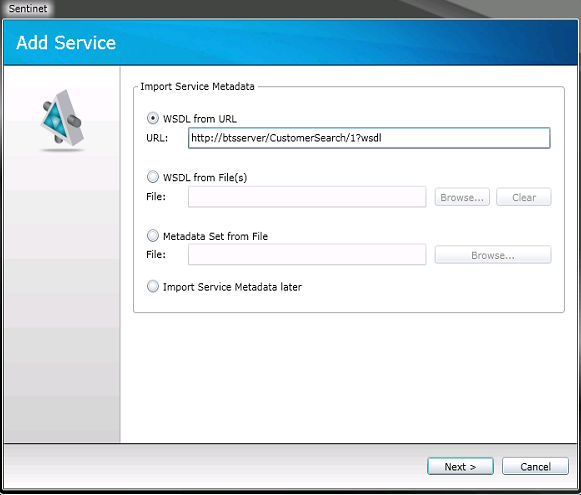  
  
5. The wizard starts downloading the service metadata. Once the download is complete, the wizard displays the Web Service tree structure. Provide a name for the service and click **Finish** to upload the service metadata to the Sentinet Repository.  
  
    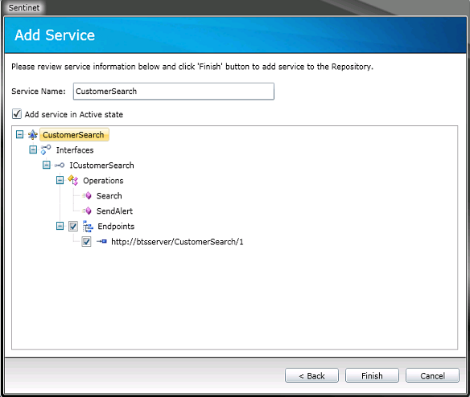  
  
6. The service is imported to the repository as version 1. Select the version, and then select the endpoint. In the **Endpoint Details** pane at the bottom, click the **Attachments** tab, and then click **Modify**.  
  
    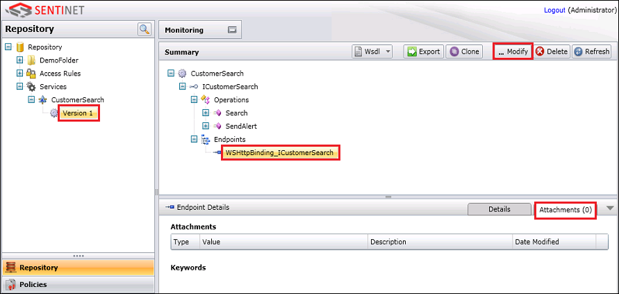  
  
7. In the Endpoint Details tab, click the (**+**) sign against **Keywords**, enter a keyword to associate with the endpoint (for example, **TestKeyword**), and then click **Save**. The keyword is used as an endpoint tag (or identifier) in the SOA repository.  
  
    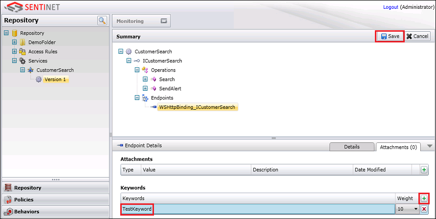  
  
   Repeat the steps above to add a new version of the **CustomerSearch** service, but with a different binding, e.g. **basicHttpBinding**. Later in this whitepaper, we’ll demonstrate how the Sentinet Resolver can resolve to different services (or different versions of the same service) just by associating a search keyword to the service endpoint.  
  
### Configure Sentinet Resolver  
 This section shows how to configure the Sentinet Resolver in simple BizTalk ESB Itinerary Designer project, and specifically how to use keywords to uniquely resolve to a service endpoint. This section also demonstrates how to test the resolver from Visual Studio itself, without sending any ESB messages.  
  
1.  Start Visual Studio and create a **BizTalk ESB Itinerary Designer** project.  
  
2.  In the Solution Explorer, double-click the itinerary to open it in the Itinerary Designer.  
  
3.  From the Toolbox, drag and drop the **Itinerary Service** shape on the designer surface.  
  
4.  Select the **Itinerary Service** shape and change the **Itinerary Service Extender** property to **Messaging Extender** from the drop-down list.  
  
     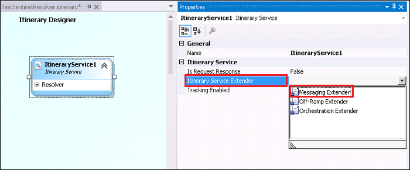  
  
5.  Right-click the **Resolver** element in the **Itinerary Service** shape and click **Add new Resolver**.  
  
     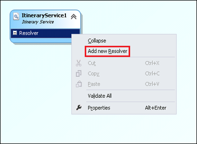  
  
6.  Select the new resolver element, rename it (e.g., **MyResolver**), and the for the **Resolver Implementation** property, select **Sentinet Resolver Extension**.  
  
     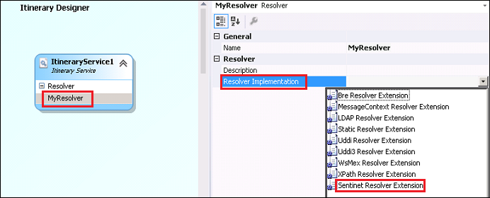  
  
7.  Specify the **Action** and **Keywords** properties for the Sentinet Resolver Extension. We’ll use these properties to resolve uniquely to services we added earlier to the Sentinet Repository. There are other properties as well that you can specify for the Sentinet Resolver Extension. To learn more about those properties, refer to the Sentinet BizTalk Extensions User Guide.  
  
    |Property|Description|  
    |--------------|-----------------|  
    |Action|Message Action header that uniquely identifies service operation that is called. This action header is part of the service WSDL and can be found either in the service WSDL, or from the Sentinet Administrative Console User Interface (under the operation’s Request message properties.|  
    |Keywords|Provide the keyword (e.g. **TestKeyword**) that you assigned to the service in the Sentinet Administrative Console.|  
  
     The following screenshot shows the Action and Keywords property specified for the **MyResolver** configuration.  
  
     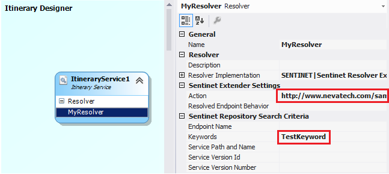  
  
8.  Save changes to the configuration.  
  
#### Advanced Resolver Configuration  
 Sentinet BizTalk Extensions Configuration application modifies **Sentinet.BizTalk.config** file located in the root of the package installation folder (the default location is `<installation drive>:\Program Files\Nevatech\Sentinet BizTalk Extensions\Sentinet.BizTalk.config`). The file can be modified outside of **Sentinet BizTalk Extensions Configuration** application to provide advanced configuration options. For example, in many practical ESB scenarios resolved endpoints have to be provided not only with service endpoint addresses and bindings, but also with specific client identities (username/password, specific Windows account credentials, or a client X.509 certificate). Without the proper client identity, ESB Off-Ramp Send Ports fail to call external services. Sentinet Resolver lets Itinerary developer assign specific endpoint behavior that provides appropriate client endpoint identity. Multiple endpoint behaviors can be pre-configured as standard WCF endpoint behaviors in the **Sentinet.BizTalk.config** file, and then specific endpoint behavior can be referenced in the Itinerary from the Sentinet Resolver configuration, by specifying the name of the behavior for the **Resolved Endpoint Behavior** property.  
  
### Test the Resolver Configuration  
 After you have configured the Sentinet Resolver by specifying the relevant property values, you can test the Resolver from Visual Studio itself.  
  
1. From the design surface, right-click the Sentinet Resolver you added to the **Itinerary Service** shape, and then click **Test Resolver Configuration**.  
  
    The output pane shows the test results, an excerpt of which is similar to shown below:  
  
   ```  
   ***** Resolved Service Endpoint *****  
  
   Service Path and Name          : /CustomerSearch  
   Service Id                     : 2b6d686a-cae1-4b7b-93da-99affef98478  
   Service Version                : 1  
   Endpoint Name                  : WSHttpBinding_ICustomerSearch  
   Endpoint Address               : http://btscloudcar/CustomerSearch/1  
   ```  
  
    Note that the Resolver returned the endpoint for the **CustomerSearch** service **Version 1** to which the search criteria (**TestKeyword**) is attached.  
  
2. Remove the **TestKeyword** associated with the **Version 1** of the **CustomerSearch** service and associate it with endpoint of the service’s second version.  
  
   1.  Open the Sentinet Administrative Console, click **Version 1** under the **CustomerSearch** service, click the wsHttpBinding endpoint, and then click the **Attachments** tab, and then click **Modify**.  
  
        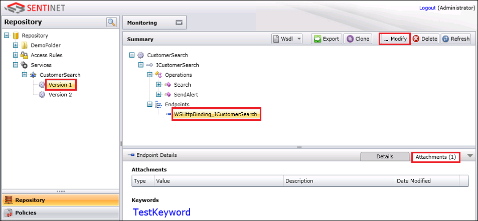  
  
   2.  Click the button against the keyword you entered before to delete the keyword, click **Yes** in the message box, and then click **Save**.  
  
        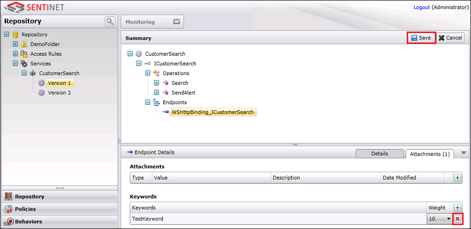  
  
   3.  Now, assign the same keyword (**TestKeyword**) to the **basicHttpBinding** endpoint under the **Version 2** of the same service.  
  
3. Go back to Visual Studio and test the resolver configuration again. Right-click the Sentinet Resolver you added to the **Itinerary Service** shape, and then click **Test Resolver Configuration**.  
  
    The output pane shows the test results, an excerpt of which is similar to shown below:  
  
   ```  
   ***** Resolved Service Endpoint *****  
  
   Service Path and Name          : /CustomerSearch  
   Service Id                     : 5b9e5878-7016-44ab-9f0e-5282a8c3e508  
   Service Version                : 2  
   Endpoint Name                  : BasicHttpBinding_ICustomerSearch  
   Endpoint Address               : http://btscloudcar/CustomerSearch/2  
   ```  
  
4. Notice how the Resolver now returned the details for the **Version 2** of the service even though you did not change anything in the ESB Itinerary application.  
  
   Assign the keyword (**TestKeyword**) back to the version 1 of the service (with the **WSHttpBinding** endpoint).  
  
## Using the Sentinet BizTalk Server Extensions  
 In this section, we will look at how the Sentinet BizTalk Extension, together with ESB Resolver, can be used to uniquely identify a service and route the message to that service, with minimal or no changes to the service or the client sending the message. We will test two scenarios:  
  
- Send a sample message to a service registered in the Sentinet repository (with the keyword attached). Then, change the policy binding for the service using the Sentinet Administrative Console and send another sample message. This scenario demonstrates how changing the service’s security policy neither affects the client application nor the ESB itinerary.  
  
- Send a sample message to a service endpoint registered in the Sentinet repository (with keyword attached). Then, attach the same keyword to another version of the same service, and send the message again. This scenario demonstrates how attaching a keyword to a different service version automatically routes messages to a new service version.  
  
  To test these scenarios, we’ll use the following samples:  
  
- **Customer Search Service** provided with the Sentinet installer. This service can be started from the Start menu.  
  
- **Nevatech.Vsb.BizTalk.Samples** solution provided with the Sentinet installer. This sample is available at `<installation drive>:\Program Files\Nevatech\Sentinet BizTalk Extensions\Samples`.  
  
- ESB.Itinerary.Test sample shipped with [!INCLUDE[esbToolkit](../includes/esbtoolkit-md.md)]. This is available at `<install drive>:\Program Files (x86)\Microsoft BizTalk ESB Toolkit\ESBSource.zip\Source\Samples\Itinerary\Source\ESB.Itinerary.Test` and is used to test sample messages to the Customer Search Service.  
  
#### To test the Sentinet Resolver by changing the service policy binding  
  
1. Make sure the **CustomerSearch** service that you deployed with the wsHttpBinding is running.  
  
2. From the **Nevatech.Vsb.BizTalk.Samples** sample, open **CustomerSearch.Search.itinerary**, select **Resolve Service Endpoint** under the **Message Extender** within the **Route Message** shape, and for the **Keywords** property, specify a keyword, such as **TestKeyword**.  
  
    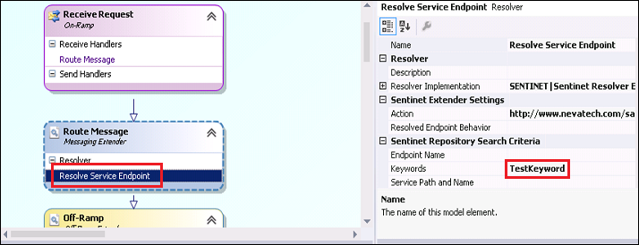  
  
3. Save the changes to the itinerary, and export the model. Right-click anywhere on the itinerary designer surface, and lick **Export Model**.  
  
4. In the BizTalk Server Administration Console, right-click the **Microsoft.Practices.ESB** application, click Import, and then click Bindings. Navigate to the ESB Resolver sample location at `<installation drive>:\Program Files\Nevatech\Sentinet BizTalk Extensions\Samples\ESB Resolver`, and open the **BizTalk.Bindings.xml** file. This creates the **Sentinet Solicit-Response** and **Sentinet One-Way** send ports required for the sample itineraries.  
  
    Also, make sure all send ports and receive locations of the **Microsoft.Practices.ESB** BizTalk application are enlisted and started.  
  
5. Open the **ESB.Itinerary.Test** application, build it, and run it. In the Itinerary Test Client that launches, perform the following steps:  
  
   1.  In the Itinerary Test Client, under **Web Service Options**, clear **Use WCF Service**, and select **Two Way Service**.  
  
   2.  From the **Service Type** drop-down, select **Messaging**.  
  
   3.  Click **Load Itinerary** and navigate to the **CustomerSearch.Search.Itinerary.xml** file located in the sample project's **ExportedItineraries** folder at `<installation drive>:\Program Files\Nevatech\Sentinet BizTalk Extensions\Samples\ESB Resolver\ExportedItineraries`.  
  
   4.  Click the ellipsis button (**..**) under **Load Message** group and navigate to **CustomerSearch.Search.Request.xml** located in the project's **SampleMessages** folder at `<installation drive>:\Program Files\Nevatech\Sentinet BizTalk Extensions\Samples\ESB Resolver\SampleMessages`.  
  
   5.  Click **Submit Request** and verify that the response in received.  
  
6. On the **CustomerSearch** dialog box, notice that the counter increases by one.  
  
7. In the Sentinet Administrative Console, update the endpoint details to use the basicHttpBinding instead of wsHttpBinding.  
  
   1.  Select the service endpoint, click the **Details** tab, and then click **Modify**.  
  
   2.  In the **Details** tab, click the ellipsis (**…**) in the **Policy** section, to launch the **Modify Policy** wizard.  
  
        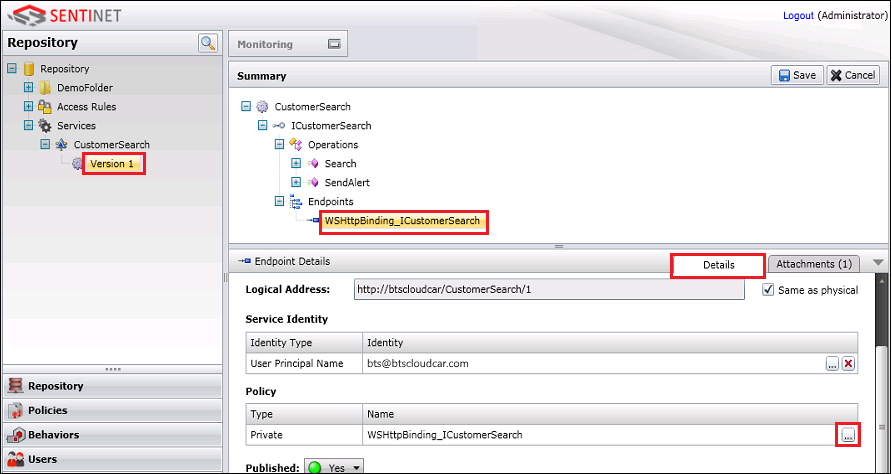  
  
   3.  On the first page, retain the policy type as **Private** and then click **Next**.  
  
   4.  On the second page, change the **wsHttpBinding** XML element to **basicHttpBinding** (case-sensitive), and then click **Finish**.  
  
        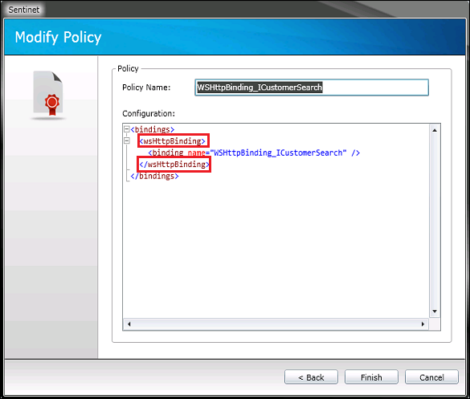  
  
   5.  Click **Save** to save changes to the endpoint details.  
  
8. Stop the **CustomerSearch** service, change the binding from **wsHttpBinding** to **basicHttpBinding**, and then start the service again.  
  
    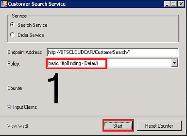  
  
9. From the **Test Itinerary Client**, send a test message again to the Customer Search service. Notice that the counter in the Customer Search Service dialog box is again incremented by 1.  
  
     Once the message is successfully received, from the Sentinet Administration Console, change the policy details back to **wsHttpBinding**. Similarly, stop the **Customer Search** service, change the policy back to wsHttpBinding and start the service.  
  
   This demonstrates how the service details in the Sentinet Repository can be updated on the fly to target an updated service endpoint without changing the itinerary or the client.  
  
#### To test the Sentinet Resolver by changing keyword assignments  
  
1.  Make sure the two instances of **CustomerSearch** service that you deployed with the wsHttpBinding and basicHttpBinding are running.  
  
2.  From the **Nevatech.Vsb.BizTalk.Samples** sample, open **CustomerSearch.Search.itinerary**, select **Resolve Service Endpoint** under the **Message Extender** within the **Route Message** shape, and for the **Keywords** property, specify a keyword, such as **TestKeyword**.  
  
       
  
3.  Save the changes to the itinerary, and export the model. Right-click anywhere on the itinerary designer surface, and lick **Export Model**.  
  
4.  In the BizTalk Server Administration Console, right-click the **Microsoft.Practices.ESB** application, click Import, and then click Bindings. Navigate to the ESB Resolver sample location at `<installation drive>:\Program Files\Nevatech\Sentinet BizTalk Extensions\Samples\ESB Resolver`, and open the **BizTalk.Bindings.xml** file. This creates the **Sentinet Solicit-Response** and **Sentinet One-Way** send ports required for the sample itineraries.  
  
     Also, make sure all send ports and receive locations of the **Microsoft.Practices.ESB** BizTalk application are enlisted and started.  
  
5.  Open the **ESB.Itinerary.Test** application, build it, and run it. In the Itinerary Test Client that launches, perform the following steps:  
  
    1.  In the Itinerary Test Client, under **Web Service Options**, clear **Use WCF Service**, and select **Two Way Service**.  
  
    2.  From the **Service Type** drop-down, select **Messaging**.  
  
    3.  Click **Load Itinerary** and navigate to the **CustomerSearch.Search.Itinerary.xml** file located in the sample project's **ExportedItineraries** folder at `<installation drive>:\Program Files\Nevatech\Sentinet BizTalk Extensions\Samples\ESB Resolver\ExportedItineraries`.  
  
    4.  Click the ellipsis button (**..**) under **Load Message** group and navigate to **CustomerSearch.Search.Request.xml** located in the project's **SampleMessages** folder at `<installation drive>:\Program Files\Nevatech\Sentinet BizTalk Extensions\Samples\ESB Resolver\SampleMessages`.  
  
    5.  Click **Submit Request** and verify that the response in received.  
  
6.  On the **CustomerSearch** dialog box, notice that the counter increases by one.  
  
7.  From the Sentinet Administration Console, remove the **TestKeyword** associated with the **Version 1** of the **CustomerSearch** service and associate it with **Version 2** of the service.  
  
    1.  Open the Sentinet Administrative Console, click **Version 1** under the **CustomerSearch** service, click the wsHttpBinding endpoint, and then click the **Attachments** tab, and then click **Modify**.  
  
           
  
    2.  Click the button against the keyword you entered before to delete the keyword, click **Yes** in the message box, and then click **Save**.  
  
           
  
    3.  Now, assign the same keyword (**TestKeyword**) to the **basicHttpBinding** endpoint under the **Version 2** of the same service.  
  
8.  Send a test message again from the **Test Itinerary Client** and notice that this time, the counter is incremented in the dialog box that represents version 2 of the service, deployed with the basicHttpBinding.