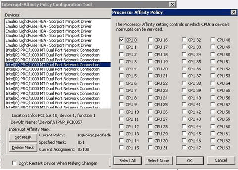

# General Guidelines for Improving Operating System Performance
The following general guidelines should be followed to improve operating system performance:  
  
## Install the latest BIOS, storage area network (SAN) drivers, network adapter firmware and network adapter drivers  
 Hardware manufacturers regularly release BIOS, firmware, and driver updates that can improve performance and availability for the associated hardware. Visit the hardware manufacturer’s Web site to download and apply updates for the following hardware components on each computer in the BizTalk Server environment:  
  
1.  BIOS updates  
  
2.  SAN drivers (if using a SAN)  
  
3.  NIC firmware  
  
4.  NIC drivers  
  
## Enable the “High performance” Power Plan on all BizTalk Server and SQL Server computers.  
 By default, Windows Server 2008/2008 R2 sets the Balanced (recommended) power plan, which enables energy conservation, but can cause increased latency (slower response time for some tasks) and cause performance issues with CPU-intensive applications.  
  
 In order to reduce latency, you must ensure that all the servers that are running BizTalk Server and SQL Server have the Windows **Power plan** set to **High performance**. For more information about how to switch to the **High Performance**  power plan, see KB article: 2207548 [Degraded overall performance on Windows Server 2008 R2](http://go.microsoft.com/fwlink/?LinkID=219677) (http://go.microsoft.com/fwlink/?LinkID=219677).  
  
## Evaluate the usage of Intel Hyper-Threading on BizTalk Server and SQL Server computers  
  
-   **Pre-Nehalem Hyper-Threading**:  
  
    -   Hyper-threading should be turned off on BizTalk Server computers. This is a BIOS setting, typically found in the Processor settings of the BIOS setup. Hyper-threading makes the server appear to have more processors/processor cores than it actually does; however, hyper-threaded processors typically provide between 20-30% of the performance of a physical processor/processor core. When BizTalk Server counts the number of processors to adjust its self-tuning algorithms, the hyper-threaded processors cause these adjustments to be skewed, which can result in negative overall performance.  
  
    -   Hyper-threading should be turned off on SQL Server computers because applications that can cause high levels of contention (such as BizTalk Server) may cause decreased performance in a hyper-threaded environment on a SQL Server computer.  
  
-   **Nehalem Hyper-Threading**: Unlike in older architectures, enabling hyper-threading in Intel microarchitecture “Nehalem” processors can provide up to an almost linear capacity increase. For the best performance results, when you deploy “Nehalem” processors, we recommend that you configure the computer’s BIOS by enabling Intel Hyper-Threading (H-T) Technology for a marked increase in throughput.  
  
-   **Hardware Virtualization**: When using hardware virtualization, the virtual machine is using virtual processors. The number of CPUs available is based on the settings chosen when configuring the virtual machine. If the hardware is hyper-threaded, the virtual machine wouldn't know it is hyper-threaded.  
  
## Assign the MSDTC log file directory to a separate dedicated drive  
 In a BizTalk Server environment with multiple MessageBox databases on separate SQL Server computers, additional overhead associated with Microsoft Distributed Transaction Coordinator (MSDTC) is incurred. By default the MSDTC log files are located in the %systemdrive%\windows\system32\msdtc directory of the computers running the DTC service. To mitigate the possibility that DTC logging could become a performance bottleneck, consider moving the MSDTC log file directory to a fast disk drive.  
  
 To change the MSDTC log file directory, see [Configure DTC Logging](http://go.microsoft.com/fwlink/?LinkID=204107) (http://go.microsoft.com/fwlink/?LinkID=204107).  
  
## Configure antivirus software to avoid real-time scanning of BizTalk Server executables and file drops  
 Antivirus software real-time scanning of BizTalk Server executable files and any folders or file shares monitored by BizTalk Server receive locations can negatively affect BizTalk Server performance. If antivirus software is installed on the BizTalk Server computer, disable real-time scanning of non-executable file types referenced by any BizTalk Server receive locations (usually .XML, but can also be .csv, .txt, etc.) and configure antivirus software to exclude scanning of BizTalk Server executable files  
  
## Disable intrusion detection network scanning between computers in the BizTalk Server environment  
 Intrusion detection software can slow down or even prevent valid communications over the network. If intrusion detection software is installed, disable network scanning between BizTalk Server computers and external data repositories (SQL Server) computers or messaging services (such as Message Queuing and WebSphere MQSeries) computers.  
  
## Defragment all disks in the BizTalk Server environment on a regular basis  
 Excessive disk fragmentation in the BizTalk Server environment will negatively affect performance. Follow these steps to defragment disks in the BizTalk Server environment:  
  
1.  Defragment all disks (local and SAN/NAS) on a regular basis by scheduling off-hours disk defragmentation.  
  
2.  Defragment the Windows PageFile and pre-allocate the Master File Tables of each disk in the BizTalk Server environment to boost overall system performance.  
  
    > [!NOTE]  
    >  To pre-allocate the Master File Tables, see Knowledge Base article 961095, [“About the Master File Table zone reservation in Windows Vista and Windows Server 2008”](http://go.microsoft.com/fwlink/?LinkID=204563) (http://go.microsoft.com/fwlink/?LinkID=204563).  
  
## If antivirus software is installed on the SQL Server computer, disable real-time scanning of data and transaction files  
 Real-time scanning of the SQL Server data and transaction files (.mdf, .ndf, .ldf, .mdb) can increase disk I/O contention and reduce SQL Server performance. Note that the names of the SQL Server data and transaction files may vary between BizTalk Server environments. For more information about the data and transaction files created with a default BizTalk Server configuration, see [Optimizing Filegroups for the Databases2](../technical-guides/optimizing-filegroups-for-the-databases2.md).  
  
## Configure MSDTC for BizTalk Server and SQL Server  
 To facilitate transactions between SQL Server and BizTalk Server, you must enable Microsoft Distributed Transaction Coordinator (MSDTC).  
  
#### To configure Distributed Transaction Coordinator (DTC)  
  
1.  Click **Start**, click **Run**, type **dcomcnfg**, and then click **OK** to open **Component Services**.  
  
2.  In the console tree, expand **Component Services**, expand **Computers**, expand **My Computer**, expand **Distributed Transaction Coordinator**, and then click **Local DTC**.  
  
3.  Right-click **Local DTC**, and then click **Properties** to display the **Local DTC Properties** dialog box.  
  
4.  On the **Tracing** tab, under **Output Options** section, clear the **Trace Output** box.  
  
5.  Click the **Security** tab.  
  
6.  Ensure that each of the following four options is selected, and all others are cleared:  
  
    -   **Network DTC Access**  
  
    -   **Allow Inbound**  
  
    -   **Allow Outbound**  
  
    -   **No Authentication Required**  
  
7.  Click **OK** to close the **Local DTC Properties** dialog box. If prompted to restart the MSDTC service, click **Yes**.  
  
8.  Close **Component Services**.  
  
9. Click **Start**, point to **Administrative Tools**, and then click **Windows Firewall with Advanced Security**.  
  
10. In Windows Firewall with Advanced Security, click **Inbound Rules**.  
  
11. In the **Inbound Rules** pane, right-click **Distributed Transaction Coordinator*** (as appropriate), and then click **Enable Rule**.  
  
12. In Windows Firewall with Advanced Security, click **Outbound Rules**.  
  
13. In the **Outbound Rules** pane, right-click **Distributed Transaction Coordinator*** (as appropriate), and then click **Enable Rule**.  
  
14. On the **Control Panel**, double-click **Administrative Tools**.  
  
15. In the right-hand pane, double-click **Services**.  
  
16. In the right-hand pane of **Services (Local)**, right-click **COM+ System Application**, click **Restart**, and wait for the service to restart.  
  
17. Right-click and restart the **Distributed Transaction Coordinator** service.  
  
18. Right-click and restart the **SQL Server (MSSQLSERVER)** service.  
  
19. Close **Services (Local)**, and then close **Administrative Tools**.  
  
## Configure firewall(s) for BizTalk Server  
  
> [!NOTE]  
>  This step is only required if one or more firewalls are in place in your BizTalk Server environment.  
  
 Review the following information to configure firewall(s) for BizTalk Server:  
  
- [Required Ports for BizTalk Server](http://go.microsoft.com/fwlink/?LinkID=153238) (http://go.microsoft.com/fwlink/?LinkID=153238).  
  
- To configure RPC dynamic port allocation to work with firewalls, see Knowledge Base article 929851, ["The default dynamic port range for TCP/IP has changed in Windows Vista and in Windows Server 2008"](http://go.microsoft.com/fwlink/?LinkID=204568) ( HYPERLINK "<http://go.microsoft.com/fwlink/?LinkID=204568>" <http://go.microsoft.com/fwlink/?LinkID=204568>). For information about how to configure Windows Firewall to accommodate the necessary ports, see [Windows Firewall and IPsec Policy Deployment Step-by-Step Guide](http://go.microsoft.com/fwlink/?LinkID=204569) (<http://go.microsoft.com/fwlink/?LinkID=204569>).  
  
## Install appropriate COM+ and MSDTC hotfix rollup packages  
 Review the following information to install the appropriate COM+ and MS DTC hotfix rollup packages:  
  
-   The MS DTC hotfix can be found in Microsoft Knowledge Base article978476 ["The MS DTC issue that is fixed in Windows Server 2008 R2 MS DTC Hotfix Rollup Package 1"](http://go.microsoft.com/fwlink/?LinkID=204109) (http://go.microsoft.com/fwlink/?LinkID=204109).  
  
-   The latest DTC hotfix rollup package KB article can be found by searching [http://support.microsoft.com](http://go.microsoft.com/fwlink/?LinkID=96185) (http://go.microsoft.com/fwlink/?LinkID=96185) for the phrase (including the quotes):  
  
    ```  
    "MS DTC Hotfix Rollup Package"  
    ```  
  
     The following query does this search for you. Choose the latest one:   
    [http://support.microsoft.com/search/default.aspx?query="MS+DTC+Hotfix+Rollup+Package"](http://support.microsoft.com/search/default.aspx?query="MS+DTC+Hotfix+Rollup+Package")  
  
## Use the Interrupt-Affinity Policy Tool to bind network adapter interrupts to specific processors on multiprocessor computers  
 The Interrupt-Affinity Policy (IntPolicy) is a tool that allows you to “bind” or change the CPU affinity of the interrupts for a given device (such as a network adapter) to a specific processor or processors on a multiprocessor computer. This binding is also referred to as partitioning. The binding of interrupts from a specific network adapter to specific processors on a multiprocessor computer enforces running deferred procedure calls (DPCs) and interrupt service routines (ISRs) for the network adapter on the designated processors. Note that interrupt affinity cannot be configured on single processor computers.  
  
> [!NOTE]  
>  A DPC is defined as a queued call to a kernel-mode function that will usually be executed at a later time. An ISR is defined as a routine whose purpose is to service a device when it generates an interrupt. For more information about deferred procedure calls and interrupt service routines, see the [Windows Driver Kit documentation](http://go.microsoft.com/fwlink/?LinkId=84418) (http://go.microsoft.com/fwlink/?LinkId=84418).  
  
   
Interrupt-Affinity Policy Tool  
  
 On Windows Server 2008 based multiprocessor computers, the default behavior of the interrupt controller is to assign device interrupts to any available processor. When network connections and file server sessions for a given network adapter are bound/partitioned to run on a specific set of processors, rather than any available processor, the performance and scalability of the associated network processing is improved. Large BizTalk Server solutions often employ the use of multi-processor SQL Server computers with multiple network adapters for which interrupt-binding may be particularly beneficial.   
Interrupt-binding using IntPolicy should always be evaluated in a test environment before employing in a production environment. The hardware, operating system and application configuration of the test environment should approximate the production environment as closely as possible. This will allow you to test various permutations of interrupt-binding and determine the extent that interrupt-binding will increase performance.  
 We recommend that you disable hyper-threading before configuring IntPolicy on a computer with CPUs that supports hyper-threading. This will ensure that interrupts are assigned to physical processors rather than logical processors. Assigning interrupt affinity to logical processors that refer to the same physical processor will not increase performance and could even degrade system performance.    HYPERLINK "The" The [Interrupt-Affinity Policy Tool](http://go.microsoft.com/fwlink/?LinkID=204111) (http://go.microsoft.com/fwlink/?LinkID=204111) is available for download from the WHDC website.  
  
## Use the NTFS file system on all volumes  
 Windows Server offers multiple file system types for formatting drives, including NTFS, FAT, and FAT32. NTFS should always be the file system of choice for servers.  
NTFS offers considerable performance benefits over the FAT and FAT32 file systems and should be used exclusively on Windows servers. In addition, NTFS offers many security, scalability, stability and recoverability benefits over FAT and FAT32.  
Under previous versions of Windows, FAT and FAT32 were often implemented for smaller volumes (say <500 MB) because they were often faster in such situations. With disk storage relatively inexpensive today and operating systems and applications pushing drive capacity to a maximum, it is unlikely that such small volumes will be in use. FAT32 scales better than FAT on larger volumes but is still not an appropriate file system for Windows servers.  
FAT and FAT32 have often been implemented in the past as they were seen as more easily recoverable and manageable with native DOS tools in the event of a problem with a volume. Today, with the various NTFS recoverability tools built both natively into the operating system and available as third-party utilities available, there should no longer be a valid argument for not using NTFS for file systems.  
  
## Do not use NTFS file compression  
 Though using NTFS file system compression is an easy way to reduce space on volumes, it is not appropriate for enterprise file servers. Implementing compression places an unnecessary overhead on the CPU for all disk operations and is best avoided. Think about options for adding additional disks, near-line storage or consider archiving data before seriously considering file system compression.  
  
## Review disk controller stripe size and volume allocation units  
 When configuring drive arrays and logical drives within your hardware drive controller, ensure you match the controller stripe size with the allocation unit size that the volumes will be formatted with. This will ensure disk read and write performance is optimal and offer better overall server performance.  
Configuring larger allocation unit (or cluster or block) sizes will cause disk space to be used less efficiently, but will also provide higher disk I/O performance as the disk head can read in more data during each read activity.  
To determine the optimal setting to configure the controller and format the disks with, you should determine the average disk transfer size on the disk subsystem of a server with similar file system characteristics. Use the Windows Performance Monitor tool to monitor the Logical Disk object counters of Avg. Disk Bytes/Read and Avg. Disk Bytes/Write over a period of normal activity to help determine the best value to use.  
Although smaller allocation unit sizes may be warranted if the system will be accessing many small files or records, an allocation unit size of 64 KB delivers sound performance and I/O throughput under most circumstances. Improvements in performance with tuned allocation unit sizes can be particularly noted when disk load increases.  
  
> [!NOTE]  
>  Either the FORMAT command line tool or the Disk Management tool is required to specify an allocation unit size larger than 4096 bytes (4 KB) when formatting volumes. Windows Explorer will only format up to this threshold. The CHKDSK command can be used to confirm the current allocation unit size of a volume however it needs to scan the entire volume before the desired information is displayed (shown as Bytes in each allocation unit).  
  
## Monitor drive space utilization  
 The less data a disk has on it, the faster it will operate. This is because on a well defragmented drive, data is written as close to the outer edge of the disk as possible, as this is where the disk spins the fastest and yields the best performance.  
Disk seek time is normally considerably longer than read or write activities. As noted above, data is initially written to the outside edge of a disk. As demand for disk storage increases and free space reduces, data is written closer to the center of the disk. Disk seek time is increased in locating the data as the head moves away from the edge, and when found, it takes longer to read, hindering disk I/O performance.  
This means that monitoring disk space utilization is important not just for capacity reasons but for performance also.  
As a rule of thumb, work towards a goal of keeping disk free space between 20% to 25% of total disk space. If free disk space drops below this threshold, then disk I/O performance will be negatively impacted.  
  
## Implement a strategy to avoid disk fragmentation  
 Run a defragmenter utility regularly on your disks, including the root drive, to prevent performance degradation. Do this weekly on busy disks. A disk defragmenter is installed with Windows and can be run from a Scheduled Task at specified intervals.  
  
## Optimize Windows Server performance for background services  
 The BizTalk Server process (BTSNTSVC.exe) runs as a background service.   
Windows Server 2008 uses preemptive multi-tasking to prioritize process threads that will be attended to by the CPU. Preemptive multi-tasking is a methodology whereby the execution of a process is halted and another process is started, at the discretion of the operating system. This scheme prevents a single thread from dominating the CPU.  
Switching the CPU from executing one process to the next is known as context-switching. The Windows operating system includes a setting that determines how long individual threads are allowed to run on the CPU before a context-switch occurs and the next thread is serviced. This amount of time is referred to as a quantum. This setting lets you choose how processor quanta are shared between foreground programs and background services. Typically for a server it is not desirable to allow a foreground program to have more CPU time allocated to it than background services. That is, all applications and their processes running on the server should be given equal consideration for CPU time.  
 To increase performance for background service like BizTalk host instances, follow these steps:  
  
1.  Click **Start**, click **Control Panel**, and then click **System**.  
  
2.  Click the **Advanced** tab, and then click **Settings** under **Performance**.  
  
3.  Click the **Advanced** tab, click **Background services**, and then click **OK** twice.  
  
## Disable non-essential services  
 A default installation of Windows Server 2008 enables several services that may not be required in a BizTalk Server environment. Each running service consumes system resources and so unnecessary services should be disabled to improve overall performance.  
Care should be taken when disabling services. Thoroughly research the purpose of a service before disabling the service as Windows Server requires certain services are running. If services required by Windows Server 2008 are disabled, the operating system may become inoperable and possibly even unable to boot.  
To disable Windows Server 2008 services that are not required for a dedicated BizTalk Server, follow these steps:  
  
1.  Click **Start**, point to **Administrative Tools**, and then click **Computer Management**.  
  
2.  Under **Computer Management (Local)**, expand **Services and Applications**, and then click **Services**.  
    In the **Status** column, each service that is running is labeled "Started." Stop and disable any service that is started unnecessarily, for example, the following services are not required on a dedicated BizTalk Server:  
  
    -   Alerter  
  
    -   ClipBook  
  
    -   DHCP Server  
  
    -   Fax Service  
  
    -   File Replication  
  
    -   Infrared Monitor  
  
    -   Internet Connection Sharing  
  
    -   Messenger  
  
    -   NetMeeting Remote Desktop Sharing  
  
    -   Network DDE  
  
    -   Network DDE DSDM  
  
    -   NWLink NetBIOS  
  
    -   NWLink IPX/SP  
  
    -   Print Spooler  
  
    -   Telephony  
  
    -   Telnet  
  
    -   Uninterruptible Power Supply  
  
3.  Note the services that depend on each service that you want to disable. To do this, follow these steps:  
  
    1.  Double-click the service you want to disable.  
  
    2.  Click the **Dependencies** tab.  
  
    3.  In the **This service depends on the following system components** list, note the services this service depends on.  
  
    4.  In the **The following system components depend on this service** list, note the services that cannot start without this service, and then click **OK**.  
  
4.  One at a time, disable each service you have selected. To do this, follow these steps:  
  
    1.  Right-click the service you want to disable, and then click **Properties**.  
  
    2.  In the **Startup type** list, click **Disabled**.  
  
    3.  If you want to stop the service immediately, click **Stop**.  
  
         If the **Stop Other Services** dialog box appears, note the other dependent services that will also stop, and then click **Yes**, and then click **OK**.  
  
5.  Repeat step 4 to disable the other nonessential services.  
  
> [!NOTE]  
>  Test the server for correct operation after you disable each service to make sure you did not disable a service you want to continue to use.   
> If the server is a member of a Windows Server 2008 domain, which BizTalk Servers often are, you must have the TCP/IP helper service on your system to correctly apply Group Policy to the computer.   
> When you disable the DHCP client, the DHCP client stops DNS dynamic update protocol registration and requires manual DNS records to be added for this client to the DNS server.  
  
## Manually load Microsoft Certificate Revocation lists  
 When starting a .NET application, the .NET Framework will attempt to download the Certificate Revocation list (CRL) for any signed assembly. If your system does not have direct access to the Internet, or is restricted from accessing the Microsoft.com domain, this may delay startup of BizTalk Server. To avoid this delay at application startup, you can use the following steps to manually download and install the code signing Certificate Revocation Lists on your system.  
  
1. Download the latest CRL updates from [http://crl.microsoft.com/pki/crl/products/CodeSignPCA.crl](http://go.microsoft.com/fwlink/?LinkID=117794) (http://go.microsoft.com/fwlink/?LinkID=117794) and [http://crl.microsoft.com/pki/crl/products/CodeSignPCA2.crl](http://go.microsoft.com/fwlink/?LinkId=117795) (http://go.microsoft.com/fwlink/?LinkId=117795).  
  
2. Move the CodeSignPCA.crl and CodeSignPCA2.crl files to the isolated system.  
  
3. From a command prompt, enter the following command to use the certutil utility to update the local certificate store with the CRL downloaded in step 1:  
  
    certutil –addstore CA c:\CodeSignPCA.crl  
  
   The CRL files are updated regularly, so you should consider setting a reoccurring task of downloading and installing the CRL updates. To view the next update time, double-click the .crl file and view the value of the **Next Update** field.  
  
## Synchronize time on all servers  
 Many operations involving tickets, receipts and logging rely on the local system clock being accurate. This is especially true in a distributed environment, where time discrepancies between systems may cause logs to be out of sync or tickets issued by one system to be rejected by another as expired or not yet valid.  
  
 For more information on configuring a server to automatically synchronize time, see [Configure a client computer for automatic domain time synchronization](http://go.microsoft.com/fwlink/?LinkId=99420) (http://go.microsoft.com/fwlink/?LinkId=99420).  
  
## Configure the Windows PAGEFILE for optimal performance  
 Follow these guidelines to configure the Windows PAGEFILE (paging file) for optimal performance:  
  
1.  **Move the paging file to a physical volume separate from the physical drive that operating system is installed on to reduce disk contention and increase disk performance** -  On BizTalk Server computers, the performance gain associated with moving the paging file will vary depending on the document processing load. On SQL Server computers, moving the paging file to a separate volume is considered a best practice in all scenarios due to the disk intensive nature of SQL Server.  
  
2.  **Isolate the paging file onto one or more dedicated physical drives that are configured as either RAID-0 (striping) or RAID-1 (mirroring) arrays, or on single disks without RAID** - By using a dedicated disk or drive array where PAGEFILE.SYS is the only file on the entire volume, the paging file will not become fragmented, which will also improve performance. As with most disk-arrays, performance of the array is improved as the number of physical disks in the array is increased. If the paging file is distributed between multiple volumes on multiple physical drives in a disk array, the paging file size should be the same size on each drive in the array. When configuring a disk array, it is also recommended to use physical drives that have the same capacity and speed. Note that redundancy is not normally required for the paging file.  
  
3.  **Do not configure the paging file on a RAID 5 array** - Configuration of the paging file on a RAID 5 array is not recommended because paging file activity is write intensive and RAID 5 arrays are better suited for read performance than write performance.  
  
4.  **If you do not have resources to move the paging file to a physical volume other than the operating system is installed on, configure the paging file to reside on the same logical volume as the operating system** - Configuring the paging file to reside on a another logical volume which is on the same physical disk as the operating system will increase disk seek time and reduce system performance as the disk drive platter heads will be continually moving between the volumes, alternately accessing the page file, operating system files, application files, and data files. Also, the operating system is typically installed on the first partition of a physical disk, which is usually the closest to the outside edge of the physical disk and where disk speed is and associated performance are optimal for the disk.  
  
    > [!IMPORTANT]  
    >  If you do remove the paging file from the boot partition, Windows cannot create a crash dump file (MEMORY.DMP) in which to write debugging information in the event that a kernel mode STOP error occurs. If you do require a crash dump file, then you will have no option but to leave a paging file of at least the size of physical memory + 1 MB on the boot partition.  
  
5.  **Manually set the size of the paging file** – Manually setting the size of the paging file typically provides better performance than allowing the server to size it automatically or having no paging file at all. Best-practice tuning is to set the initial (minimum) and maximum size settings for the paging file to the same value. This ensures that no processing resources are lost to the dynamic resizing of the paging file, which can be intensive. This is especially true given that this resizing activity typically occurs when the memory resources on the system are already becoming constrained. Setting the same minimum and maximum page file size values also ensure the paging area on a disk is one single, contiguous area, improving disk seek time. Windows Server 2008 automatically recommends a total paging file size equal to 1.5 times the amount of installed RAM. On servers with adequate disk space, the paging file on all disks combined should be configured up to twice the physical memory for optimal performance.  
  
## Remove CPU-intensive screen savers  
 3D or OpenGL screen savers are known to be CPU-intensive and use important system resources when they are running. It is best to avoid installing these altogether as an option at server-build time, or to remove them if they have been installed. The basic “Windows Server 2008” or blank screen savers are an excellent alternative to using CPU-intensive screen savers.  
  
## See Also  
 [Optimizing Operating System Performance](../technical-guides/optimizing-operating-system-performance.md)