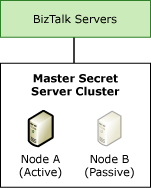

# High Availability for the Master Secret Server
Even if you do not use the Enterprise Single Sign-On (SSO) functionality for mapping credentials and single sign-on, SSO is a critical part of the overall Microsoft BizTalk Server infrastructure, because [!INCLUDE[btsBizTalkServerNoVersion](../includes/btsbiztalkservernoversion-md.md)] uses SSO to help secure information for port configuration. The port configuration data is encrypted and stored in the SSO database. Each BizTalk server has an SSO service (ENTSSO.exe) that is used for encrypting and decrypting the port configuration data.  
  
 When an SSO service starts up, it retrieves the encryption key from the master secret server. This encryption key is called the master secret. The master secret server is another SSO service that has an additional subservice that maintains and distributes the master secret. After a master secret is retrieved, the SSO service caches it. Every 60 seconds, the SSO service synchronizes the master secret with the master secret server.  
  
 If the master secret server fails, and the SSO service detects the failure in one of its refresh intervals, the SSO service and all run-time operations that were running before the server failed, including decryption of credentials, continue successfully. However, you cannot encrypt new credentials or port configuration data. Therefore, the [!INCLUDE[btsBizTalkServerNoVersion](../includes/btsbiztalkservernoversion-md.md)] environment has a dependency on the availability of the master secret server.  
  
## Making the Master Secret Server Available  
 For availability of the SSO system, and therefore of the [!INCLUDE[btsBizTalkServerNoVersion](../includes/btsbiztalkservernoversion-md.md)] environment, it is critical that you back up the master secret as soon as it is generated. If you lose it, you lose the data that the SSO system encrypted by using that master secret. For more information about backing up the master secret, see [How to Back Up the Master Secret](http://go.microsoft.com/fwlink/?LinkID=151934) (<http://go.microsoft.com/fwlink/?LinkID=151934>) in BizTalk Server Help.  
  
 You can make the master secret server available in two ways:  
  
- **Available, but not highly available**. You can create a Microsoft System Center Operations Manager event to notify you when the master secret server becomes unavailable, and you can then manually promote another SSO server to master secret server and restore the master secret on this server.  
  
   Although this configuration is not highly available, it can be satisfactory for most scenarios and it is consistent with scaling out the receiving, sending, and processing hosts.  
  
- **Highly available**. To provide redundancy for the master secret server, use Windows Clustering on a separate master secret server cluster, or configure the master secret server on an existing database cluster. The services provided by the master secret server do not consume many resources, and typically do not affect database functionality or performance when installed on a database cluster. The following figure shows how you can make the master secret server highly available.  
  
     
  
   While this configuration is highly available, it requires additional hardware resources. For more information about high-availability installation options for SSO, see [High-Availability SSO Installation Options](http://go.microsoft.com/fwlink/?LinkId=156838) (http://go.microsoft.com/fwlink/?LinkId=156838) in BizTalk Server Help.  
  
   This section includes detailed information about configuring the SSO master secret server as a highly available cluster resource on a [!INCLUDE[btsWinSvrNoVersion](../includes/btswinsvrnoversion-md.md)] cluster.  
  
  > [!NOTE]
  >  To reduce the hardware resources for a highly available solution, you can add the master secret server as a cluster resource in your [!INCLUDE[btsSQLServerNoVersion](../includes/btssqlservernoversion-md.md)] cluster. Note that you do not need to purchase additional [!INCLUDE[btsBizTalkServerNoVersion](../includes/btsbiztalkservernoversion-md.md)] licenses to install the SSO service on the computer running the SQL Server.  
  
## In This Section  
  
-   [Clustering the Master Secret Server](../technical-guides/clustering-the-master-secret-server.md)  
  
-   [Designating a New Master Secret Server Manually](../technical-guides/designating-a-new-master-secret-server-manually.md)  
  
## See Also  
 [Planning for High Availability2](../technical-guides/planning-for-high-availability2.md)   
 [High Availability for BizTalk Hosts](../technical-guides/high-availability-for-biztalk-hosts.md)   
 [High Availability for Databases](../technical-guides/high-availability-for-databases.md)