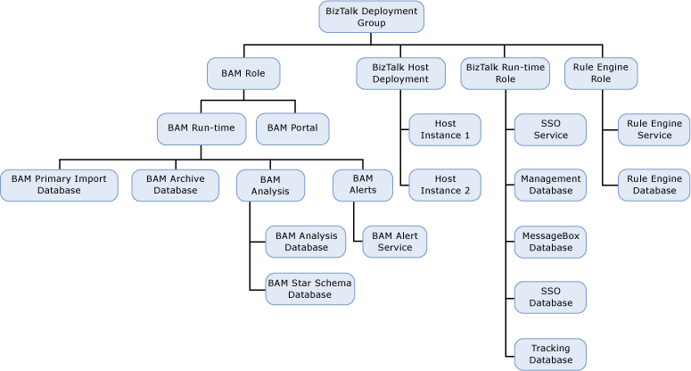
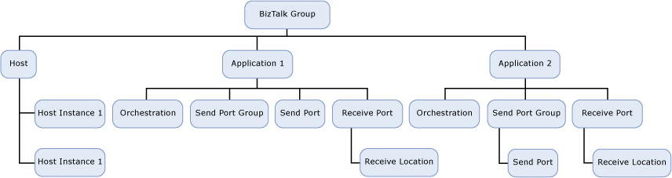

# How Health Rolls Up
The [!INCLUDE[btsBizTalkServerNoVersion](../includes/btsbiztalkservernoversion-md.md)] Management Pack categorizes the BizTalk Server deployment, applications and its constituent artifacts into a layer structure where the health of one layer can depend on the health of the lower level.  
  
-   BizTalk Deployment  
  
-   BizTalk Application  
  
## Health Roll Up for BizTalk Deployment  
 The following diagram shows how the health states of BizTalk Server deployment rolls up in this management pack.  
  
   
  
 The following table describes the components displayed in BizTalk Server deployment workflow diagram.  
  
|Name|Description|Health|  
|----------|-----------------|------------|  
|BizTalk Deployment Group|A group that contains multiple runtime servers with components such as runtime rule engine.|Health of this group depends on the availability of   -   BAM Role -   BizTalk Host deployment -   BizTalk Run-time Role -   Rule Engine Rule|  
|BAM Role|A server on which BAM component is installed.|Health of this depends on the BAM Run-time Role and BAM Portal.|  
|BizTalk Host Deployment|A logical entity defining the runtime parameters or boundaries for the various application artifacts to run. Several instances of this (host instances) run as NT services on different runtime servers.|Health of this group depends on the availability of different instances of this host.|  
|BizTalk Run-time Role|A server where BizTalk Run-time is installed.|Health of this group depends on the availability of   -   SSO Service -   Management Database -   MessageBox Database -   SSO Database -   Tracking Database|  
|Rule Engine Role|A server which has rule engine installed.|Health of this group depends on the availability of Rule Engine Service and Rule Engine Database   -   Rule Engine Service -   Rule Engine Database|  
|BAM Run-time Role|A server on which BAM run-time component is installed.|The health of this depends on the availability of   -   BAM Primary Import Database -   BAM Archive Database -   BAM Analysis -   BAM Alerts|  
|BAM Portal|A Web Server which has BAM portal application installed and configured.|The health of this depends on the availability of BAM portal application.|  
|Host Instance|A Windows NT service configured to run on BizTalk Run-time server.|The health of this is depends on the state of Windows NT service.|  
|SSO Service|A Windows NT service for SSO.|The health of this is depends on the state of SSO service.|  
|Management Database|A SQL Server that contains one or more BizTalk databases.|The health of this is depends on the availability of SQL Server database availability.|  
|MessageBox Database|A SQL Server that contains one or more BizTalk MessageBox databases.|The health of this is depends on the availability of SQL Server database availability.|  
|Rule Engine Service|A Rule Engine Service which is used to process BizTalk rules.|The health of this depends on the availability of Rule Engine Service.|  
|Rule Engine Database|A SQL Server that contains one or more BizTalk Rule Engine databases.|The health of this is depends on the availability of SQL Server database availability.|  
|BAM Primary Import Database|A SQL Server that contains BAM   databases.|The health of this is depends on the availability of SQL Server database availability.|  
|BAM Archive Database|A SQL Server database that contains archived data.|The health of this is depends on the availability of SQL Server database availability.|  
|BAM Analysis|Contains both offline and online BAM analysis data.|The health of this is depends on the availability of BAM analysis data.|  
|BAM Alerts|A SQL notification service.|The health of this is depends on the state of notification service.|  
|BAM Alert Service|A SQL notification service.|The health of this is depends on the state of notification service.|  
|BAM Analysis Database|A SQL Server database that contains both offline and online BAM analysis data.|The health of this is depends on the availability of SQL Server database availability.|  
|BAM Star Schema database|Contains the staging table, and the measure and dimension tables.|The health of this is depends on the availability of SQL Server database availability.|  
|Tracking Database|A SQL Server database that stores health monitoring data tracked by BizTalk Server tracking engine.|The health of this is depends on the availability of SQL Server database availability.|  
|SSO Database|A SQL Server that hosts SSO database.|The health of this is depends on the availability of SQL Server database availability.|  
  
## Health Roll Up for BizTalk Application  
 The following diagram shows how the health states of BizTalk application and its constituent artifacts rolls up in this management pack.  
  
   
  
 The following table describes the components displayed in BizTalk application workflow diagram.  
  
|Name|Description|Health|  
|----------|-----------------|------------|  
|BizTalk Group|A group that contains application artifacts. All these artifacts are stored in a centralized database that is named as configuration database. These artifacts can be discovered from any of the runtime computers.|The health of this group depends on the availability of BizTalk Host and BizTalk applications.|  
|Host|A logical entity defining the runtime parameters or boundaries for the various application artifacts to run. Several instances of this (host instances) run as NT services on different runtime servers.|The health of this group depends on the availability of different instance of this host.|  
|Application|A group of BizTalk application artifacts such as Orchestrations, schemas, maps and pipelines. Messaging components such as send ports, receive locations and receive ports. Instances of these artifacts are run in host instance when a suitable message is received by the BizTalk Server.|The health of this depends on the   -   Configuration status of receive port -   Runtime state of receive port -   Configuration status of send port -   Health of orchestration -   Runtime state of orchestration|  
|Receive Port|A BizTalk artifact that runs in a host instance. This runs when the BizTalk Server receives a message. Receive port contains one or more receive location.|The health of this depends on the configuration status and runtime state of receive port.|  
|Receive Location|A BizTalk artifact that receives message from an external system. This uses an adapter with its associated endpoint to receive a message.|The health of this depends on the configuration status and runtime state of receive location.|  
|Send Port|Sends the processed message to an external system.|The health of this depends on the configuration status and runtime state of send port.|  
|Orchestration|Receives a message from receive port and processes the message. Orchestration is similar to workflow.|The health of this depends on the configuration status and runtime state of orchestration.|  
|Send Port Group|A logical group of send ports that receives message from BizTalk message box and sends it to external systems.|The health of this group depends on the health of the send ports in this group.|