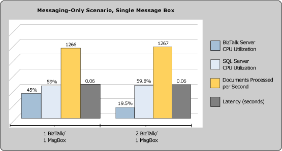
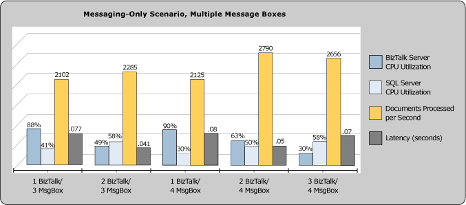
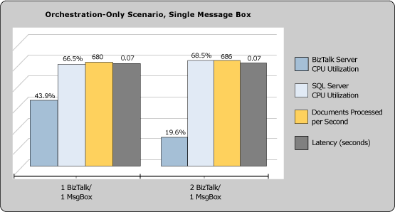
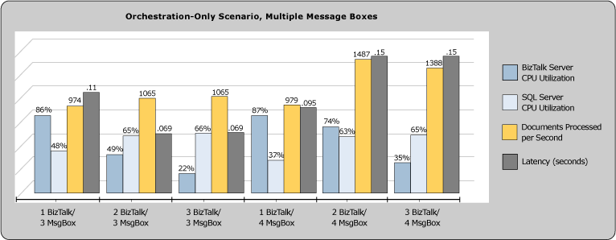

# Key Performance Indicators
This topic provides test results that the BizTalk Server product group observed when using the following scale-out methods:  
  
- Key performance indicators (KPIs) when increasing the number of [!INCLUDE[btsBizTalkServerNoVersion](../includes/btsbiztalkservernoversion-md.md)] computers in a [!INCLUDE[btsBizTalkServerNoVersion](../includes/btsbiztalkservernoversion-md.md)] group. For these tests, only one [!INCLUDE[btsBizTalkServerNoVersion](../includes/btsbiztalkservernoversion-md.md)] MessageBox database was configured for the [!INCLUDE[btsBizTalkServerNoVersion](../includes/btsbiztalkservernoversion-md.md)] group. These tests focused solely on the impact of adding more [!INCLUDE[btsBizTalkServerNoVersion](../includes/btsbiztalkservernoversion-md.md)] computers to a [!INCLUDE[btsBizTalkServerNoVersion](../includes/btsbiztalkservernoversion-md.md)] group.  
  
- KPIs when increasing the number of [!INCLUDE[btsBizTalkServerNoVersion](../includes/btsbiztalkservernoversion-md.md)] MessageBox databases used by the [!INCLUDE[btsBizTalkServerNoVersion](../includes/btsbiztalkservernoversion-md.md)] group. These tests focused solely on the impact of adding more [!INCLUDE[btsBizTalkServerNoVersion](../includes/btsbiztalkservernoversion-md.md)] MessageBox databases to a [!INCLUDE[btsBizTalkServerNoVersion](../includes/btsbiztalkservernoversion-md.md)] group.  
  
- KPIs when increasing the number of both [!INCLUDE[btsBizTalkServerNoVersion](../includes/btsbiztalkservernoversion-md.md)] computers and [!INCLUDE[btsBizTalkServerNoVersion](../includes/btsbiztalkservernoversion-md.md)] MessageBox databases used by the [!INCLUDE[btsBizTalkServerNoVersion](../includes/btsbiztalkservernoversion-md.md)] group. These tests measured the impact of adding both [!INCLUDE[btsBizTalkServerNoVersion](../includes/btsbiztalkservernoversion-md.md)] computers and [!INCLUDE[btsBizTalkServerNoVersion](../includes/btsbiztalkservernoversion-md.md)] MessageBox databases to a [!INCLUDE[btsBizTalkServerNoVersion](../includes/btsbiztalkservernoversion-md.md)] group.  
  
## Analysis of key performance indicators  
  
### Messaging scenario, BizTalk Server scale-out – BizTalk and SQL KPI  
 Adding a second computer running BizTalk Server does not show a significant impact on the  overall throughput.  The load on the BizTalk Server CPU decreases by 25%. The CPU for SQL Server marginally increases from 59% to 59.8% when the second computer running BizTalk Server is added to the BizTalk Server group. Beyond this point, no further performance benefit was gained by increasing the number of BizTalk processing servers.  
  
 Each BizTalk host instance regularly polls the appropriate queue in the MessageBox. Any message that is referenced on the host queue is actually stored within the shared set of tables in the MessageBox. If throughput drops when adding more computers running BizTalk Server, a common cause is too much activity against the shared tables within the MessageBox database. A dedicated I/O path for SQL Server to these tables can be created by assigning these tables to a specific filegroup.  
  
 [Optimizing Filegroups for the Databases2](../technical-guides/optimizing-filegroups-for-the-databases2.md) provides guidance on how to assign tables to specific filegroups. The script included in [BizTalk Server MessageBox Database Filegroups SQL Script](../technical-guides/biztalk-server-messagebox-database-filegroups-sql-script.md) of the guide tells how you can accomplish this. Scaling out to a multiple MessageBox configuration should only be considered after distributing MessageBox objects across multiple filegroups, and after all other SQL-related optimizations have been applied.  
  
 **Percentage of BizTalk Server and SQL Server CPU utilization**  
  
   
  
### Messaging scenario, BizTalk Server and SQL Server scale-out – BizTalk and SQL KPI  
 This test was performed to determine the effectiveness of scaling out the SQL Server tier by adding four MessageBox databases. In this scenario, adding up to two computers running BizTalk Server enabled a maximum sustainable throughput of 2,790 messages per second. This was 118% higher than the maximum obtainable throughput when using only a single MessageBox. Beyond this point, adding more processing power to the BizTalk Server tier degraded performance in a similar fashion to the single MessageBox scenario.  
  
 The key findings from the Messaging scenario tests are that scaling out BizTalk Server is an effective technique to increase overall throughput if contention on SQL Server is not a bottleneck. If the MessageBox database becomes a contention point, first apply the optimizations detailed in [Optimizing Database Performance](../technical-guides/optimizing-database-performance.md), particularly the filegroup optimization script described in [BizTalk Server MessageBox Database Filegroups SQL Script](../technical-guides/biztalk-server-messagebox-database-filegroups-sql-script.md) to distribute I/O load. If you are still unable to achieve your desired throughput, you should consider scaling out by adding more MessageBox databases.  
  
 **Percentage of BizTalk Server and SQL Server CPU utilization**  
  
   
  
### Orchestration scenario, BizTalk Server scale-out – SQL Server and BizTalk Server KPI  
 Adding a second computer running BizTalk Server does not show a significant impact on the  overall throughput. The load on the BizTalk Server CPU decreases by 23 percent. The CPU for SQL Server increases from 66.5 percent to 68.5 percent when an additional computer running BizTalk Server is added.  
  
 **Percentage of BizTalk Server and SQL Server CPU utilization**  
  
   
  
### Orchestration scenario, BizTalk Server and SQL Server scale-out – SQL Server and BizTalk Server KPI  
 This test was performed to determine the effectiveness of scaling out both the BizTalk Server and SQL Server tier by adding more computers running BizTalk Server and more MessageBox databases for the Orchestration scenario. In this scenario, adding up to two computers running BizTalk Server enabled a maximum sustainable throughput of 1,487 orchestrations per second. This was 116% higher than the maximum obtainable result against a single MessageBox. Scaling out to four MessageBox databases on separate SQL Server computers accommodates increased throughput due to additional processing power and the ability to distribute database load across multiple MessageBox databases. This tactic also relieves contention on shared tables, which was a bottleneck in the single MessageBox environment. As with the Messaging scenario, increasing the number of MessageBox databases and distributing these across dedicated SQL instances enables the addition of several BizTalk Server computers to the BizTalk Server group.  
  
 **Percentage of BizTalk Server and SQL Server CPU utilization**  
  
   
  
## See Also  
 [Scaling a Production BizTalk Server Environment](../technical-guides/scaling-a-production-biztalk-server-environment.md)