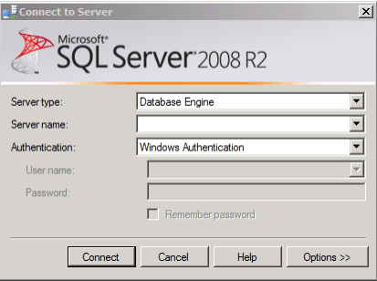
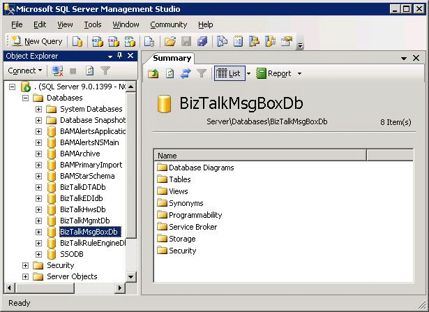
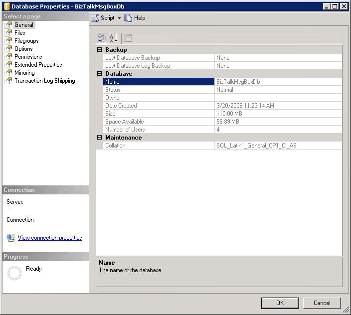
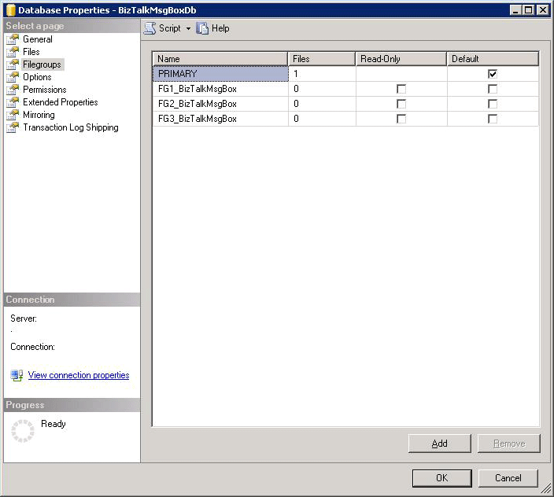
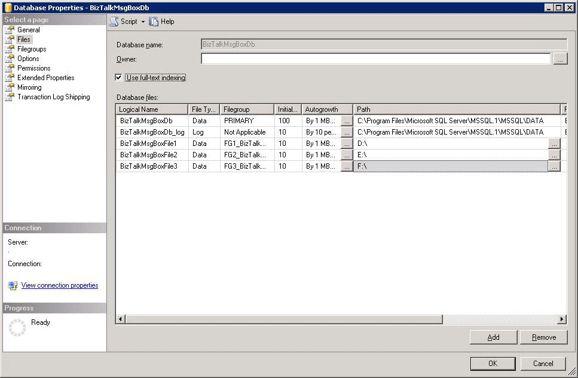

# Optimizing Filegroups for the Databases
File input/output (I/O) contention is frequently a limiting factor, or bottleneck, in a production BizTalk Server environment. BizTalk Server is a very database intensive application and in turn, the SQL Server database used by BizTalk Server is very file I/O intensive. This topic describes how to make optimal use of the files and filegroups feature of SQL Server to minimize the occurrence of file I/O contention and improve the overall performance of a BizTalk Server solution.  
  
## Overview  
 Every BizTalk Server solution will eventually encounter file I/O contention as throughput is increased. The I/O subsystem, or storage engine, is a key component of any relational database. A successful database implementation typically requires careful planning at the early stages of a project. This planning should include consideration of the following issues:  
  
- What type of disk hardware to use, such as RAID (redundant array of independent disks) devices. 
  
- How to apportion data on the disks using files and filegroups. For more information about using files and filegroups in SQL Server, see [Database Files and Filegroups](https://docs.microsoft.com/sql/relational-databases/databases/database-files-and-filegroups).
  
- Implementing the optimal index design for improving performance when accessing data. For more information about designing indexes, see [Designing Indexes](https://docs.microsoft.com/sql/relational-databases/sql-server-index-design-guide).
  
- How to set SQL Server configuration parameters for optimal performance. For more information about setting optimal configuration parameters for SQL Server, see [Server Configuration Options](https://docs.microsoft.com/sql/database-engine/configure-windows/server-configuration-options-sql-server).
  
  One of the primary design goals of BizTalk Server is to ensure that a message is **never** lost. In order to mitigate the possibility of message loss, messages are frequently written to the MessageBox database as the message is processed. When messages are processed by an orchestration, the message is written to the MessageBox database at every persistence point in the orchestration. These persistence points cause the MessageBox to write the message and related state to physical disk. At higher throughputs, this persistence can result in considerable disk contention and can potentially become a bottleneck.  
  
  Making optimal use of the files and filegroups feature in SQL Server has been shown to effectively address File IO bottlenecks and improve overall performance in BizTalk Server solutions.  
  
> [!NOTE]  
>  This optimization should only be done by an experienced SQL Server database administrator and only after all BizTalk Server databases have been properly backed up. This optimization should be performed on all SQL Server computers in the BizTalk Server environment.  
  
 SQL Server files and filegroups can be used to improve database performance because this functionality allows a database to be created across multiple disks, multiple disk controllers, or RAID (redundant array of independent disks) systems. For example, if your computer has four disks, you can create a database that is made up of three data files and one log file, with one file on each disk. As data is accessed, four read/write heads can concurrently access the data in parallel. This speeds up database operations significantly. For more information about implementing hardware solutions for SQL Server disks, see [Database Performance](http://go.microsoft.com/fwlink/?LinkID=71419) (http://go.microsoft.com/fwlink/?LinkID=71419) in the SQL Server Books Online.  
  
 Additionally, files and filegroups enable data placement, because tables can be created in specific filegroups. This improves performance, because all file I/O for a given table can be directed at a specific disk. For example, a heavily used table can be placed on a file in a filegroup, located on one disk, and the other less heavily accessed tables in the database can be located on different files in another filegroup, located on a second disk.  
  
 File I/O bottlenecks are discussed in considerable detail in [Bottlenecks in the Database Tier](../technical-guides/bottlenecks-in-the-database-tier.md). The most common indicator that file I/O (disk I/O) is a bottleneck is the value of the “Physical Disk:Average Disk Queue Length” counter. When the value of the “Physical Disk:Average Disk Queue Length” counter is greater than about 3 for any given disk on any of the computers running SQL Server, then file I/O is likely a bottleneck.  
  
 If applying file or filegroup optimization doesn't resolve a file I/O bottleneck problem, it may be necessary to increase the throughput of the disk subsystem by adding additional physical or SAN drives.  
  
 This topic describes how to manually apply file and filegroup optimizations, but these optimizations can also be scripted. A sample SQL script is provided in [BizTalk Server MessageBox Database Filegroups SQL Script](../technical-guides/biztalk-server-messagebox-database-filegroups-sql-script.md).  
  
> [!NOTE]
>  It is important to note that this script would need to be modified to accommodate the file, filegroup, and disk configuration used by the SQL Server databases for any given BizTalk Server solution.  
> 
> [!NOTE]
>  This topic also describes how to create multiple files and filegroups for the BizTalk MessageBox database. For an exhaustive list of recommended files and filegroups for all of the BizTalk Server databases, see “Appendix B” of the [BizTalk Server Database Optimization](http://go.microsoft.com/fwlink/?LinkID=101578) white paper (http://go.microsoft.com/fwlink/?LinkID=101578).  
> 
> [!NOTE]
>  Even though the [BizTalk Server Database Optimization](http://go.microsoft.com/fwlink/?LinkID=101578) white paper (<http://go.microsoft.com/fwlink/?LinkID=101578>) was written with [!INCLUDE[btsbiztalkserver2006r2](../includes/btsbiztalkserver2006r2-md.md)] in mind, the same principles apply to BizTalk Server.  
  
## Databases created with a default BizTalk Server configuration  
 Depending on which features are enabled when configuring BizTalk Server, up to 13 different databases may be created in SQL Server and all of these databases are created in the default filegroup. The default filegroup for SQL Server is the PRIMARY filegroup unless the default filegroup is changed by using the ALTER DATABASE command. The following table lists the databases that are created in SQL Server if all features are enabled when configuring BizTalk Server.  
  
### BizTalk Server Databases  
  
||||  
|-|-|-|  
|**Database**|**Default Database Name**|**Description**|  
|Configuration database|BizTalkMgmtDb|The central meta-information store for all instances of BizTalk Server in the BizTalk Server group.|  
|BizTalk MessageBox database|BizTalkMsgBoxDb|Stores subscriptions predicates. It is a host platform, and keeps queues and state tables for each BizTalk Server host. The MessageBox database also stores the messages and message properties.|  
|BizTalk Tracking database|BizTalkDTADb|Stores business and health monitoring data tracked by the BizTalk Server tracking engine.|  
|BAM Analysis database|BAMAnalysis|SQL Server Analysis Services database that keeps the aggregated historical data for Business Activities.|  
|BAM Star Schema database|BAMStarSchema|Transforms the data collected from Business Activity Monitoring for OLAP Processing. This database is required when using the BAM Analysis database.|  
|BAM Primary Import database|BAMPrimaryImport|Stores the events from Business Activities and then queries for the progress and data after activity instances. This database also performs real-time aggregations.|  
|BAM Archive database|BAMArchive|Stores subscription predicates. The BAM Archive database minimizes the accumulation of Business Activity data in the BAM Primary Import database.|  
|SSO database|SSODB|Securely stores the configuration information for receive locations. Stores information for SSO affiliate applications, as well as the encrypted user credentials to all the affiliate applications.|  
|Rule Engine database|BizTalkRuleEngineDb|Repository for:   -   Policies, which are sets of related rules. -   Vocabularies, which are collections of user-friendly, domain-specific names for data references in rules.|  
|BizTalk Base EDI database|BizTalkEDIDb|Stores EDI document tracking and processing data.|  
|Human Workflow Services Administration database|BizTalkHwsDb|Stores administrative information required by the BizTalk Human Workflow Services.|  
|Trading Partner Management database|TPM|Stores trading partner data for Business Activity Services (BAS).|  
|Tracking Analysis Server Administration database|BizTalkAnalysisDb|Stores both business and health monitoring OLAP cubes.|  
  
## Separation of data files and log files  
 As noted earlier, a default BizTalk Server configuration places the MessageBox Database into a single file in the default filegroup. By default, the data and transaction logs for the MessageBox database are placed on the same drive and path. This is done to accommodate systems with a single disk. A single file/filegroup/disk configuration is **not optimal** in a production environment. For optimal performance, the data files and log files should be placed on separate disks.  
  
> [!NOTE]  
>  Log files are never part of a filegroup. Log space is managed separately from data space.  
  
## The 80/20 rule of distributing BizTalk Server databases  
 The main source of contention in most BizTalk Server solutions, either because of disk I/O contention or database contention, is the BizTalk Server MessageBox database. This is true in both single and multi-MessageBox scenarios. It is reasonable to assume that as much as 80% of the value of distributing BizTalk databases will be derived from optimizing the MessageBox data files and log file. The sample scenario detailed below is focused on optimizing the data files for a MessageBox database. These steps can then be followed for other databases as needed. For example, if the solution requires extensive tracking, the Tracking database can also be optimized.  
  
## Manually adding files to the MessageBox database, step-by-step  
 This section of the topic describes the steps that can be followed to manually add files to the MessageBox database. In this example three filegroups are added and then a file is added to each filegroup to distribute the files for the MessageBox across multiple disks.
  
### Manually adding files to the MessageBox database on SQL Server
   
1.  Open **SQL Server Management Studio** to display the **Connect to Server** dialog box.  
  
       
  
2.  In the **Server name** edit box of the **Connect to Server** dialog box, enter the name of the SQL Server instance that houses the BizTalk Server MessageBox databases and click **Connect** to display SQL Server Management Studio. In the **Object Explorer** pane of SQL Server Management Studio, expand **Databases** to view the databases for this instance of SQL Server.  
  
       
  
3.  Right-click the database to which to add the files, and then click **Properties** to display the **Database Properties** dialog box for the database.  
  
       
  
4.  In the **Database Properties** dialog box, select the **Filegroups** page. To create additional filegroups for the BizTalkMsgBoxDb databases, click **Add** . In the following example, three additional filegroups are added.  
  
       
  
5.  In the **Database Properties** dialog box, select the **Files** page.  
  
     To create additional files to add to the filegroups, click **Add** , and then click **OK**. The MessageBox database is now distributed across multiple disks, which will provide a significant performance advantage over a single disk configuration.  
  
     In the following example, a file is created for each of the filegroups that were created earlier and each file is placed on a separate disk.  
  
       
  
## Sample SQL script for adding filegroups and files to the BizTalk MessageBox database  
 This guide includes an SQL script for adding filegroups and files to the BizTalk Server MessageBox database.  
  
> [!NOTE]  
>  Because SQL Server writes to its log files sequentially, there is no performance advantage realized by creating multiple log files for a SQL Server database.  
  
 To run this script, follow these steps:  
  
1. Open **SQL Server Management Studio** to display the **Connect to Server** dialog box.  
  
2. In the **Server name** edit box of the **Connect to Server** dialog box, enter the name of the SQL Server instance that houses the BizTalk Server MessageBox databases and click **Connect** to display the SQL Server Management Studio dialog box.  
  
3. In SQL Server Management Studio, click the **File** menu, point to **New**, and then click **Query with Current Connection** to start the SQL Query Editor.  
  
4. Copy the sample script from [BizTalk Server MessageBox Database Filegroups SQL Script](../technical-guides/biztalk-server-messagebox-database-filegroups-sql-script.md) into the Query Editor.  
  
5. Edit the parameters in the script to match your BizTalk Server environment, and execute the script.  
  
   The advantage to scripting is that scripts can perform multiple tasks quickly, can be reproduced precisely, and reduce the possibility of human error. The disadvantage of scripting is that the execution of an incorrectly written script can potentially cause serious problems that could require the BizTalk Server databases to be re-configured from scratch.  
  
> [!IMPORTANT]  
>  It is of utmost importance that SQL scripts such as the sample script in this guide are thoroughly tested before being executed in a production environment.  
  
## See Also  
 [Optimizing Database Performance](../technical-guides/optimizing-database-performance.md)