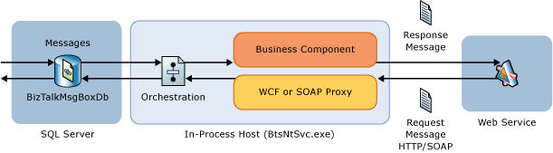

# Optimizing Orchestration Performance
This topic describes best practices for using orchestrations in BizTalk Server solutions. This includes recommendations for:  
  
-   Reducing latency of BizTalk Server solutions that use orchestrations  
  
    -   Eliminating orchestrations for messaging only patterns  
  
    -   Utilizing inline sends from orchestrations  
  
    -   Minimizing orchestration persistence points  
  
-   Nesting orchestrations  
  
-   Orchestration design patterns  
  
-   Orchestration exception handling blocks  
  
## Recommendations for optimizing orchestrations for low latency scenarios  
 The following techniques can be used to reduce latency of BizTalk Server solutions that use orchestrations.  
  
### Eliminate orchestrations for messaging only patterns  
 When possible minimize the use of orchestrations to increase overall throughput and reduce the latency of business processes. If there is no need to run long running transactions and there is no need to invoke several systems for each request, then consider eliminating orchestrations and moving business logic to Receive and Send Ports to reduce the total amount of roundtrips to the BizTalkMsgBoxDb and decrease the latency due to database access. In this case, implement custom pipelines and reuse helper classes that were previously invoked from orchestrations. Use orchestrations only when strictly needed to implement design patterns as Scatter and Gather or Convoys. For more information about Orchestration Design Patterns, see the topic [Implementing Design Patterns in Orchestrations](http://go.microsoft.com/fwlink/?LinkId=140042) (http://go.microsoft.com/fwlink/?LinkId=140042) in the BizTalk Server documentation.  
  
### Use inline sends from orchestrations to accommodate low latency scenarios  
 Whenever possible, minimize the use of orchestrations and favor messaging-only patterns to increase the overall throughput and reduce the latency of the business processes. If there is no need for long-running transactions and there is no need for business logic to invoke several systems, then consider moving business logic to receive and send Ports and eliminating the use of orchestrations. This approach can be implemented with custom pipelines and which reuse the helper classes that were previously invoked from orchestrations. In order to achieve better performance in low latency scenarios, adopt one of the following approaches:  
  
-   Eliminate unnecessary orchestrations and adopt messaging-only patterns to reduce the total amount of roundtrips to the BizTalk MessageBox database. This approach accommodates low latency because inline sends bypass the BizTalk messaging engine and the associated overhead. Orchestration inline send functionality is provided with BizTalk Server 2006 and later.  
  
-   Inside orchestrations, eliminate logical ports bound to physical ports and use in-line sends in their place. For example, an inline send could be used to create an instance of a  WCF proxy class to invoke a downstream Web service or an ADO.NET component to access a SQL Server database. In the following diagram, an inline send is performed when the orchestration instantiates a business component, which internally makes use of a WCF  proxy object to directly invoke a downstream Web service:  
  
       
  
> [!NOTE]
>  Although using inline sends from orchestrations will significantly reduce latency, there are limitations to this approach. Because inline sends bypass the BizTalk messaging engine, the following functionality provided with the messaging engine is not available:  
> 
> - Transactional pipelines  
>   -   Recoverable pipelines  
>   -   Pipelines that call the BAM interceptor API  
>   -   BizTalk Server adapter support  
>   -   Batching  
>   -   Retries  
>   -   Correlation set initialization  
>   -   Declarative configuration  
>   -   Secondary transports  
>   -   Tracking  
>   -   Declarative use of BAM  
  
 For more information about the types of pipelines that cannot be executed from within an orchestration, see the “Restrictions” section of the topic [How to Use Expressions to Execute Pipelines](http://go.microsoft.com/fwlink/?LinkId=158008) (http://go.microsoft.com/fwlink/?LinkId=158008) in the BizTalk Server 2010 documentation.  
  
### Optimize orchestration latency by reducing the number of persistence points, if possible  
 An orchestration scope only needs to be marked as “long-running transactional” if you want to use compensation or scope timeouts. A long-running transactional scope causes an extra persistence point at the end of the scope, so they should be avoided when you don’t need to use compensation or scope timeouts. An atomic scope causes a persistence point at the end of the scope, but also guarantees that no persistence points will occur inside the atomic scope. This side-effect of no persistence inside the scope can sometimes be used to your advantage to batch persistence points (when doing multiple sends, for example). In general, though, we recommend avoiding atomic scopes if possible. The orchestration engine saves to persistent storage the entire state of a running orchestration instance at various points, so that the instance can later be restored in memory and carried out to completion.   
**The number of persistence points in an orchestration is one of the key factors influencing the latency of messages flowing through orchestrations**. Each time the engine hits a persistence point, the internal state of a running orchestration is serialized and saved to the MessageBox and this operation incurs a latency cost. The serialization of the internal state includes all messages and variables instantiated and not yet released in the orchestration. The larger the messages and variables and the greater the number of these, the longer it will take to persist the internal state of an orchestration. An excessive number of persistence points can lead to significant performance degradation. For this reason, we recommend eliminating unnecessary persistence points from orchestrations by reducing the number of transactional scopes and Send shapes. This approach allows decreasing the contention on the MessageBox due to orchestration dehydration and rehydration, increasing the overall scalability, and reducing orchestration latency.   
Another recommendation is to always keep the internal state of an orchestration as small as possible. This technique can significantly reduce the time spent by the XLANG Engine serializing, persisting and restoring the internal state of an orchestration in case of persistence point. One way to achieve this is to create variables and messages as late as possible and release them as early as possible; for example introduce non transactional scopes inside your orchestrations and declare variables and messages within these inner scopes instead of declaring them at the top-most level. For more information about minimizing orchestration persistence points, see the following topics in the BizTalk Server  2010 documentation:  
  
-   [Persistence and the Orchestration Engine](http://go.microsoft.com/fwlink/?LinkID=155292) (http://go.microsoft.com/fwlink/?LinkID=155292).  
  
-   [Orchestration Dehydration and Rehydration](http://go.microsoft.com/fwlink/?LinkID=155284) (http://go.microsoft.com/fwlink/?LinkID=155292).  
  
## Guidelines for using promoted properties to access message tags or attributes from an orchestration  
 If you do need to promote properties, promote only those properties that are used for message routing, filters, and message correlation. The promotion of each property requires the disassembler component (XML, Flat, custom) to recognize the document type and to retrieve data from the message using the XPath expression from the relative annotation contained in the XSD that defines the document type. In addition, each property promotion causes a separate call of the bts_InsertProperty stored procedure when the Message Agent publishes the message to the MessageBox database. If an orchestration needs to access a particular element or attribute contained by an XML document, use one of the following techniques:  
  
- Reduce the number of written and promoted properties and eliminate those that are not strictly necessary.  
  
- Eliminate unnecessary distinguished fields. The distinguished fields are written context properties and they can easily occupy significant space as their name is equal to the XPath expression that is used to retrieve data. The distinguished property is defined as annotations in the XSD that defines the document type. The disassembler component uses the same approach adopted for promoted properties and uses the XPath expression that defines a distinguished field to find it within in the incoming document. Then, the disassembler component writes a property in the context where:  
  
  - **Name**: XPath Expression defined in the annotation.  
  
  - **Value**: Value of the element identified by the XPath expression within an incoming document.  
  
    The XPath Expressions can be very long, especially when the element in question is very deep in the document schema. So, the more distinguished fields, the larger the context size. This in turn adversely affects the overall performance.  
  
- Use the XPath built-in function provided by the orchestration runtime.  
  
- If messages are quite small (a few kilobytes) and XML-formatted, you can de-serialize the message into a .NET class instance and work with public fields and properties. If the message needs a complex elaboration (custom code, Business Rule Engine policies, etc.) accessing data using the properties exposed by an instance of a .NET class is much faster using XPath expressions. When the business logic invoked by the orchestration has completed, the entity object can be serialized back into a BizTalk message. You can create .NET classes from an XML schema using one of the following tools: XSD tool (.NET Framework 2.0) or SVCUTIL (.NET Framework 3.0).  
  
- Enable a helper component from an orchestration. This technique has an advantage over using distinguished fields. In fact, an orchestration may read the XPath expression from a config store (config file, SSO Config Store, custom Db, and so on) so, when you have to change the XPath expression, you do not have to change and redeploy a schema, as you should do for promoted properties and distinguished fields. The following code sample provides an example of a helper component. The component uses the XPathReader class that is provided by the BizTalk runtime. This allows the code to read through the document stream until the XPath expression is found.  
  
```  
#region Copyright  
//===  
//Microsoft Windows Server AppFabric Customer Advisory Team (CAT)   
//  
// This sample is supplemental to the technical guidance published on the community  
// blog.  
//   
// Author: Paolo Salvatori.  
//===  
// Copyright © 2010 Microsoft Corporation. All rights reserved.  
//   
// THIS CODE AND INFORMATION IS PROVIDED "AS IS" WITHOUT WARRANTY OF ANY KIND, EITHER   
// EXPRESSED OR IMPLIED, INCLUDING BUT NOT LIMITED TO THE IMPLIED WARRANTIES OF   
// MERCHANTABILITY AND FITNESS FOR A PARTICULAR PURPOSE. YOU BEAR THE RISK OF USING IT.  
//===  
#endregion  
#region Using Directives  
using System;  
using System.Collections.Generic;  
using System.IO;  
using System.Xml;  
using System.Linq;  
using System.Text;  
using System.Globalization;  
using Microsoft.XLANGs.BaseTypes;   
using Microsoft.BizTalk.Streaming;  
using Microsoft.BizTalk.XPath;  
#endregion  
namespace Microsoft.AppFabric.CAT.Samples.DuplexMEP.Helpers  
{  
public class XPathHelper  
{  
#region Private Constants   
private const string MessageCannotBeNull = "[XPathReader] The message cannot be null.";  
#endregion  
#region Public Static Methods  
public static string GetValue(XLANGMessage message, int partIndex, string xpath)  
{  
try  
{  
if (message == null)  
{  
throw new ApplicationException(MessageCannotBeNull);  
}  
using (Stream stream = message[partIndex].RetrieveAs(typeof(Stream)) as Stream)  
{  
XmlTextReader xmlTextReader = new XmlTextReader(stream);  
XPathCollection xPathCollection = new XPathCollection();  
XPathReader xPathReader = new XPathReader(xmlTextReader, xPathCollection);  
xPathCollection.Add(xpath);  
while (xPathReader.Read())  
{  
if (xPathReader.HasAttributes)  
{  
for (int i = 0; i < xPathReader.AttributeCount; i++)  
{  
xPathReader.MoveToAttribute(i);  
if (xPathReader.Match(xPathCollection[0]))  
{  
return xPathReader.GetAttribute(i);  
}  
}  
}  
if (xPathReader.Match(xPathCollection[0]))  
{  
return xPathReader.ReadString();  
}  
}  
}  
}  
finally  
{  
message.Dispose();  
}  
return string.Empty;  
}  
#endregion  
}  
}  
```  
  
## Minimize orchestration complexity to improve performance  
 The complexity of orchestrations has a significant impact on performance. As orchestration complexity increases, overall performance decreases. Orchestrations can be used in an almost infinite variety of scenarios, and each scenario might involve orchestrations of varying complexity. Avoid complex orchestrations when possible in favor of a modular approach. In other words, split your business logic into multiple, reusable orchestrations.  
  
 If you do need to implement a complex orchestration, define messages and variables into inner scopes whenever possible rather than at the root level. This technique maintains a smaller footprint in memory for each orchestration because variables and messages are disposed of when the flow leaves the scope where the variables and messages were defined. This approach is particularly beneficial when orchestrations are saved to the MessageBox at persistence points.  
  
## Use the Call Orchestration shape versus the Start Orchestration shape to improve performance  
 Avoid the **Start Orchestration** shape and use the **Call Orchestration** shape to execute a nested orchestration. In fact, The **Call Orchestration** shape can be used to synchronously call an orchestration that is referenced in another project. This approach allows for reuse of common orchestration workflow patterns across BizTalk projects. When you invoke another nested orchestration synchronously with the **Call Orchestration** shape, the enclosing orchestration waits for the nested orchestration to finish before continuing. The nested orchestration is executed on the same thread that runs the calling orchestration.  
  
 The **Start Orchestration** shape is similar to the **Call Orchestration** shape, but in this case the nested orchestration is called in an asynchronous manner: the flow of control in the invoking orchestration proceeds beyond the invocation, without waiting for the invoked orchestration to finish its work. In order to implement this decoupling between the caller and the called orchestrations, the **Start Orchestration** is implemented via publication of a message to the BizTalk Messagebox. This message is then consumed by an in-process BizTalk host instance which executes the nested orchestration. When possible, use **Call Orchestration**, especially if the calling orchestration needs to wait for a result from the nested orchestration in order to continue processing.  For more information about using the Call Orchestration shape, see the following topics in the BizTalk Server 2010 documentation:  
  
-   [Working with Direct Bound Ports in Orchestrations](http://go.microsoft.com/fwlink/?LinkId=139902) (http://go.microsoft.com/fwlink/?LinkId=139902).  
  
-   [Nesting Orchestrations](http://go.microsoft.com/fwlink/?LinkId=139903) (http://go.microsoft.com/fwlink/?LinkId=139903).  
  
## Use XmlReader with XLANGMessage versus using XmlReader with XmlDocument to improve orchestration performance  
 To improve orchestration performance for .NET methods called from an orchestration, use XmlReader with XLANGMessage, not XmlDocument. The following code example illustrates this functionality.  
  
```csharp  
// As a general rule, use XmlReader with XLANGMessage, not XmlDocument.   
// This is illustrated in the parameter passed into the following code.   
// The XLANG/s compiler doesn't allow a return value of XmlReader   
// so documents must be initially constructed as XmlDocument()  
public static XmlDocument FromMsg(XLANGMessage old)  
{  
    //get at the data  
    XmlDocument ret = new XmlDocument();  
  
    try{  
        XmlReader reader = (XmlReader)old[0].RetrieveAs(typeof(XmlReader));  
        //construct new message from old  
        //read property  
        object msgid = old.GetPropertyValue(typeof(BTS.MessageID));  
    }  
    finally {  
        // Call Dispose on the XLANGMessage object   
        // because the message doesn't belong to the   
        // .NET runtime - it belongs to the Messagebox database   
        old.Dispose();  
    }  
    return ret;  
}  
```  
  
 Another method would be to create a .NET class based on the schema. This takes less memory than loading the document into an **XmlDocument** object, as well as providing easy access to the schema elements for .NET developers. To generate a class based on a BizTalk schema, you can use the xsd.exe tool provided with Visual Studio. For example, running **xsd.exe \<schema.xsd\> /classes** against a simple schema containing fields named ItemA, ItemB, ItemC, will produce the following class.  
  
```csharp  
//------------------------------------------------------------------------------  
// <auto-generated>  
//     This code was generated by a tool.  
//     Runtime Version:2.0.50727.1433  
//  
//     Changes to this file may cause incorrect behavior and will be lost if  
//     the code is regenerated.  
// </auto-generated>  
//------------------------------------------------------------------------------  
  
using System.Xml.Serialization;  
  
//   
// This source code was auto-generated by xsd, Version=2.0.50727.42.  
//  
  
/// <remarks/>  
[System.CodeDom.Compiler.GeneratedCodeAttribute("xsd", "2.0.50727.42")]  
[System.SerializableAttribute()]  
[System.Diagnostics.DebuggerStepThroughAttribute()]  
[System.ComponentModel.DesignerCategoryAttribute("code")]  
[System.Xml.Serialization.XmlTypeAttribute(AnonymousType=true, Namespace="http://Schemas.MySchema")]  
[System.Xml.Serialization.XmlRootAttribute(Namespace="http://Schemas.MySchema", IsNullable=false)]  
public partial class MySchemaRoot {  
  
    private string itemAField;  
  
    private string itemBField;  
  
    private string itemCField;  
  
    /// <remarks/>  
    [System.Xml.Serialization.XmlElementAttribute(Form=System.Xml.Schema.XmlSchemaForm.Unqualified)]  
    public string ItemA {  
        get {  
            return this.itemAField;  
        }  
        set {  
            this.itemAField = value;  
        }  
    }  
  
    /// <remarks/>  
    [System.Xml.Serialization.XmlElementAttribute(Form=System.Xml.Schema.XmlSchemaForm.Unqualified)]  
    public string ItemB {  
        get {  
            return this.itemBField;  
        }  
        set {  
            this.itemBField = value;  
        }  
    }  
  
    /// <remarks/>  
    [System.Xml.Serialization.XmlElementAttribute(Form=System.Xml.Schema.XmlSchemaForm.Unqualified)]  
    public string ItemC {  
        get {  
            return this.itemCField;  
        }  
        set {  
            this.itemCField = value;  
        }  
    }  
}  
```  
  
 This class can then be referenced in your .NET assembly in order to access the message elements, and the returned object can be directly assigned to a message. The following is an example use of the class generated above.  
  
```csharp  
public static Root SetValues(Microsoft.XLANGs.BaseTypes.XLANGMessage msg)  
{  
   try  
   {  
   MySchemaRoot rootObj=(MySchemaRoot)msg[0].RetrieveAs(typeof(MySchemaRoot);  
   rootObj.ItemA="value a";  
   rootObj.ItemB="value b";  
   rootObj.ItemC="value c";  
   }  
    finally {  
        msg.Dispose();  
            }  
  
   return rootObj;  
}  
```  
  
 This technique allows you to use an object-oriented approach when processing messages. This technique should be used primarily with relatively small messages. This is because even though this technique uses considerably less memory than when loading the message into an **XmlDocument** object, the entire message is still loaded into memory. When processing larger messages, use the **XmlReader** class to read messages and the **XmlWriter** class to write messages. When using **XmlReader** and **XmlWriter**, the message is contained in a **VirtualStream** object. If the message size exceeds the value specified for **Large message threshold (bytes)** that is exposed on the BizTalk Group Properties configuration page, the message is written to the file system. This decreases overall performance, but avoids out of memory exceptions.  
  
## Improve performance by minimizing the use of logical ports bound to physical ports  
 You can increase performance by minimizing the use of logical ports bound to physical ports that use the following adapters:  
  
- SQL Server, Oracle  
  
- WSE, HTTP, WCF  
  
- MSMQ, MQSeries  
  
  In BizTalk Server 2010, send and receive pipelines can be directly invoked from an orchestration using the XLANGPipelineManager class contained in the Microsoft.XLANGs.Pipeline.dll. Thus, the processing of pipelines can be moved from ports to orchestrations; logical ports in an orchestration can be substituted with an Expression shape, which invokes an instance of a given .NET class (for example, a Data Access component using ADO.NET). Before adopting this technique, you should be aware that if you do not use adapters and physical ports, you lose the ability to leverage their functions, such as batching, retries, declarative configuration, and secondary transports.  
  
## Orchestration Design Patterns  
 The Orchestration Designer allows developers to implement a wide range of enterprise integration patterns. Some common patterns include Aggregator, Exception Handling and Compensation, Message Broker, Scatter and Gather, and Sequential and Parallel Convoy. Those patterns can be utilized to develop complex Enterprise Application Integration (EAI), Service-Oriented Architecture (SOA), and Business Process Management (BPM) solutions with BizTalk Server. For more information about Orchestration Design Patterns, see the topic [Implementing Design Patterns in Orchestrations](http://go.microsoft.com/fwlink/?LinkId=140042) (http://go.microsoft.com/fwlink/?LinkId=140042) in the BizTalk Server documentation and [Patterns and Best Practices for Enterprise Integration](http://go.microsoft.com/fwlink/?LinkId=140043) (http://go.microsoft.com/fwlink/?LinkId=140043).  
  
## Make appropriate use of .NET classes in orchestrations to maximize performance  
 In general, the .NET classes used inside an orchestration can be divided into two distinct categories:  
  
-   **Helpers and services -** These classes provide common services to orchestrations such as tracing, error handling, caching, and serialization/deserialization. Most of these classes can be implemented as static classes with no internal state and multiple public static methods. This approach avoids creating multiple objects of the same class in different orchestrations running at the same time, which helps to reduce the working space of host processes and save memory. A class that is stateless helps to reduce the overall size of the internal state that must be serialized and persisted to the BizTalk MessageBox when an orchestration is dehydrated.  
  
-   **Entities and Business Objects -** You can use these classes to manage entities, such as orders, order items, and customers. A single orchestration can internally create and manage multiple instances of the same type. These classes are typically stateful, and expose public fields and/or properties along with methods to modify the internal state of the object. Instances of these classes can be dynamically created by deserializing an XLANGMessage part into a .NET object by using the **XmlSerializer** or the **DataContractSerializer** classes or by using the **XLANGPart.RetrieveAs** method. You should structure an orchestration using non-transactional scopes in such a way that instances of stateful classes are created as late as possible and released as soon as they are no longer needed. This approach reduces the working space of host processes and minimizes the overall size of the internal state that is serialized and persisted to the MessageBox database when an orchestration is dehydrated. For more information about using orchestrations in BizTalk Server, see the article [FAQ for BizTalk Server Orchestrations](http://go.microsoft.com/fwlink/?LinkID=116886) (http://go.microsoft.com/fwlink/?LinkID=116886).  
  
    > [!NOTE]  
    >  While this article is written for BizTalk Server 2004 and BizTalk Server 2006, the concepts presented also apply to BizTalk Server 2010 orchestrations.  
  
## Orchestration Exception Handler Blocks  
 When using Orchestration exception Handler blocks, include all orchestration shapes in one or multiple scopes (non transactional scopes whenever possible) and create at least the following exception handler blocks:  
  
- An exception handler block for handling a generic System.Exception error.  
  
- An exception handler block for handling a general exception in order to catch and handle possible unmanaged errors, such as COM exceptions.  
  
  For more information about using Orchestration exception handling blocks, see the following articles:  
  
- [Using BizTalk Server Exception Handling](http://msdn.microsoft.com/library/aa561229.aspx) (http://msdn.microsoft.com/library/aa561229.aspx).  
  
- [Charles Young Blog, BizTalk Server 2006: The Compensation Model](http://go.microsoft.com/fwlink/?LinkId=158017) (http://go.microsoft.com/fwlink/?LinkId=158017).  
  
  > [!NOTE]
  >  While this blog was written with [!INCLUDE[btsBizTalkServer2006](../includes/btsbiztalkserver2006-md.md)] in mind, the principles described in the blog also apply to BizTalk Server.  
  
## Considerations when using maps in orchestrations  
 The following considerations apply when using maps in orchestrations:  
  
-   If you are using a map to extract or set properties used with business logic in an orchestration, use distinguished fields or promoted properties. This practice should be followed because when extracting or setting values with a map the document is loaded into memory however when using distinguished fields or promoted properties, the orchestration engine accesses the message context and does not load the document into memory.  
  
-   If you are using a map to aggregate several fields into one field, use distinguished fields or promoted properties with an orchestration variable to accumulate the result set.  
  
## See Also  
 [Optimizing Performance](../technical-guides/optimizing-performance.md)