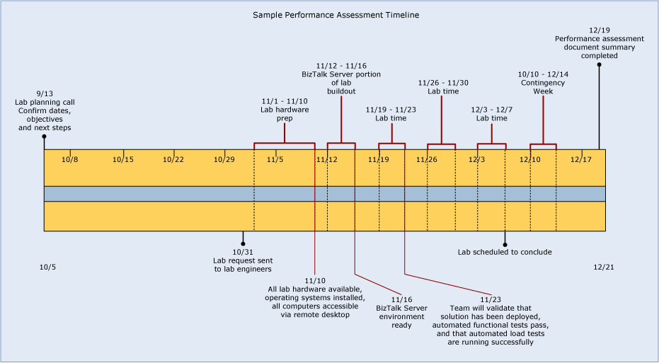

# Phase 2: Planning the Assessment
The Plan phase of a performance assessment largely consists of setting up specific milestones for the completion of the deliverables identified during the Scope phase. The Plan phase is the “when” to the Scope phase’s “what.” Third-party software and physical logistics are “how” and “where” aspects that should also be considered during the planning phase as these aspects may require additional lead time to implement.  
  
 This topic describes the various aspects of the Plan phase of a performance assessment.  
  
## Solution milestones timeline  
 It is important to have a clear and concise record of the milestones for the performance assessment. Setting specific milestones will increase the likelihood that the solution will be completed in a timely manner. Consider creating a Visio timeline to visually represent dates, milestones, and tasks associated with the performance assessment. Keep the timeline simple enough to be easily understood yet detailed enough to communicate milestones effectively. The actual milestones should be agreed upon by all stakeholders and reviewed regularly. A sample Visio timeline is displayed below:  
  
   
Sample performance assessment Visio timeline  
  
> [!NOTE]  
>  For more information about how to create a timeline using Visio 2010, see the article [Project timeline](http://go.microsoft.com/fwlink/?LinkID=208367) HYPERLINK ""  (http://go.microsoft.com/fwlink/?LinkID=208367).  
  
 The following table summarizes the deliverables and other details associated with the milestones in the preceding figure.  
  
|Milestone|Deliverables|Other Details|  
|---------------|------------------|-------------------|  
|Lab planning call|Begin documentation|Confirm objectives defined during scoping, assign dates to deliverables to create task and milestones.|  
|Lab request|Hardware/software diagram and specification|The hardware/software diagram and specification is required by the lab team to procure and build the hardware to the designated software specification.|  
|Lab hardware available|Lab hardware should now be accessible to all stakeholders.|For illustration purposes, it has been assumed that a system build team is available to build out the lab. In reality this may not be the case and responsibility for building out the lab hardware may rest upon one or more of the members of the team participating in the performance assessment.|  
|BizTalk Server environment ready|-   BizTalk Server should be fully deployed and configured. -   The BizTalk Server application to be tested should be fully deployed.||  
|Functional validation of solution completed|All functional flows through the system should be tested at this point.|Ideally this will be done using automated functional testing so that this process can be easily repeated as required.|  
|Lab scheduled to conclude|-   Performance goals should be met at this point -   Documentation should be up to date with all optimization and configuration settings that have been applied so far.||  
|Performance assessment document summary completed|Final lab report is delivered||  
  
## Non-Microsoft software considerations  
 It’s a good practice to be very clear from the beginning about which stakeholders will provide the needed expertise for any third-party software that will be used during the performance assessment. Consider the following when non-Microsoft software will be used with the solution:  
  
-   Determine how the software or hardware required be obtained.  
  
-   Plan for capacity and sizing to ensure that non-Microsoft software does not become a bottleneck in your solution.  
  
-   Determine a plan of action for installing required non-Microsoft software.  
  
-   Create a plan of action for configuring and optimizing required non-Microsoft software.  
  
## Physical space and other logistics  
 Physical space is an important detail to consider during the planning phase. In order to conduct a lab, computers need to exist where they can be accessed and the participants will need space to work and hold discussions. The participants will also benefit from additional space where phone conferences may be held in a less public forum.  
  
 One of the most important aspects of the physical environment for the lab is to create an environment where all participants can comfortably see the same set of screens. This can be accomplished by using overhead projectors through which the team can view remote desktop sessions used during the lab or by shadowing sessions using the “shadow” feature of remote desktop.  
  
 Performance assessment engagements may yield unexpected problems, which will only be compounded by the fact that the engagement is typically on a tight schedule. Because of the sometimes lengthy working days that are required to meet milestones, physical space logistics will become important to the success of the engagement.  
  
 In summary, the following factors should be considered when planning the physical space required for the performance assessment:  
  
-   Lab computers must be accessible to team members.  
  
-   Team members will need space to hold discussions during the lab.  
  
-   Team members should have access to visual media that allows all members to see the same set of screens, typically either an overhead projector tied to a remote desktop screen or by using the “shadow” feature of remote desktop.  
  
-   Team members should have access to a “whiteboard area” which will be used to facilitate discussions during the lab.  
  
-   Team members should have access to space where phone conferences can be held in a less public forum.  
  
-   If possible, the lab area should be climate controlled during extended hours, this will accommodate off hours access if required.  
  
-   Everyone will likely still need to communicate with their day jobs, so allow enough table space for both client computers and personal laptops, 2 for each participant.  
  
-   Ensure that enough power strips and network connections are available in the lab. If wireless is used, arrange guest access for participants.  
  
-   Ensure that the lab environment will be secure during off hours.  
  
## See Also  
 [Phases of a Performance Assessment](../technical-guides/phases-of-a-performance-assessment.md)