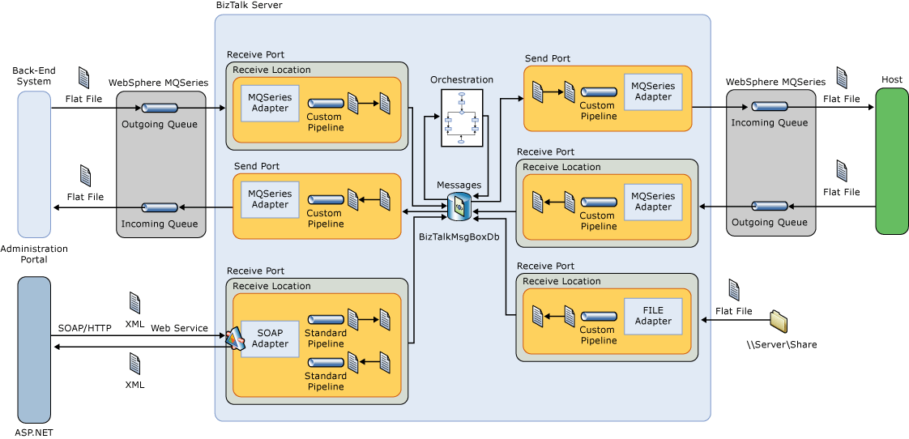
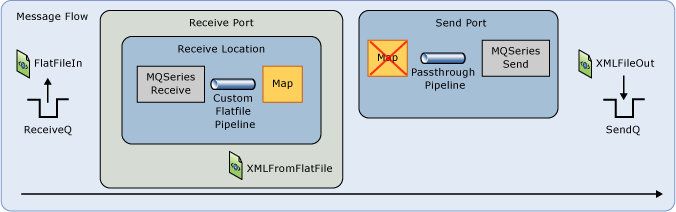

# Phase 3: Preparing for the Assessment
The Prepare phase of a performance assessment can be thought of as the “how” to the Scope phase’s “what” and the Plan phase’s “when.” At this point in the performance assessment, all stakeholders should have agreed upon the scope of the engagement and the plans for conducting the lab. It is in the Prepare phase of the performance assessment where the plans are executed and steps are taken to get ready for execution of the performance lab.  
  
 This topic describes the various aspects of the Prepare phase of a BizTalk Server performance assessment.  
  
## Detailed design of the solution platform  
 A detailed solution design facilitates communications and avoids assumptions, which will improve the agility and effectiveness of all activities. You should fully document the following elements:  
  
-   **BizTalk Server databases and how they will be distributed across computers** - SQL Server performance is one of the key factors in overall BizTalk Server performance. If SQL Server is experiencing resource constraints, this will impact the ability of BizTalk Server to process messages. The main factor that influences BizTalk database performance is the speed of disks that they are hosted on. Separating the transaction log and database files for each BizTalk database onto separate drives or SAN LUN’s has been shown to remarkably improve the overall performance of BizTalk Server. Therefore, it is important that this information be recorded in an easily accessible manner. The values that will be used in the production environment should be documented in the detailed solution design. The following table provides an example of how this can be done.  
  
    |BizTalk Database|Volume Name|Files|LUN# or ML_#|Physical LUN Size (GB)|  
    |----------------------|-----------------|-----------|---------------------|------------------------------|  
    |MessageBox|Data_TempDb_1|TEMPDB,  MASTER, and MSDB data files|1|134|  
    ||Logs_TempDb_1|TEMPDB,  MASTER, and MSDB transaction log files|2|134|  
    ||Data_BtsMsgBox|BizTalkMsgBoxDb data file|3|134|  
    ||Logs_BtsMsgBox|BizTalkMsgBoxDb transaction log file|4|134|  
    |BAM|Data_TempDb_2|TEMPDB, MASTER, and MSDB data files|5|67|  
    ||Logs_TempDb_2|TEMPDB, MASTER, and MSDB transaction log files|6|67|  
    ||Data_BAM|BAMPrimaryImport data file|7|134|  
    ||Logs_BAM|BAMPrimaryImport transaction log file|8|134|  
    |BizTalk Tracking, Management, Single Sign-On, and Rule Engine databases|Data_TempDb_3|TEMPDB,  MASTER, MSDB, BizTalkDTADb, BizTalkMgmtDb, ENTSSO, and BizTalkRuleEngineDb data files|9|67|  
    ||Logs_TempDb_3|TEMPDB,  MASTER, MSDB, BizTalkDTADb, BizTalkMgmtDb, ENTSSO, and BizTalkRuleEngineDb transaction log files|10|67|  
  
-   **BizTalk Host design and descriptions of each host and their instances.**  
  
-   **Description of each orchestration.**  
  
-   **Description of each pipeline.**  
  
-   **Description of custom components such as .NET assemblies and COM+ components.**  
  
## Detailed architecture diagram  
 The following diagram illustrates an architecture diagram that could be used for a performance assessment.  
  
   
BizTalk Architecture Diagram  
  
## Message flow diagrams  
 Create detailed message flow diagrams to help prevent confusion or false assumptions regarding what is supposed to be happening to messages during processing.  
  
 When thinking about a BizTalk solution holistically, we tend to think of the message flow through the system. This Message Flow perspective is especially important when doing performance testing because all parts of the flow must be considered as potential bottlenecks. Having a message flow diagram prevents any confusion or false assumptions regarding what is supposed to be happening to messages during each test run.  
  
 In the following example, created using simple Visio shapes, everyone on the project regardless of background can quickly understand how a message gets into the system, what parts of the solutions interact with the message, and finally where the message lands after processing.  
  
   
Message Flow Diagram  
  
 The following details should be considered when creating the message flow diagrams:  
  
-   Describe the lifecycle of each type of message from the time it arrives at a receive location until all resulting messages are sent and all related processing is completed.  
  
-   Describe how processing changes for error conditions.  
  
-   Include details about correlation, delivery notifications, and acknowledgements.  
  
-   Include details about dependence on external systems.  
  
-   Include performance requirement information regarding latency and throughput.  
  
## Third-party software details  
 All non-Microsoft software that is used should be fully documented as part of the detailed solution design.  
  
## Detailed lab hardware stack  
 Building on the previously created high-level hardware diagram, the following hardware information should be fully documented:  
  
-   Processors  
  
    -   Type  
  
    -   Speed  
  
    -   Number of cores  
  
    -   Hyperthreading  
  
-   Memory  
  
    -   Amount  
  
    -   Speed  
  
    -   Parity  
  
-   Network  
  
    -   Number of network interface cards (NICs)  
  
    -   Speed of network  
  
-   SAN  
  
    -   Number of SAN cards in each computer  
  
    -   Number of logical unit numbers (LUNs) for each computer and purpose for each LUN  
  
    -   Speed of storage area network (SAN) Cards  
  
    -   SAN card configuration details  
  
    -   SAN disk allocation, formatting, and partitioning  
  
-   Disk  
  
    -   Local disk details for each computer  
  
    -   Formatting used for local disks  
  
    -   Partitioning details for local disks  
  
-   Cache  
  
    -   L2 Cache amount  
  
    -   L3 Cache amount  
  
## Detailed lab software stack  
 The following software information should be documented:  
  
-   Specific operating system versions, editions, and architecture  
  
-   Specific operating system features  
  
-   Specific software installed on each computer  
  
-   Specific drivers  
  
-   Service Packs and other updates  
  
-   Configuration values for all software and operating system features used if they vary from default values  
  
## See Also  
 [Phases of a Performance Assessment](../technical-guides/phases-of-a-performance-assessment.md)