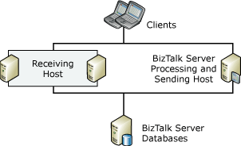
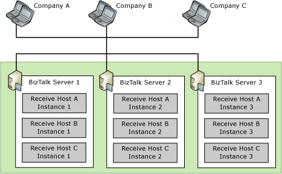
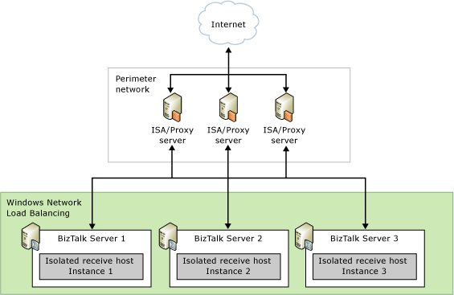

# Scaling Out Receiving Hosts
To make receiving hosts highly available, you must have two or more [!INCLUDE[btsBizTalkServerNoVersion](../includes/btsbiztalkservernoversion-md.md)] computers that are running instances of each receiving host. By scaling out the receiving hosts you can increase the availability for BizTalk Server deployments that are messaging-intensive. While these deployments might perform minimal processing for orchestrations, they can route many messages of varying types with great speed and reliability.  
  
 You can enhance security and scalability in your environment by separating the receiving host from the hosts that process orchestrations and send messages because you can secure and scale each host independently of other hosts. For example, you can add two computers (host instances) to the receiving host without adding any computers to the processing or sending hosts.  
  
## Understanding In-Process and Isolated Receiving Hosts  
 [!INCLUDE[btsBizTalkServerNoVersion](../includes/btsbiztalkservernoversion-md.md)] integrates applications to provide business services. The integration is usually represented as [!INCLUDE[btsBizTalkServerNoVersion](../includes/btsbiztalkservernoversion-md.md)] receives a document (from an application), processes the document, and sends the processed document back to the application or to another application. The process is called a document transaction.  
  
 A transaction usually starts with a BizTalk adapter monitoring a certain protocol channel and receiving a document. The *adapter* is so called because it connects other applications to [!INCLUDE[btsBizTalkServerNoVersion](../includes/btsbiztalkservernoversion-md.md)]. Based on its function, it can be a send adapter or a receive adapter. Most of the default adapters are one .NET component with both the receive function and send function built into one .NET assembly. Based on the process memory space in which an adapter resides, it is either an in-process (receive) adapter or an isolated (receive) adapter. An in-process adapter can only be hosted by the [!INCLUDE[btsBizTalkServerNoVersion](../includes/btsbiztalkservernoversion-md.md)] process (BTSNTSvc.exe), and an isolated adapter is designed to be hosted by another process. For example, the HTTP adapter and the SOAP adapter are hosted by the Internet Information Services (IIS) process. They are essentially ISAPI extensions. On the other hand, all of the send adapters are in-process adapters.  
  
 [!INCLUDE[btsBizTalkServerNoVersion](../includes/btsbiztalkservernoversion-md.md)] Configuration creates two default hosts—the in-process host is called BizTalkServerApplication, and the isolated host is called BizTalkServerIsolatedHost. A host serves two functions: one is logically grouping the [!INCLUDE[btsBizTalkServerNoVersion](../includes/btsbiztalkservernoversion-md.md)] items so these items can be assigned to different [!INCLUDE[btsBizTalkServerNoVersion](../includes/btsbiztalkservernoversion-md.md)] processes, and the other is controlling security. You need to specify a Windows group for a host. Only the users in this group can send documents to the adapters hosted by the *host instances* assigned to this host.  
  
 Each of the two default hosts has a host instance. A host instance does not have a name, but is associated with a host. The BizTalkServerApplication host instance is actually the [!INCLUDE[btsBizTalkServerNoVersion](../includes/btsbiztalkservernoversion-md.md)] service process (BTSNTSvc.exe) on a [!INCLUDE[btsBizTalkServerNoVersion](../includes/btsbiztalkservernoversion-md.md)] computer within the BizTalk group. The BizTalkServerIsolatedHost host instance is not directly bound to a process. It is associated with the process that hosts the receive adapter.  
  
 [!INCLUDE[btsBizTalkServerNoVersion](../includes/btsbiztalkservernoversion-md.md)] Configuration also creates a *receive handler* for each of the default adapters with the exception of SMTP (SMTP is a send adapter). One of the receive handler properties is host name. That is how it is bound to a host and the host instances of that host.  
  
 In addition to an adapter, host, host instance, and receive handler, you need to configure a receive port before [!INCLUDE[btsBizTalkServerNoVersion](../includes/btsbiztalkservernoversion-md.md)] can start receiving documents. A receive port contains receive locations. A receive location has a receive handler property. Following the logic, you can trace to the [!INCLUDE[btsBizTalkServerNoVersion](../includes/btsbiztalkservernoversion-md.md)] process that processes this receive port.  
  
 In the receive port configuration, you optionally specify maps. In the receive location configuration, you must specify a pipeline used for document preprocessing. The designated [!INCLUDE[btsBizTalkServerNoVersion](../includes/btsbiztalkservernoversion-md.md)] process handles everything from receiving a document, to preprocessing the document, to mapping the document. This is the same for both in-process host instances and isolated host instances.  
  
## Scaling Out In-Process Receiving Hosts  
 The following figure shows a BizTalk Server deployment that provides high availability for the receiving host by having two host instances each on a different computer. Note that in this figure the processing and sending host is not highly available, because there is only one host instance processing the BizTalk items assigned to the host.  
  
   
  
 For large deployments, for scenarios dealing with multiple trading partners, and for scenarios when you use different protocols, you can spread out the receiving functionality across multiple receiving hosts. For example, you can create a host for receiving messages for each adapter, or different hosts for receiving messages from different partners. When you create multiple receiving hosts you can create security boundaries and ease the manageability and scalability of your environment; however, it does not make your environment highly available. To make your environment highly available, you must create two or more host instances for each receiving host that you create. For example, you can create three different receiving hosts (A, B, and C) to receive messages from three different companies. To make each of these hosts highly available you then create host instances of each of these hosts in two or more computers. Note that you can have instances of each host on one computer without losing the security boundary, manageability, or scalability.  
  
 The following figure shows a highly available three-computer [!INCLUDE[btsBizTalkServerNoVersion](../includes/btsbiztalkservernoversion-md.md)] environment with hosts dedicated to receiving messages from different companies.  
  
   
  
 To provide high availability in this configuration, each computer runs three host instances: one instance for each of the three companies. The host instances for each company contain the receive locations and pipelines to communicate with that company. During typical operations, as long as you have done the necessary work for scale-out in front of the receive adapters, the messaging load is distributed among the three host instances for each host. If a host instance on one computer fails, the host instances running on the other two computers provide redundancy and maintain service availability.  
  
## Scaling Out Isolated Receiving Hosts  
 Besides host instances, the process of scaling and providing high availability for the receiving hosts also depends on the specific adapters that you implement in your deployment. Each adapter has protocol-specific characteristics that make planning and deployment different in each case. However, BizTalk Server lets you apply the same high-availability solution for all adapters, primarily through additional computers and host instances.  
  
 Depending on the specific protocol being used, some receive adapters require an additional mechanism for distributing incoming messages among multiple host computers to provide high availability. For example, BizTalk Server solutions that use the HTTP or SOAP adapter (otherwise known as the Web services adapter) require a load balancer such as Network Load Balancing (NLB) to distribute the receiving workload, as shown in the following figure.  
  
   
  
 For more information about the high-availability guidelines for the most common adapters in [!INCLUDE[btsBizTalkServerNoVersion](../includes/btsbiztalkservernoversion-md.md)], see "Scaling the BizTalk Server Receive Adapters" section in [Scaled-Out Receiving Hosts](http://go.microsoft.com/fwlink/?LinkId=151283) (<http://go.microsoft.com/fwlink/?LinkId=151283>) in BizTalk Server Help.  
  
## See Also  
 [Clustering Receiving Hosts](../technical-guides/clustering-receiving-hosts.md)   
 [Scaling Out Processing Hosts](../technical-guides/scaling-out-processing-hosts.md)   
 [Scaling Out Sending Hosts](../technical-guides/scaling-out-sending-hosts.md)