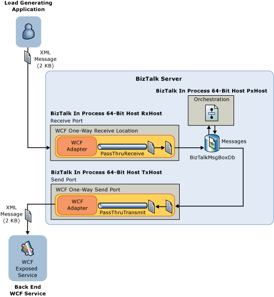
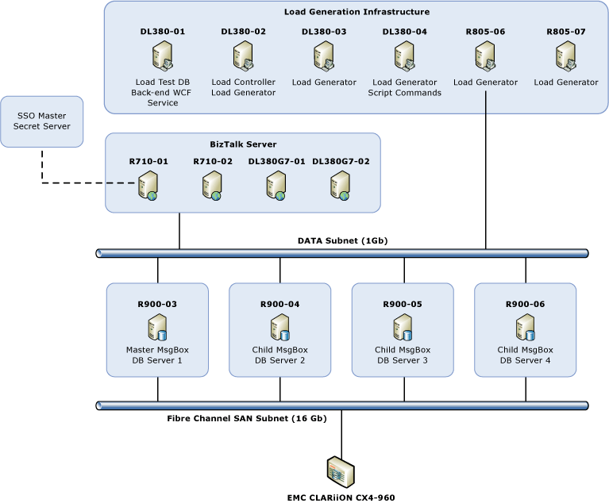
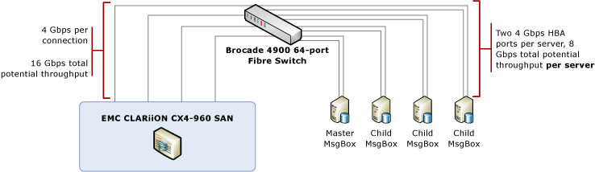

# Scenario Overview
This topic provides an overview of load testing completed by the BizTalk Server product group to assess scalability of BizTalk Server when running on modern enterprise class hardware.  

 All testing was performed in an isolated environment using dedicated hardware. Over 200 test runs were performed and all results were validated by the BizTalk Server product group.  

 Tests were performed using a Messaging  scenario and an Orchestration scenario; both scenarios utilized the BizTalk WCF-NetTcp adapter.  

 To evaluate the maximum possible performance of the BizTalk Server engine, no custom pipeline components were used; and only a single, very simple orchestration was used for the Orchestration scenario. Performance optimizations described in [Optimizing Performance](../technical-guides/optimizing-performance.md) were applied to the environment, and are fully documented in [Observations and Recommendations](../technical-guides/observations-and-recommendations.md).  

## Test Goals  
 The goals of the load testing performed included the following:  

1.  Provide general sizing and scaling guidance for BizTalk Server:  

    1.  Quantify the impact of adding additional computers to the BizTalk Server group. For this testing, the performance of a BizTalk Server solution was measured when the BizTalk Server group was running one, two, three, and four computers running BizTalk Server.  

    2.  Quantify the impact of adding additional BizTalk MessageBox databases to a BizTalk Server group. For this testing, the performance of a BizTalk Server solution was measured when the group was configured to use either a single MessageBox database or four MessageBox databases.  

        > [!NOTE]  
        >  Testing with two MessageBox databases was not done because there is little, if any, performance advantage when scaling from one to two MessageBox databases. In fact, scaling from one to two MessageBox databases can adversely affect performance. For more information about scaling out the MessageBox, see [Scaling Out the SQL Server Tier](../core/scaling-up-the-sql-server-tier.md).

2.  Provide sizing and scaling guidance for the following scenarios:  

    1.  WCF-NetTcp one-way Messaging  scenario  

    2.  WCF-NetTcp one-way Orchestration scenario  

## Test Measurements Used  
BizTalk Server performance was measured using the following criteria:  

1.  **Overall throughput** –Measured with the **BizTalk:Messaging(*hostname*)\Documents received/Sec** and **BizTalk:Messaging(*hostname*)\Documents processed/Sec** performance counters for the BizTalk Server receive and processing hosts.  

2.  **CPU utilization** – measured with the **\Processor(_Total)\\%Processor Time** performance counters on the BizTalk Server] and SQL Server computers. All test results were comprehensively reviewed and any performance bottlenecks are described in [Observations and Recommendations](../technical-guides/observations-and-recommendations.md).  

## Scaling out the processing tier and the database tier  
BizTalk Server easily accommodates increased processing tier capabilities by adding one or more BizTalk Server computers to an existing BizTalk Server group. BizTalk Server accommodates increased database tier capabilities through the addition of MessageBox databases.  

To provide scale out metrics for BizTalk Server, tests were performed with one, two, three, and fourBizTalk Server computers. To demonstrate the impact of scaling out the database tier, these tests were performed against both single and multi-MessageBox systems.  

## Testing scenarios  
 The flow of messages through the BizTalk Server environment for these scenarios is described in detail below.  

### Messaging test scenario  
   

1.  The Visual Studio 2010 Ultimate edition load testing functionality generates an XML message and sends it to the computer running BizTalk Server with the NetTcp transport.  

    > [!NOTE]  
    >  For more information about Visual Studio 2010 Ultimate edition load testing, see  HYPERLINK ""  [Testing the Application](http://go.microsoft.com/fwlink/?LinkID=208247) (http://go.microsoft.com/fwlink/?LinkID=208247).  
    >   
    >  For more information about how we used the Visual Studio 2010 Ultimate edition load testing functionality in our test environment, see [Using Visual Studio to Facilitate Automated Testing](../technical-guides/using-visual-studio-to-facilitate-automated-testing.md).  

2.  The XML message is received by a BizTalk Server receive location that uses the WCF-NetTcp receive adapter. The receive location is configured to use the PassThruReceive pipeline, which performs no processing of the message.  

3.  The BizTalk Server end point manager (EPM) publishes the message to the BizTalk MessageBox database.  

4.  A BizTalk Server send port that uses the WCF-NetTcp send adapter subscribes to messages published by the receive location and retrieves the message from the BizTalk MessageBox. The send port uses the PassThruTransmit pipeline, which performs no processing of the message.  

5.  The message is delivered to the back end WCF service by the WCF-NetTcp send adapter.  

### Orchestration test scenario  
   

1.  The Visual Studio 2010 Ultimate edition load testing functionality generates an XML message and sends it to the computer running BizTalk Server using the NetTcp transport.  

2.  The XML message is received by a BizTalk Server receive port that uses the WCF-NetTcp receive adapter. The receive port is configured to use the PassThruReceive, pipeline which performs no processing of the message.  

3.  The message is delivered to a simple Orchestration, which consists only of a receive port (bound to the WCF receive port from step 2) and a send port (bound to the WCF send port from step 4). Message variables are “un-typed”, meaning that they use a “Message Type” of “System.XML.XmlDocument”. The orchestration just receives the message through its receive port and sends the message through its send port. No message processing is performed.  

4.  A one-way BizTalk Server send port that uses the WCF-NetTcp send adapter subscribes to messages published by the orchestration and retrieves the message from the BizTalk MessageBox. The send port uses the PassThruTransmit pipeline, which performs no processing of the message.  

5.  The message is delivered to the back end WCF service by the WCF-NetTcp send adapter.  

## Hardware configuration  

### Lab hardware diagram and specifications  
 The hardware configuration used for the lab is illustrated below. To easily accommodate scale out of the processing and database tiers, the following lab hardware was used:  

- Two Enterprise class Hewlett Packard DL-380 computers and two Enterprise class Dell R710 computers for the BizTalk Server processing tier.  

- Four Enterprise class Dell R900 computers for the database tier, to provide multi-MessageBox capability.  

  A diagram of the hardware used in the lab is provided below:  

    

  The following table provides more specific information about the hardware used in the lab.  

|Name|Model|CPU type|Number of CPUs|Number of cores/CPU|CPU architecture|Memory|Operating System|Software|  
|----------|-----------|--------------|--------------------|--------------------------|----------------------|------------|----------------------|--------------|  
|R710-01|Dell PowerEdge R710|Intel Xeon X5570|2 x 2.93 GHz|4|x64|72 GB|Windows Server 2008 R2 Enterprise Edition|BizTalk Server|  
|R710-02|Dell PowerEdge R710|Intel Xeon X5570|2 x 2.93 GHz|4|x64|72 GB|Windows Server 2008 R2 Enterprise Edition|BizTalk Server|  
|DL380G7-01|Hewlett Packard DL380 G7|Intel Xeon X5670|2 x 2.93 GHz|6|x64|192 GB|Windows Server 2008 R2 Enterprise Edition|BizTalk Server|  
|DL380G7-02|Hewlett Packard DL380 G7|Intel Xeon X5670|2 x 2.93 GHz|6|x64|192 GB|Windows Server 2008 R2 Enterprise Edition|BizTalk Server|  
|DL380-01|Hewlett Packard DL380|Intel Xeon 5150|2 x 2.66 GHz|2|x64|8 GB|Windows Server 2008 R2 Enterprise Edition|SQL Server 2008 R2 Load Test DB   Visual Studio 2010   WCF back-end service|  
|DL380-02|Hewlett Packard DL380|Intel Xeon E5335|2 x 2.00 GHz|4|x64|8 GB|Windows Server 2008 R2 Enterprise Edition|Visual Studio 2010 Load Test Controller|  
|DL380-03|Hewlett Packard DL380|Intel Xeon E5335|2 x 2.00 GHz|4|x64|8 GB|Windows Server 2008 R2 Enterprise Edition|Visual Studio 2010 Load Test Agent|  
|DL380-04|Hewlett Packard DL380|Intel Xeon E5335|2 x 2.00 GHz|4|x64|8 GB|Windows Server 2008 R2 Enterprise Edition|Visual Studio 2010 Load Test Agent.   Perfmon Command-line|  
|R805-06|Dell PowerEdge R805|AMD Quad-Core Opteron 2354|2 x 2.2 GHz|4|x64|32 GB|Windows Server 2008 R2 Enterprise Edition|Visual Studio 2010 Load Test Agent|  
|R805-07|Dell PowerEdge R805|AMD Quad-Core Opteron 2354|2 x 2.2 GHz|4|x64|32 GB|Windows Server 2008 R2 Enterprise Edition|Visual Studio 2010 Load Test Agent|  
|R900-03|Dell PowerEdge R900|Intel Xeon E7330|4 x 2.4 GHz|4|x64|64 GB|Windows Server 2008 R2 Enterprise Edition|SQL Server 2008 R2 with Cumulative Update 4|  
|R900-04|Dell PowerEdge R900|Intel Xeon E7330|4 x 2.4 GHz|4|x64|64 GB|Windows Server 2008 R2 Enterprise Edition|SQL Server 2008 R2 with Cumulative Update 4|  
|R900-05|Dell PowerEdge R900|Intel Xeon E7330|4 x 2.4 GHz|4|x64|64 GB|Windows Server 2008 R2 Enterprise Edition|SQL Server 2008 R2 with Cumulative Update 4|  
|R900-06|Dell PowerEdge R900|Intel Xeon E7330|4 x 2.4 GHz|4|x64|64 GB|Windows Server 2008 R2 Enterprise Edition|SQL Server 2008 R2 with Cumulative Update 4|  

### Storage area network configuration  
 The following diagram depicts the storage area network (SAN) configuration used for the lab environment.  

   

### EMC CLARiiON CX4-960 SAN configuration  

|Service processor and Cache information|LUN configuration|  
|---------------------------------------------|-----------------------|  
|Two Service Processors, each with:   -   Read cache size: 2000 MB. -   Write cache size: 8000 MB. -   Two front-end ports attached to the fiber switch. 4 Gbps per port.|-   64 disks (268 GB, 15k RPM, Fiber Channel, Seagate. -   Eight 8-disk RAID 1+0 Groups carved from these 64 disks. -   Each DB server was assigned 5 MetaLUNs configured evenly from these RAID Groups.|  

 It is important to determine the maximum attainable throughput of a SAN and compare this value to the expected load against the SAN in production. This will help prevent unanticipated expenditures for SAN-related hardware when moving your application from a test/quality assurance (QA) environment into a production environment. For example, the maximum available throughput for the SAN may be more than sufficient for your application in a sandboxed test environment. However, if other server applications will use the SAN in production, available SAN throughput may be insufficient and could become a bottleneck.  

 When evaluating performance of your SAN, consider the following:  

1. **What is the maximum attainable throughput of the SAN?** – This is measured using the lowest common denominator, in terms of throughput, of the host bus adapter (HBA) in the server, the Switch-SAN throughput, and the speed of the SAN controller cards.  

2. **What other applications will use the SAN in production?** – Consider what other applications will make use of the SAN in the production environment. If other database or otherwise I/O intensive applications such as Exchange Server will use the SAN in production, the amount of SAN throughput available for your computer running BizTalk Server will be reduced accordingly.  

   For the lab environment, a dedicated SAN was used. Each of the four SQL Server computers was connected to the SAN switch with two 4-Gbps host bus adapters (HBAs), providing a total potential throughput of 8-Gbps per server. The SAN had two service processors, and each service processor had two front-end ports attached to the fiber switch, providing a total potential throughput of 16-Gbps between the SAN and the switch.  

   The following LUN configuration was used for each of the four computers running SQL Server in the test environment.  

|Drive letter|Volume name|Files|LUN size (GB)|  
|------------------|-----------------|-----------|---------------------|  
|C|Local C drive|MASTER,MSDB, and MODEL|136|  
|H|Data_Tempdb|TempDB data files|50|  
|I|Logs_Tempdb|TempDB log files|50|  
|J|Data_BtsMsgBox|BizTalk MsgBoxDB data files + (on the Master MsgBox) Mgmt DB, SSO DB, DTA DB data files|120|  
|K|Logs_BtsMsgBox|BizTalk MsgBoxDB log files + (on the Master MsgBox) Mgmt DB, SSO DB, DTA DB log files|120|  
|O|Logs_Spare|Not used for SQL files. Used to store DTCLog file, as MSDTC cause frequent disk I/O, especially in a multi-MessageBox environment.|20|  

### SQLIO test results  
 We used the SQLIO tool to benchmark and measure the Input/Output capacity of the storage area network (SAN) configuration used in our lab environment. As the name of the tool implies, SQLIO is a valuable tool for measuring the impact of file system I/O on SQL Server performance. 

To measure Input/Output capacity of the storage area network (SAN) configuration for SQL Server database applications, see [Analyzing I/O Characteristics and Sizing Storage Systems for SQL Server Database Applications](https://msdn.microsoft.com/library/ee410782(SQL.100).aspx).  

 For our SQLIO test, the sqlio.exe utility issues 8K read requests from 8 threads and maintain an I/O queue depth of 8. We used the following parameters:  

- All tests used 8 processing threads, each running for 60 seconds.  

- 8kb random writes to the data files.  

- 8kb random reads to the data files.  

- All files are sized at 25 GB.  

- The disk drives to be benchmarked are H:, I:, J:, and  K drive.  

  The SQLIO command lines used are follows:  

- **For reads**: sqlio -kR -s60 -frandom -o8 -t8 -b8 -LS -FParam.txt  

- **For writes**: sqlio -kW -s60 -frandom -o8 -t8 -b8 -LS -FParam.txt  

  The Param.txt file contains the following:  

- **Number of drives:** H:,I:,J:, and K  

- **Physical location of the testing files**:  

  -   H:\testfile.dat 2 0x0 25000  

  -   I:\testfile.dat 2 0x0 25000  

  -   J:\testfile.dat 2 0x0 25000  

  -   K:\testfile.dat 2 0x0 25000  

  The following table lists the test results:  

- 8 KB random reads from 25 GB test files simultaneously on LUNs H:, I:, J:, K: (the LUNs used for all of our database files)  

  ###  

  | Input/Output operations per second (IOs/sec) | Megabytes per second (MBs/Sec) | Average Latency |
  |----------------------------------------------|--------------------------------|-----------------|
  |                   10662.67                   |             83.30              |      5 ms       |

- 8 KB random writes to 25 GB test files simultaneously on LUNs H:, I:, J:, K: (the LUNs used for all of our database files)  

  ###  

  |Input/Output operations per second (IOs/sec)|Megabytes per second (MBs/Sec)|Average Latency|  
  |------------------------------------------------------|---------------------------------------|---------------------|  
  |31527.95|246.31|1 ms|  

## See Also  
 [Scaling a Production BizTalk Server Environment](../technical-guides/scaling-a-production-biztalk-server-environment.md)