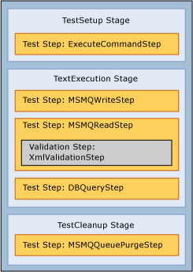

# Stages of a BizUnit Test Case
Each BizUnit test case consists of three stages: **TestSetup**, **TestExecution**, and **TestCleanup**. Each stage contains one or more test steps that are responsible for performing a single discrete unit of work; for example, the **FileCreateStep** is responsible for creating a file in a location you specify with a given filename.  BizUnit includes over 70 test steps and also provides extension capabilities which allow new test steps to be easily added to the framework. The ability to add new steps to the framework allows BizUnit to be used across a broad range of scenarios. This topic describes the BizUnit test stages in further detail.  
  
## Setup Stage  
 This setup stage prepares the platform for the testing. For example, before a particular test can be run, a file may need to be copied to a file drop in preparation for the actual execution of the test. You could also use this stage to cleanup any file locations or database tables that will be used in the test. As with every stage in BizUnit, there is no limit to the number of test steps that can be added, which provides the flexibility required to handle complex scenarios.  
  
## Execution Stage  
 The execution stage is where the test is actually run. This is where the function of the system you are validating is actually tested.  
  
## Cleanup Stage  
 The cleanup stage is the container for test steps that returns the platform to the consistent state that it was in before you ran the test. This stage is always executed, even if an error occurs in the execution stage. The reason the platform should be returned to its starting point is to prevent one test case from interfering with another so that each test case is run autonomously as part of the test suite. Ensuring a complete cleanup of the system at this stage is one of the guiding principles for effective testing with BizUnit.  
  
 The following diagram illustrates the format of a sample test case, which contains test steps in the three stages: setup, execution, and cleanup. It is important to always follow this structure when defining test cases with BizUnit.  
  
   
Stages of a BizUnit test  
  
## See Also  
 [Using BizUnit to Facilitate Automated Testing](../technical-guides/using-bizunit-to-facilitate-automated-testing.md)