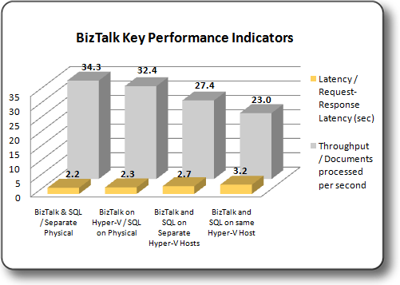

# Test Results: BizTalk Server Key Performance Indicators
This topic summarizes BizTalk Server Key Performance Indicators (KPI) observed during the test scenarios. Specifically these tests evaluated throughput as measured by the "**BizTalk:Messaging/Documents processed/Sec**" performance monitor counter, and latency, as measured by the Visual studio client response time.

## Summary of BizTalk Server Key Performance Indicators
For each scenario the physical machines were restricted so that number of logical processors and virtual processors was equivalent. This was done using the **/maxmem** and **/numproc** switches for the **boot.ini** file. For more information, see [Boot Options in a Boot.ini File](/windows-hardware/drivers/devtest/boot-options-in-a-boot-ini-file).

### Comparison of BizTalk Server Key Performance Indicators

For this test scenario, running BizTalk Server on a Hyper-V virtual machine provided approximately 95% of the throughput and latency performance of BizTalk Server on physical hardware. To provide scale out and increase the overall performance of the system, you can easily add more BizTalk Server virtual machines to the environment as required, due to the stateless nature of [!INCLUDE[btsBizTalkServerNoVersion](../includes/btsbiztalkservernoversion-md.md)]. You can create and add more BizTalk Server virtual machines to the environment by using the **SysPrep** utility to generate new images from a base image.

> [!NOTE]
> You can create more images based on an existing image of a computer that has BizTalk Server installed. 
> You can run SysPrep against a base image by using a SysPrep answer file and scripts provided with BizTalk Server. 
> These sample scripts are designed for use only with BizTalk Server installed on 32-bit and 64-bit versions of 
> Windows Server 2008. For more information see [Sysprep a BizTalk Server VHD (BizTalk Server Sample)](/biztalk/core/sysprep-a-biztalk-server-vhd-biztalk-server-sample).

You can significantly expedite provisioning, consolidation, and management of virtual machines when you use System Center Virtual Machine Manager (VMM). For more information, see [System Center Virtual Machine Manager](/system-center/vmm/whats-new-in-vmm).

The results obtained in this performance lab show a marked improvement from the performance achieved when you run [!INCLUDE[btsbiztalkserver2006r2](../includes/btsbiztalkserver2006r2-md.md)] on [!INCLUDE[btsWinSvr2k3](../includes/btswinsvr2k3-md.md)] in a Hyper-V virtual machine. Running [!INCLUDE[btsbiztalkserver2006r2](../includes/btsbiztalkserver2006r2-md.md)] on a Hyper-V virtual machine provided approximately 75% of the throughput and latency performance of [!INCLUDE[btsbiztalkserver2006r2](../includes/btsbiztalkserver2006r2-md.md)] on physical hardware versus the approximately 95% performance observed when running BizTalk Server and [!INCLUDE[btsWinSvr2k8](../includes/btswinsvr2k8-md.md)] on Hyper-V virtual machines. This improved performance is largely attributable to the improved performance of [!INCLUDE[btsWinSvr2k8](../includes/btswinsvr2k8-md.md)] when running as a guest operating system on Hyper-V. The related performance comparison is available from the [!INCLUDE[btsbiztalkserver2006r2](../includes/btsbiztalkserver2006r2-md.md)] [Hyper-V guide](/biztalk/technical-guides/biztalk-server-2010-hyper-v-guide).

 The graphic below illustrates the performance of BizTalk Server on the various test platforms:

 

 The table below illustrates the relative performance of the collected KPI’s for each configuration. Each result set is calculated as a percentage of the Baseline configuration KPI.

|KPI|Virtual BizTalk/Physical SQL|Virtual BizTalk/Virtual SQL on separate Hosts|Virtual BizTalk/Virtual SQL on Consolidated environment|
|---------|-----------------------------------|----------------------------------------------------|--------------------------------------------------------------|
|\BizTalk:Messaging\Documents processed/Sec|94.3%|79.8%|67%|
|Latency as measured by the Visual Studio client|94.3%|79.7%|66.9%|

For more information about how to optimize the performance of a BizTalk Server solution, see [Performance and Capacity Planning](/biztalk/core/performance-and-capacity-planning).

## Performance Comparison Results Summary
 The 94.3% throughput and 94.3% latency achieved when running only [!INCLUDE[btsBizTalkServerNoVersion](../includes/btsbiztalkservernoversion-md.md)] on Hyper-V suggests that virtualizing this tier of your solution using Hyper-V provides excellent performance together with the provisioning, consolidation, flexibility and ease of management that are possible when deploying solutions to a Hyper-V environment.

### Throughput Comparison Sample Results
 When the [!INCLUDE[btsBizTalkServerNoVersion](../includes/btsbiztalkservernoversion-md.md)] computers used in the BizTalk Server environment were run on Hyper-V virtual machines, throughput of the BizTalk Server solution as measured by the "**BizTalk:Messaging/Documents processed/Sec**" performance monitor counter ranged from 67% to 94.3% of the throughput attainable when all of the computers used in the BizTalk Server environment were installed on physical hardware.

### Latency Comparison Sample Results
 When the [!INCLUDE[btsBizTalkServerNoVersion](../includes/btsbiztalkservernoversion-md.md)] computers used in the BizTalk Server environment were run on Hyper-V virtual machines, latency of the BizTalk Server solution as measured by the Visual Studio client response time ranged from 66.9% to 94.3% of the latency attainable when all of the computers used in the BizTalk Server environment were installed on physical hardware.
