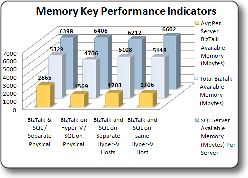

# Test Results: Memory Key Performance Indicators
This topic summarizes Memory Key Performance Indicators (KPI) observed during the test scenarios. These tests evaluated available memory as measured by the **\Memory\Available Mbytes** performance monitor counter.  
  
## Summary of Memory Key Performance Indicators  
 **Comparison of Memory Key Performance Indicators –** Total memory available to SQL Server and BizTalk Server as measured by the **\Memory\Available Mbytes** performance monitor counter was fairly consistent across all test scenarios. The difference in the average memory available to the physical BizTalk Server computers and the average memory available to the BizTalk Server computers running on virtual machines is due to the fact that two physical BizTalk Server computers were used for testing while three BizTalk Server computers running on virtual machines were used for testing.  
  
 The graphic below illustrates Memory performance on the various test platforms:  
  
   
  
 The table below illustrates the relative performance of the collected KPI’s for each configuration. Each result set is calculated as a percentage of the Baseline configuration KPI  
  
|KPI|Virtual BizTalk/Physical SQL|Virtual BizTalk/Virtual SQL on separate Hosts|Virtual BizTalk/Virtual SQL on Consolidated environment|  
|---------|-----------------------------------|----------------------------------------------------|--------------------------------------------------------------|  
|SQL Server Available Memory (Mbytes) Per Server|100.1%|97.1%|103.2%|  
|Total BizTalk Available Memory (Mbytes)|88.3%|95.9%|96%|  
|Average Per Server / BizTalk Available Memory (Mbytes)|58.9%|63.9%|64%|  
  
 For more information about how to evaluate Memory performance, see the **Measuring Memory Performance** section of the topic [Checklist: Measuring Performance on Hyper-V](../technical-guides/checklist-measuring-performance-on-hyper-v.md).