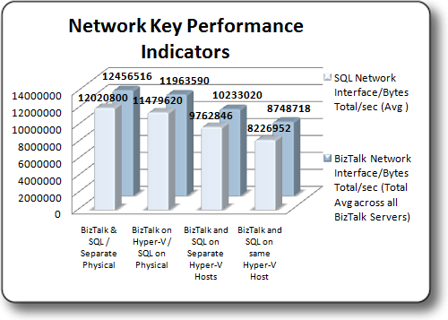

# Test Results: Networking Key Performance Indicators
This topic summarizes Network Key Performance Indicators (KPI) observed during the test scenarios. These tests evaluated Network Performance as measured by the **\Network Interface(\*)\Bytes Total/sec** performance monitor counter and by measuring the **SQL Network Interface\Bytes Total/sec (Avg )** returned by the VSTS 2008 Load Test Controller.  
  
## Summary of Network Key Performance Indicators  
 **Comparison of Networking Key Performance Indicators –** Network throughput for BizTalk Server running on Hyper-V virtual machines was observed to range from approximately 70% to 96% of the network throughput achieved on the physical BizTalk Servers, depending on the particular test environment. Network throughput for SQL Server running on a Hyper-V virtual machine was observed to range from approximately 68% to 81% of the network throughput achieved on the physical SQL Server, again depending on the particular test environment. The delta in the observed network throughput can be attributed to the resource requirements of the Hyper-V Hypervisor.  
  
 Follow the steps in [Network Optimizations](../technical-guides/network-optimizations.md) to maximize network throughput on Hyper-V virtual machines as measured by **\Network Interface(\*)\Bytes Total/sec**  
  
 The graphic below illustrates the network performance on the various test platforms:  
  
   
  
 The table below illustrates the relative performance of the collected KPI’s for each configuration. Each result set is calculated as a percentage of the Baseline configuration KPI  
  
|KPI|Virtual BizTalk/Physical SQL|Virtual BizTalk/Virtual SQL on separate Hosts|Virtual BizTalk/Virtual SQL on Consolidated environment|  
|---------|-----------------------------------|----------------------------------------------------|--------------------------------------------------------------|  
|\Network Interface(*)\Bytes Total/sec (Total Avg Across all BizTalk Servers)|96%|82.1%|70.2%|  
|SQL Network Interface\Bytes Total/sec (Avg )|95.5%|81.2%|68.4%|  
  
 For more information about how to evaluate Network performance, see the **Measuring Network Performance** section of the topic [Checklist: Measuring Performance on Hyper-V](../technical-guides/checklist-measuring-performance-on-hyper-v.md).
