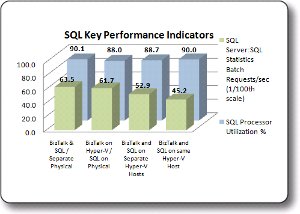

# Test Results: SQL Server Key Performance Indicators
This topic summarizes SQL Server Key Performance Indicators (KPI) observed during the test scenarios. These tests evaluated the following SQL Server KPI:  
  
-   SQL Processor Utilization as measured by the **\SQL\Processor(_Total)\\% Processor Time** performance monitor counter.  
  
-   The number of Transact-SQL command batches received per second as measured by the **\SQL Server:SQL Statistics\Batch Requests/sec** performance monitor counter.  
  
## Summary of SQL Server Key Performance Indicators  
 For each scenario the physical machines were restricted so that number of logical processors and virtual processors was equivalent. This was done using the /maxmem and /numproc boot.ini switches. For more information about using these switches, see “Boot INI Options Reference” at [http://go.microsoft.com/fwlink/?LinkId=122139](http://go.microsoft.com/fwlink/?LinkId=122139).  
  
 **Comparison of SQL Server Key Performance Indicators –**  [!INCLUDE[btsSQLServerNoVersion](../includes/btssqlservernoversion-md.md)] processor utilization as measured by **\SQL\Processor(_Total)\\% Processor Time** counter was approximately the same on all test environments, ranging from a low of 88% to a high of 90.1%. There is however a significant difference between the **\SQL Server:SQL Statistics\Batch Requests/sec** measured on the consolidated environment (4520) and the **\SQL Server:SQL Statistics\Batch Requests/sec** measured on the physical environment (6350). The **\SQL Server:SQL Statistics\Batch Requests/sec** performance monitor counter provides a good indicator of how much work is being performed by SQL Server. The reduction in Batch Requests/sec when SQL Server is running in a Hyper-V environment can be attributed to the CPU overhead required by Hyper-V.  
  
 There is, however, a significant difference between the **\SQL Server:SQL Statistics\Batch Requests/sec** measured on the consolidated environment (4520) and the **\SQL Server:SQL Statistics\Batch Requests/sec** measured on the physical environment (6350). The **\SQL Server:SQL Statistics\Batch Requests/sec** performance monitor counter provides a good indicator of how much work is being performed by SQL Server. The reduction in Batch Requests/sec when SQL Server is running in a Hyper-V environment can be attributed to the CPU overhead required by Hyper-V.  
  
 Follow these steps to increase performance of SQL Server running on a Hyper-V virtual machine as measured by the **\SQL Server:SQL Statistics\Batch Requests/sec** performance monitor counter:  
  
1. **Allocate additional fixed VHD disks with dedicated virtual controllers and channels –** Allocation of additional fixed VHD disks using dedicated virtual controllers and channels will increase disk throughput versus using a single VHD disk.  
  
2. **Optimize Network Performance –** Follow steps outlined in the “Optimize Network Performance” section of [Checklist: Optimizing Performance on Hyper-V](~/technical-guides/checklist-optimizing-performance-on-hyper-v.md). When running multiple Hyper-V virtual machines on the same Hyper-V host it is of particular importance to follow recommendations in the “Configure Hyper-V Virtual Machines that are Running on the same Hyper-V host computer to use a Private Virtual Network” section of [Network Optimizations](../technical-guides/network-optimizations.md).  
  
   Because of the stateless nature of [!INCLUDE[btsBizTalkServerNoVersion](../includes/btsbiztalkservernoversion-md.md)], additional [!INCLUDE[btsSQLServerNoVersion](../includes/btssqlservernoversion-md.md)] virtual machines can be easily added to the environment as required to provide scale out and increase the overall performance of the system.  
  
   The graphic below illustrates the performance of SQL Server on the various test platforms:  
  
     
   SQL Key Performance Indicators  
  
   The table below illustrates the relative performance of the collected KPI’s for each configuration. Each result set is calculated as a percentage of the Baseline configuration KPI  
  
|KPI|Virtual BizTalk/Physical SQL|Virtual BizTalk/Virtual SQL on separate Hosts|Virtual BizTalk/Virtual SQL on Consolidated environment|  
|---------|-----------------------------------|----------------------------------------------------|--------------------------------------------------------------|  
|\SQL\Processor(_Total)\\% Processor Time|97.7%|98.4%|99.9%|  
|\SQL Server:SQL Statistics\Batch Requests/sec|97.1%|83.3%|71.2%|  
  
 For more information about how to evaluate Disk I/O performance, see the **Measuring Disk I/O Performance** section of the topic [Checklist: Measuring Performance on Hyper-V](../technical-guides/checklist-measuring-performance-on-hyper-v.md).  
  
 For more information about Best Practices when running SQL Server 2008 in a Hyper-V environment, see the whitepaper “Running SQL Server 2008 in a Hyper-V Environment – Best Practices and Performance Recommendations” available for download at [http://go.microsoft.com/fwlink/?LinkId=144622](http://go.microsoft.com/fwlink/?LinkId=144622).