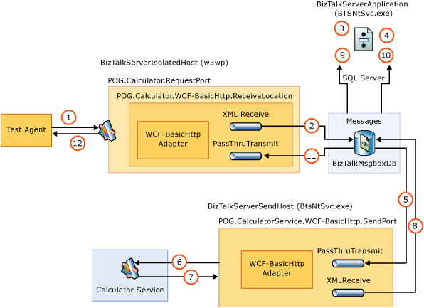
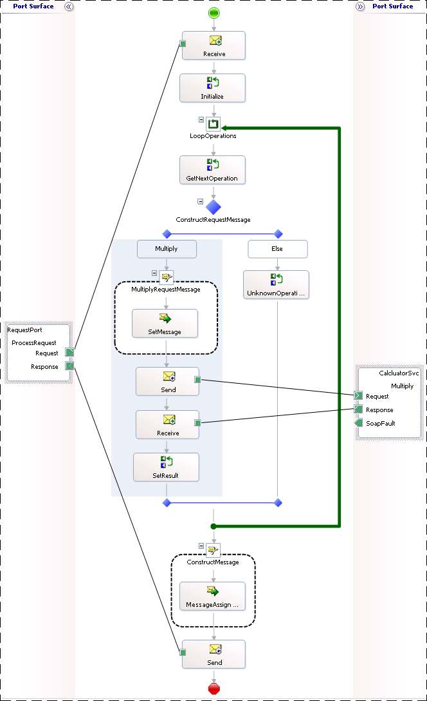
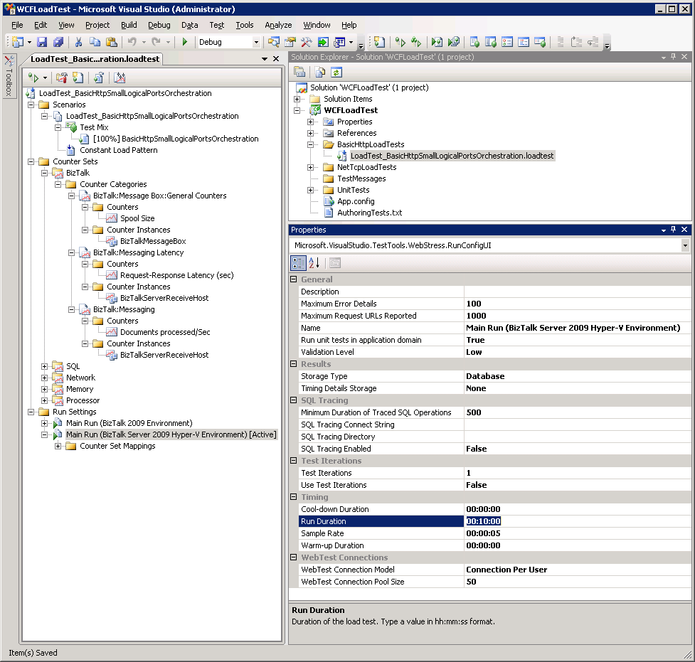
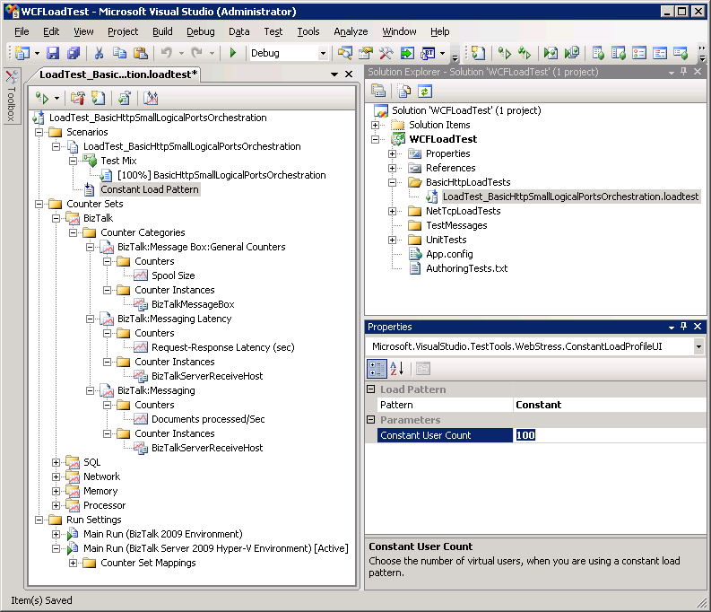

# Test Scenario Overview
This topic provides an overview of the test application; a description of the testing methodology used, and lists the key performance indicators (KPIs) captured during load testing.  

## Test Application  
 A synchronous request-response application was used to compare performance of BizTalk Server running on Hyper-V to BizTalk Server running on physical hardware. This application was used to illustrate performance of a [!INCLUDE[btsBizTalkServerNoVersion](../includes/btsbiztalkservernoversion-md.md)] solution that has been tuned for low latency. Low latency messaging is critical for certain scenarios such as online banking where a client sends a request and expects a response message within a very short interval (for example < 3 seconds).  

 The figure below illustrates the high-level architecture used. Visual Studio Team System (VSTS) 2008 Test Load Agent invoked a custom test class, which used the WCF transport to generate load against [!INCLUDE[btsBizTalkServerNoVersion](../includes/btsbiztalkservernoversion-md.md)]. The [!INCLUDE[btsBizTalkServerNoVersion](../includes/btsbiztalkservernoversion-md.md)] application in this scenario was exposed via a WCF-BasicHttp request-response receive location. VSTS 2008 Test Load Agent was used as the test client because of the great flexibility that it provides, including the capability to configure the number of messages sent in total, number of simultaneous threads, and the sleep interval between requests sent.  

 Several VSTS 2008 Test Load Agent computers can be run in tandem to simulate real world load patterns. For these tests, the VSTS 2008 Test Load Agent computers were driven by a single VSTS 2008 Test Load Agent Controller computer that was also running BizUnit 3.0. As a result, a consistent load was sent to both the physical and virtual [!INCLUDE[btsBizTalkServerNoVersion](../includes/btsbiztalkservernoversion-md.md)] computers. For more information about using VSTS 2008 Test Edition to generate simulated load for testing, see [http://go.microsoft.com/fwlink/?LinkID=132311](http://go.microsoft.com/fwlink/?LinkID=132311).  

   
Test Application Architecture  

1. A WCF-BasicHttp or WCF-Custom Request-Response Receive Location receives a new CalculatorRequest from a Test Load Agent computer.  

2. The XML disassembler component promotes the Method element inside the CalculatorRequest xml document. The Message Agent submits the incoming message to the MessageBox database (BizTalkMsgBoxDb).  

3. The inbound request starts a new instance of the LogicalPortsOrchestration. This orchestration uses a direct bound port to receive the CalculatorRequest messages with the Method promoted property = “LogicalPortsOrchestration”.  

4. The LogicalPortsOrchestration uses a loop to retrieve operations and for each item it invokes the downstream Calculator WCF web service using a Logical Solicit-Response Port. The request message for the Calculator WCF web service is created using a helper component and published to the MessageBox.  

5. The request message is consumed by a WCF-BasicHttp Send Port.  

6. The WCF-BasicHttp Send Port invokes one of the methods (Add, Subtract, Multiply, Divide) exposed by the Calculator WCF web service.  

7. The Calculator WCF web service returns a response message.  

8. The response message is published to the MessageBox.  

9. The response message is returned to the caller LogicalPortsOrchestration. The orchestration repeats this pattern for each operation within the inbound CalculatorRequest xml document.  

10. The LogicalPortsOrchestration publishes the CalculatorResponse message to the MessageBox.  

11. The response message is retrieved by the Request-Response WCF-BasicHttp Receive Location.  

12. The response message is returned to the Load Test Agent computer.  

    A screenshot of the orchestration used during the load test is shown below:  

> [!NOTE]  
>  For purposes of illustration, the orchestration depicted below is a simplified version of the orchestration that was actually used during load testing. The orchestration used during load testing included multiple scopes, error handling logic, and additional port types.  

   
Test Application Orchestration  

## Testing Methodology  
 Performance testing involves many tasks, which if performed manually are repetitive, monotonous, and error prone. In order to improve test efficiency and provide consistency between test runs, [!INCLUDE[btsVStudio2008](../includes/btsvstudio2008-md.md)] Team System (VSTS) Test Edition with BizUnit 3.0 was used to automate the tasks required during the testing process. VSTS 2008 Test Load Agent computers were used as the test client to generate the message load against the system and the same message types were used on each test run to improve consistency. Following this process provides a consistent set of data for every test run. For more information about BizUnit 3.0, see [http://go.microsoft.com/fwlink/?LinkID=85168](http://go.microsoft.com/fwlink/?LinkID=85168). For more information about [!INCLUDE[btsVStudio2008](../includes/btsvstudio2008-md.md)] Team System Test Edition, see [http://go.microsoft.com/fwlink/?LinkID=141387](http://go.microsoft.com/fwlink/?LinkID=141387).  

 The following steps were automated:  

- Stop BizTalk hosts.  

- Clean up test directories.  

- Restart IIS.  

- Clean up the [!INCLUDE[btsBizTalkServerNoVersion](../includes/btsbiztalkservernoversion-md.md)] Messagebox database.  

- Restart [!INCLUDE[btsSQLServerNoVersion](../includes/btssqlservernoversion-md.md)].  

- Clear event logs.  

- Create a test results folder for each run to store associated performance metrics and log files.  

- Start BizTalk Hosts.  

- Load Performance Monitor counters.  

- Warm up BizTalk environment with a small load.  

- Send through representative run.  

- Write performance logs to a results folder.  

- Collect application logs and write to a .csv file in the results folder.  

- Run the Performance Analysis of Logs (PAL) tool, Relog and Log Parser tools against the collected performance logs to produce statistics, charts and reports. For more information about PAL, Relog, and Log Parser, see [Appendix D: Tools for Measuring Performance](../technical-guides/appendix-d-tools-for-measuring-performance.md).  

> [!NOTE]  
>  All tracking was disabled and the BizTalk Server SQL Server Agent job was disabled during testing.  

 To ensure that the results of this lab were able to provide a comparison of the performance of [!INCLUDE[btsBizTalkServerNoVersion](../includes/btsbiztalkservernoversion-md.md)] in a physical and Hyper-V environment, performance metrics and logs were collected in a centralized location for each test run.  

 The test client was used to create a unique results directory for each test run. This directory contained all the performance logs, event logs and associated data required for the test. This approach provided information needed when retrospective analysis of prior test runs was required. At the end of each test, the raw data was compiled into a set of consistent results and key performance indicators (KPIs). Collecting consistent results set for physical and virtualized machines provided the points of comparison needed between the different test runs and different environments. The data collected included:  

- **Environment –** To record which environment the test was being run against, either BizTalk Server on physical hardware or BizTalk Server on Hyper-V.  

- **Test Run Number –** To uniquely identify each test run  

- **Test Case –** To record the architecture of the BizTalk Server solution used during testing. (For example Orchestration with Logical Ports versus Orchestration using inline Sends)  

- **Date –** To record the date and time the test was run  

- **Time Started –** As reported by the first VSTS load test agent initiated  

- **Time Stopped –** As reported by the last VSTS load test agent to complete  

- **Test Duration in Minutes –** To record the duration of the test.  

- **Messages Sent in Total –** To record the total number of messages sent from the Load Agent computers to the BizTalk Server computers during the test.  

- **Messages Sent per Second –** To record the messages sent per second from the Load Agent computers to the BizTalk Server computers during the test.  

- **Average Client Latency –** To record the average amount of time between when Test Load Agent clients initiated a request to and received a response from the BizTalk Server computers during the load test.  

- **Request-Response Duration Average (ms) –** As reported by the **BizTalk:Messaging Latency\Request-Response Latency (sec)** Performance Monitor counter for the BizTalkServerIsolatedHost  

  > [!NOTE]  
  >  Where multiple virtualized BizTalk hosts were running an average of these counters as calculated from the logs was used.  

- **Orchestrations Completed per Second –** As reported by the **XLANG/s Orchestrations(BizTalkServerApplication)\Orchestrations completed/sec** Performance Monitor counter. This counter provides a good measure of the throughput of the [!INCLUDE[btsBizTalkServerNoVersion](../includes/btsbiztalkservernoversion-md.md)] solution.  

- **% of Messages Processed < 3 seconds –** To record the total number of messages processed within 3 seconds during the test.  

  VSTS 2008 Load Test was used to generate a consistent load throughout all the tests. The following test run settings and load pattern were modified during testing to adjust the load profile of each test:  

- **Test Run Settings**  

   The following test run setting was modified depending on the test being performed:  

  - **Run Duration –** Specifies how long the test is run.  

      
    Test Run Settings  

- **Test Pattern Settings**  

   The following test pattern settings were modified depending on the test being performed:  

  1. **Pattern –** Specifies how the simulated user load is adjusted during a load test. Load patterns are either **Constant**, **Step**, or **Goal** based. All load testing performed was either Constant or Step.  

     > [!NOTE]
     >  All testing performed for purposes of this guide used either a **Constant** load pattern or a **Step** load pattern. Constant load patterns and Step load patterns provide the following functionality:  
     > 
     > - **Constant load pattern –** The load pattern is the same for the duration of the test, the number of simulated users starts at a predefined level and does not change.  
     >   -   **Step load pattern –** The load pattern is increased during the test run; the number of simulated users starts at a predefined level and is incremented by a predefined amount at predefined intervals for the duration of the test.  

  2. **Constant User Count (Constant Load Pattern) –** Number of virtual users that are generating load against the endpoint address specified in the app.config file of the Visual Studio Load Test project. This value is specified in the Load Pattern settings used for the load test.  

  3. **Initial User Count (Step Load Pattern) –** Number of virtual users that are generating load against the specified endpoint address at the beginning of a Step Load Pattern test. This value is specified in the Load Pattern settings used for the load test.  

  4. **Maximum User Count (Step Load Pattern) –** Number of virtual users that are generating load against the specified endpoint address at the end of a Step Load Pattern test. This value is specified in the Load Pattern settings used for the load test.  

  5. **Step Duration (Step Load Pattern) –** Number of seconds that virtual users are generating load against the specified endpoint address for a load test step.  

  6. **Step User Count (Step Load Pattern) –** Number of virtual users to increase at each step when using a step load pattern.  

       
     Test Pattern Settings  

  For more information about working with load tests in [!INCLUDE[btsVStudio2008](../includes/btsvstudio2008-md.md)], see the topic **Working with Load Tests** in the [!INCLUDE[btsVStudio2008](../includes/btsvstudio2008-md.md)] Team System documentation at [http://go.microsoft.com/fwlink/?LinkId=141486](http://go.microsoft.com/fwlink/?LinkId=141486).  

## Key Performance Indicators Measured During Testing  
 The following Performance Monitor counters were captured as key performance indicators (KPI) for all test runs:  

> [!NOTE]  
>  For more information about evaluating performance with Performance monitor counters, see [Checklist: Measuring Performance on Hyper-V](../technical-guides/checklist-measuring-performance-on-hyper-v.md).  

 **BizTalk Server KPI**  

- **Documents processed per second –** As measured by the **BizTalk:Messaging/Documents processed/Sec** counter.  

- **Latency –** As measured as returned by the VSTS 2008 Load Test Controller.  

  **SQL Server KPI**  

- **SQL Server processor utilization –** As measured by the **SQL\Processor(Total)\\%Processor Time** counter. This counter measures CPU utilization of [!INCLUDE[btsSQLServerNoVersion](../includes/btssqlservernoversion-md.md)] processing on the [!INCLUDE[btsSQLServerNoVersion](../includes/btssqlservernoversion-md.md)] computer.  

- **Transact SQL command processing performance –** As measured by the **\SQL Server:SQL Statistics\Batch Requests/sec** counter. This counter measures the number of Transact-SQL command batches received per second. This counter is used to measure throughput on the [!INCLUDE[btsSQLServerNoVersion](../includes/btssqlservernoversion-md.md)] computer.  

  **Networking KPI**  

- **BizTalk Server network throughput –** As measured by the **\Network Interface(\*)\Bytes Total/sec** performance monitor counter on the [!INCLUDE[btsBizTalkServerNoVersion](../includes/btsbiztalkservernoversion-md.md)] computers.  

- **SQL Server network throughput –** As measured by the **SQL Network Interface\Bytes Total/sec (Avg)** returned by the VSTS 2008 Load Test Controller.  

  **Memory KPI**  

- **Available memory –** As measured by the **\Memory\Available Mbytes** counter for the various scenarios.  

## Physical Infrastructure Specifics  
 For each of the servers that were installed the following settings were adjusted.  

 **For all servers:**  

- The paging file was set to 1.5 times the amount of physical memory allocated. The paging file was set to a fixed size by ensuring that the initial size and maximum values were identical in MB.  

- The “Adjust for best performance” performance option was selected from the advanced System Properties screen.  

- It was verified that the system had been adjusted for best performance of Background services in the Performance Options section of System Properties.  

- [!INCLUDE[btsWinSvr2k8](../includes/btswinsvr2k8-md.md)] was installed as the guest operating system on each of the virtual machines.  

- Windows Update was successfully run on all servers to install the latest security updates.  

  **For SQL Server:**  

- SQL Server was installed as per the installation guide available at [http://go.microsoft.com/fwlink/?LinkId=141021](http://go.microsoft.com/fwlink/?LinkId=141021).  

- [!INCLUDE[btsSQLServerNoVersion](../includes/btssqlservernoversion-md.md)] used had the SAN LUNs configured as per the table below. The database and log files were separated to across the LUNs as follows to reduce possible disk I/O contention:  

  - The Data_Sys volume was used to store all database files (including system and BizTalk databases) except the MessageBox and TempDb databases.  

  - The Log_Sys volume was used to store all log files (including system and [!INCLUDE[btsBizTalkServerNoVersion](../includes/btsbiztalkservernoversion-md.md)] databases) except the MessageBox and TempDb databases.  

  - The Data_TempDb volume was used to store the TempDb database file.  

  - The Logs_TempDb volume was used to store the TempDb log file.  

  - The MessageBox database file was stored on the Data_BtsMsgBox volume and the log file was stored on the Log_BtsMsgBox volume.  

- In addition to this, a separate LUN was provided for the MSDTC log file. On high throughput BizTalk systems, the MSDTC log file activity has been shown to cause an I/O bottleneck if it is left on the same physical drive as the operating system.  

  |      Volume Name      |               Files               | LUN Size GB | Host Partition Size GB | Cluster Size |
  |-----------------------|-----------------------------------|-------------|------------------------|--------------|
  |       Data_Sys        |    MASTER, and MSDB data files    |     10      |           10           |     64KB     |
  |       Logs_Sys        |     MASTER and MSDB log files     |     10      |           10           |     64KB     |
  |      Data_TempDb      |         TempDB data file          |     50      |           50           |     64KB     |
  |      Logs_TempDb      |          TempDB log file          |     50      |           50           |     64KB     |
  |    Data_BtsMsgBox     |     BizTalkMsgBoxDb data file     |     300     |          100           |     64KB     |
  |    Logs_BtsMsgBox     |     BizTalkMsgBoxDb log file      |     100     |          100           |     64KB     |
  | Data_BAMPrimaryImport |    BAMPrimaryImport data file     |     10      |           10           |     64KB     |
  | Logs_BAMPrimaryImport |     BAMPrimaryImport log file     |     10      |           10           |     64KB     |
  | Data_BizTalkDatabases | Other BizTalk database data files |     20      |           20           |     64KB     |
  | Logs_BizTalkDatabases | Other BizTalk database log files  |     20      |           20           |     64KB     |
  |          N/A          |          MSDTC log file           |      5      |           5            |     N/A      |

- BizTalk Server was installed as per the installation guides available at [http://go.microsoft.com/fwlink/?LinkId=128383](http://go.microsoft.com/fwlink/?LinkId=128383).  

- The [!INCLUDE[btsBizTalkServerNoVersion](../includes/btsbiztalkservernoversion-md.md)] Best Practices Analyzer (BPA) tool was used to perform platform validation once the system had been configured. The [!INCLUDE[btsBizTalkServerNoVersion](../includes/btsbiztalkservernoversion-md.md)] BPA is available at [http://go.microsoft.com/fwlink/?LinkId=67150](http://go.microsoft.com/fwlink/?LinkId=67150).  

## Virtualization Specifics  
 A single 50 GB fixed VHD was used to host the operating system for each Hyper-V virtual machine.  

 Fixed VHDs were used instead of dynamically sized VHDs because they immediately allocate the maximum storage for the VHD to the file on the drive where it is hosted. This reduces fragmentation of the VHD file occurring on the physical drive where it is hosted, which improves disk I/O performance.  

 To set-up the virtual machines, an installation of [!INCLUDE[btsWinSvr2k8](../includes/btswinsvr2k8-md.md)] 64-bit edition was performed on a single VHD. Once all appropriate updates had been installed the base virtual machine was imaged using sysprep utility that is installed with [!INCLUDE[btsWinSvr2k8](../includes/btswinsvr2k8-md.md)], in the %WINDIR%\system32\sysprep directory.  

 This base VHD was then copied and used as the basis for all Hyper-V virtual machines that were deployed across the environment. Sysprep was run on the base VHD image to reset system security identifiers before any [!INCLUDE[btsSQLServerNoVersion](../includes/btssqlservernoversion-md.md)] or [!INCLUDE[btsBizTalkServerNoVersion](../includes/btsbiztalkservernoversion-md.md)] binaries were deployed to the system.  

> [!NOTE]
>  Running Sysprep after BizTalk Server has been installed and configured on the server can be accomplished through the use of a Sysprep answer file and scripts provided with BizTalk Server. These sample scripts are designed for use with BizTalk Server installed on 32-bit and 64-bit versions of [!INCLUDE[btsWinSvr2k8](../includes/btswinsvr2k8-md.md)] only. For more information see the BizTalk Server online documentation.  

 The Unattended Windows Setup Reference is available at [http://go.microsoft.com/fwlink/?LinkId=142364](http://go.microsoft.com/fwlink/?LinkId=142364).  

## See Also  
 [Appendix C: BizTalk Server and SQL Server Hyper-V Supportability](../technical-guides/appendix-c-biztalk-server-and-sql-server-hyper-v-supportability.md)