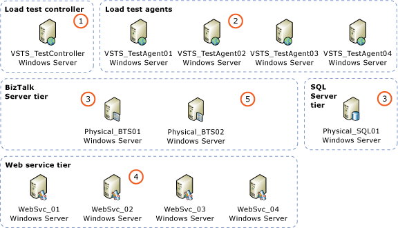
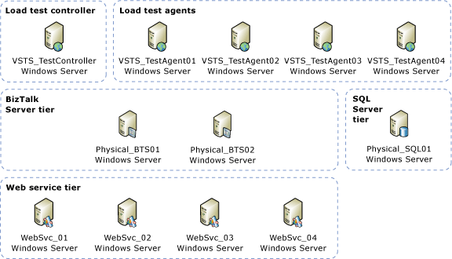
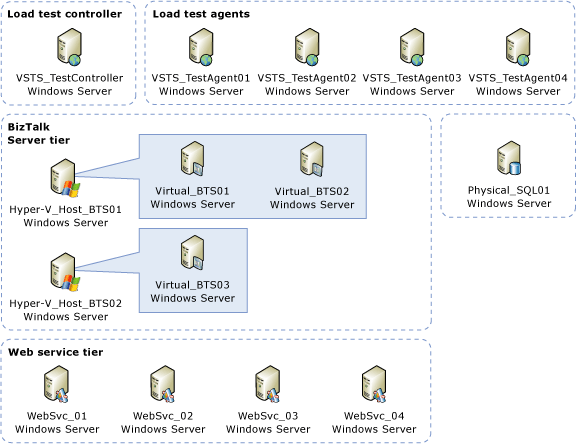
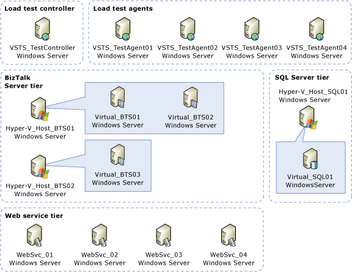
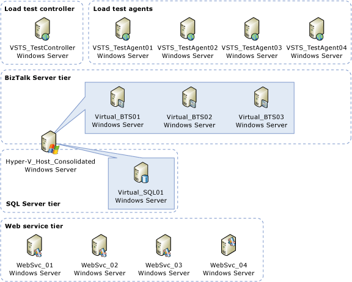

# Test Scenario Server Architecture
This topic provides an overview of the flow of messages between servers during load testing and the distinct server architectures against which the load test was performed.  
  
## Overview of Message Flow During Load Testing  
 The following diagram provides a generic overview of the server architecture used for all test scenarios and the flow of messages between servers during a load test.  
  
> [!NOTE]  
>  Each distinct server architecture that was tested is described in the section **Baseline Server Architecture**.  
  
 The following figure provides an overview of the message flow. The numbers in the figure correspond to the steps listed below the figure.  
  
   
Message Flow Overview  
  
1. Load testing is initiated by the Load Agent Controller computer **VSTS_TestController**:  
  
   - A Visual Studio 2008 project on **VSTS_TestController** is executed. The project loads an instance of the BizUnit class, loads the specified BizUnit XML configuration file, and begins executing the steps defined in the BizUnit configuration file.  
  
     > [!NOTE]  
     >  For more information about the XML configuration file used by BizUnit, see the topic “Defining Tests Using an XML Configuration File” at [http://go.microsoft.com/fwlink/?LinkId=143432](http://go.microsoft.com/fwlink/?LinkId=143432).  
  
   - After completing the Test Setup steps, one of the steps in the BizUnit project executes a command that displays a dialog box which prompts you to start a “priming” test run to submit priming messages to the [!INCLUDE[btsBizTalkServerNoVersion](../includes/btsbiztalkservernoversion-md.md)] environment.  
  
   - Priming messages are submitted from a separate Visual Studio 2008 Test project on **VSTS_TestController**. Priming messages are sent to “warm up” the test environment by initializing system caches.  
  
   - After all priming messages have been processed; the BizUnit instance loads Performance Monitor counters for all computers being tested in the main test run and executes a command to display a dialog box which prompts you to submit messages for the main test run.  
  
   - The Visual Studio 2008 Load Test project on **VSTS_TestController** directs the Load Test Agent computers to submit messages for the main test run.  
  
2. The Load Test Agent computers submit test messages to the [!INCLUDE[btsBizTalkServerNoVersion](../includes/btsbiztalkservernoversion-md.md)] computers specified in the app.config file of the Visual Studio 2008 Load Test project on the Load Test Controller computer (**VSTS_TestController**).  
  
3. The [!INCLUDE[btsBizTalkServerNoVersion](../includes/btsbiztalkservernoversion-md.md)] computers receive the messages submitted by the Load Test Agent computers, for this load test the messages were received by a two way request-response receive location.  
  
   - [!INCLUDE[btsBizTalkServerNoVersion](../includes/btsbiztalkservernoversion-md.md)] publishes the message to the MessageBox database.  
  
   - The messages are consumed by an orchestration.  
  
   - The orchestration is bound to a two way solicit-response send port which invokes the downstream calculator service.  
  
   > [!NOTE]  
   >  The downstream calculator service is based upon Windows Communication Foundation samples described at [http://go.microsoft.com/fwlink/?LinkId=141762](http://go.microsoft.com/fwlink/?LinkId=141762). The Windows Communication Foundation samples are available for download at [http://go.microsoft.com/fwlink/?LinkId=87352](http://go.microsoft.com/fwlink/?LinkId=87352).  
  
4. The calculator service consumes the request from [!INCLUDE[btsBizTalkServerNoVersion](../includes/btsbiztalkservernoversion-md.md)] and returns a response to the [!INCLUDE[btsBizTalkServerNoVersion](../includes/btsbiztalkservernoversion-md.md)] solicit-response send port.  
  
5. [!INCLUDE[btsBizTalkServerNoVersion](../includes/btsbiztalkservernoversion-md.md)] processes the response and persists the response message to the MessageBox database. Then the response message from the Calculator web service is retrieved from the MessageBox database by the BizTalk request-response port, and a response message is delivered back to the Load Test Agent computers.  
  
## Baseline Server Architecture  
 For the Baseline Server architecture, the Hyper-V role was not installed and Both [!INCLUDE[btsBizTalkServerNoVersion](../includes/btsbiztalkservernoversion-md.md)] and SQL Server were installed on to the host operating system. This was done to establish “baseline” performance metrics of the [!INCLUDE[btsBizTalkServerNoVersion](../includes/btsbiztalkservernoversion-md.md)] solution on a physical hardware environment.  
  
 The following figure depicts the physical [!INCLUDE[btsBizTalkServerNoVersion](../includes/btsbiztalkservernoversion-md.md)] and SQL Server tiers for the Baseline Server Architecture.  
  
   
Physical BizTalk Server / Physical SQL Server (Baseline)  
  
- **BizTalk Server** - 2 BizTalk Server computers configured as follows:  
  
  - One [!INCLUDE[btsBizTalkServerNoVersion](../includes/btsbiztalkservernoversion-md.md)] computer with **6** GB RAM and **8** processor cores available.  
  
  - One [!INCLUDE[btsBizTalkServerNoVersion](../includes/btsbiztalkservernoversion-md.md)] computer with **3** GB RAM and **4** processor cores available.  
  
  - Total of 6 + 3 = **9** GB RAM available and 8 + 4 = **12** processor cores available for [!INCLUDE[btsBizTalkServerNoVersion](../includes/btsbiztalkservernoversion-md.md)].  
  
- **SQL Server** - 1 SQL Server computer configured as follows:  
  
  -   **8** GB RAM available.  
  
  -   **4** processor cores available.  
  
## Virtual BizTalk Server / Physical SQL Server  
 The following figure depicts the virtual [!INCLUDE[btsBizTalkServerNoVersion](../includes/btsbiztalkservernoversion-md.md)] and physical [!INCLUDE[btsSQLServerNoVersion](../includes/btssqlservernoversion-md.md)] tiers.  
  
   
Virtual BizTalk Server / Physical SQL Server  
  
 For this scenario, the load test was performed against [!INCLUDE[btsBizTalkServerNoVersion](../includes/btsbiztalkservernoversion-md.md)] running on Hyper-V virtual machines and SQL Server running on physical hardware.  
  
> [!NOTE]  
>  The allocation of RAM and processor cores described below was identical for each non-baseline scenarios, the only difference being whether certain computers are running on a Hyper-V virtual machine or on physical hardware.  
  
- **BizTalk Server** - 3 [!INCLUDE[btsBizTalkServerNoVersion](../includes/btsbiztalkservernoversion-md.md)]s computers configured as follows:  
  
  - 3 GB RAM allocated to each [!INCLUDE[btsBizTalkServerNoVersion](../includes/btsbiztalkservernoversion-md.md)] computer with a total of 3 x 3 = **9** GB RAM available for [!INCLUDE[btsBizTalkServerNoVersion](../includes/btsbiztalkservernoversion-md.md)].  
  
  - 4 processor cores allocated to each [!INCLUDE[btsBizTalkServerNoVersion](../includes/btsbiztalkservernoversion-md.md)] computer with a total of 3 x 4 = **12** processor cores available for [!INCLUDE[btsBizTalkServerNoVersion](../includes/btsbiztalkservernoversion-md.md)].  
  
- **SQL Server** - 1 SQL Server computer configured as follows:  
  
  -   **8** GB RAM available.  
  
  -   **4** processor cores available.  
  
## Virtual BizTalk Server / Virtual SQL Server  
 The following figure depicts a virtual [!INCLUDE[btsBizTalkServerNoVersion](../includes/btsbiztalkservernoversion-md.md)] computer and a virtual SQL Server computer on separate Hyper-V host computers.  
  
   
Virtual BizTalk Server / Virtual SQL Server  
  
 For this scenario, the load test was performed against [!INCLUDE[btsBizTalkServerNoVersion](../includes/btsbiztalkservernoversion-md.md)] running on Hyper-V virtual machines and [!INCLUDE[btsSQLServerNoVersion](../includes/btssqlservernoversion-md.md)] running on a Hyper-V virtual machine. The [!INCLUDE[btsBizTalkServerNoVersion](../includes/btsbiztalkservernoversion-md.md)] Hyper-V virtual machines and the [!INCLUDE[btsSQLServerNoVersion](../includes/btssqlservernoversion-md.md)] Hyper-V virtual machine were run on separate Hyper-V host computers.  
  
> [!NOTE]
>  The allocation of RAM and processor cores for this scenario is identical to the allocation of RAM and processor cores for the **Virtual BizTalk Server / Physical SQL Server** scenario, the only difference being that [!INCLUDE[btsSQLServerNoVersion](../includes/btssqlservernoversion-md.md)] was configured to run on a Hyper-V virtual machine rather than physical hardware.  
  
## Consolidated Environment  
 The following figure depicts virtual [!INCLUDE[btsBizTalkServerNoVersion](../includes/btsbiztalkservernoversion-md.md)] computers and a virtual SQL Server computer consolidated on one Hyper-V host computer.  
  
   
Consolidated Environment  
  
 For this scenario, the load test was performed against [!INCLUDE[btsBizTalkServerNoVersion](../includes/btsbiztalkservernoversion-md.md)] running on Hyper-V virtual machines and [!INCLUDE[btsSQLServerNoVersion](../includes/btssqlservernoversion-md.md)] running on a Hyper-V virtual machine. The [!INCLUDE[btsBizTalkServerNoVersion](../includes/btsbiztalkservernoversion-md.md)] Hyper-V virtual machines and the [!INCLUDE[btsSQLServerNoVersion](../includes/btssqlservernoversion-md.md)] Hyper-V virtual machine were all run on the same Hyper-V host computer.  
  
> [!NOTE]
>  The allocation of RAM and processor cores for this scenario is identical to the allocation of RAM and processor cores for the **Virtual BizTalk Server / Virtual SQL Server** scenario, the only difference being that both the [!INCLUDE[btsBizTalkServerNoVersion](../includes/btsbiztalkservernoversion-md.md)] Hyper-V virtual machines and [!INCLUDE[btsSQLServerNoVersion](../includes/btssqlservernoversion-md.md)] Hyper-V virtual machines were configured to run on the same Hyper-V host computer.  
  
## See Also  
 [Test Scenario Overview](../technical-guides/test-scenario-overview.md)