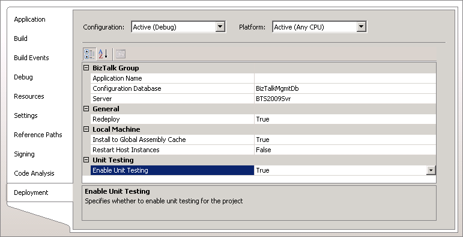

# Unit Testing
[!INCLUDE[btsBizTalkServer2006r3](../includes/btsbiztalkserver2006r3-md.md)] introduces a unit testing feature that can be enabled on the **Deployment** property page of a BizTalk project. The following screenshot shows this project setting accessed from Project Designer when you right-click a project and click **Properties**.  
  
   
  
 **Screenshot of the Deployment tab in Project Designer exposing the Enable Unit Testing project property**  
  
 This feature allows you to create unit tests for schemas, maps, and pipelines. The topics in the [!INCLUDE[btsBizTalkServer2006r3](../includes/btsbiztalkserver2006r3-md.md)] documentation provide some example approaches to using the unit testing feature. When this feature is enabled and the project rebuilt, the artifact classes will be derived from the following base classes to support unit testing.  
  
|Artifact type|Base class|  
|-------------------|----------------|  
|Schema|**Microsoft.BizTalk.TestTools.Schema.TestableSchemaBase**|  
|Map|**Microsoft.BizTalk.TestTools.Mapper.TestableMapBase**|  
|Pipeline|**Microsoft.BizTalk.TestTools.Pipeline.TestablePipelineBase**|  
  
 For more information about the unit testing feature introduced with [!INCLUDE[btsBizTalkServer2006r3](../includes/btsbiztalkserver2006r3-md.md)], see the following topics in the [!INCLUDE[btsBizTalkServer2006r3](../includes/btsbiztalkserver2006r3-md.md)] Help:  
  
-   [Using the Unit Testing Feature with Schemas and Maps](http://go.microsoft.com/fwlink/?LinkId=150482) (http://go.microsoft.com/fwlink/?LinkId=150482).  
  
-   [Using the Unit Testing Feature with Pipelines](http://go.microsoft.com/fwlink/?LinkId=150483) (http://go.microsoft.com/fwlink/?LinkId=150483)  
  
## See Also  
 [Implementing Automated Testing](../technical-guides/implementing-automated-testing.md)