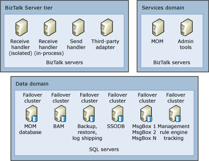
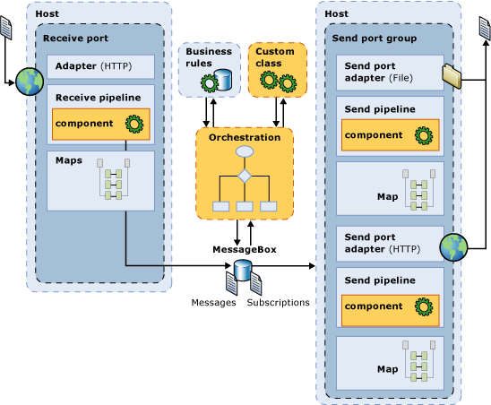

# Why It Is Important to Test
This topic provides an overview of the mindset that leads to insufficient testing, describes the risks associated with failing to test BizTalk solutions, and contrasts the pitfalls of manual testing with the benefits of automated testing.  
  
## Testing as “overhead”  
 Unfortunately, with ever increasing demands for return on investment (ROI), the testing phase of a project is often seen as one of the first aspects of a project plan that can be scaled back.  
  
 One argument against testing BizTalk solutions is that “We don’t need to test our solution because Microsoft already thoroughly tests BizTalk Server.” While it is true that Microsoft does thoroughly test BizTalk Server, different usage scenarios require one of an almost countless number of permutations of business requirements for throughput, high availability, adapter usage, latency, tracking requirements, orchestration usage, and custom code. Because BizTalk Server is extremely flexible and can accommodate so many different usage scenarios, it is simply not possible to anticipate and test all of them. Furthermore, the default settings that are applied in a BizTalk Server environment should be optimized to accommodate each usage scenario. The only way to determine the optimal settings for a particular usage scenario is to test the solution, measure various parameters, tune the environment, and retest. Consider the following diagram, which depicts a sample physical architecture for a BizTalk Server solution.  
  
   
Sample Physical BizTalk Architecture  
  
 You can see in the diagram above that the BizTalk Server solution contains many moving parts, including multiple computers running BizTalk Server, computers running SQL Server, server cluster nodes, and Active Directory domains. After the system is up and running, there will be many configuration tweaks applied to optimize the application per the business requirements,  as to maximize the overall ROI of the solution. This single scenario shows that there are many variables in play. In addition to the physical architecture of the environment, consider the following diagram, which depicts the flow of a message through BizTalk Server.  
  
   
Sample Logical BizTalk Message Flow  
  
 When we look at the logical diagram of a message flowing through BizTalk Server, we see other variables that necessitate per-project testing, including custom send and receive pipeline components and custom classes that can be called from BizTalk orchestrations. Given that the type complexity and use of custom components and BizTalk components varies from project to project, it becomes more evident why it is important to perform testing for each specific usage scenario.  
  
## Testing methodology and timelines  
 To ensure testing is performed effectively and efficiently, the test harness should be fully automated so it is easily reproducible and minimizes the chance for human error. Additionally, adequate time should be allotted for testing when planning the project. A minimalist approach to testing would comprise manual steps similar to the following:  
  
1. Manually load one or more messages into a receive end point, such as a file drop or by using a SOAP client to call a Web service.  
  
2. Manually validate the correct content and structure of a message. Because multiple schemas are often present in a project, the messages may be a mixture of flat file and XML and may also contain cross field dependencies.  
  
   > [!NOTE]  
   >  An example of this would be any project involving SWIFT messages. These are flat file messages that have cross field dependencies. That is, one field’s value depends on another – simple XSD validation will not do here; hence the SWIFT Accelerator makes use of the BizTalk Rules Engine for validation of the messages. For more information about the [SWIFT Accelerator](http://go.microsoft.com/fwlink/?LinkID=79657), see [SWIFT Accelerator](http://go.microsoft.com/fwlink/?LinkID=79657) (http://go.microsoft.com/fwlink/?LinkID=79657).  
  
3. Manually check the event logs on the BizTalk Server computers for errors.  
  
4. Manually check the BAM databases (if used) to validate that activity information is recorded correctly.  
  
   Using a manual process as described above for testing is subjective and error prone. Consider having to examine a hundred line SWIFT message with cross field dependencies for 10 different test cases. Most project developers would not be able to or even if they were able, would not be inclined to engage in such a task reliably and accurately. Implementation of a subjective, manual, error prone testing process adds risk to a project and increases the chance of failure.  
  
   The risk of failure is often amplified by project planning timelines that do not incorporate sufficient time for testing. All too often, a project testing strategy hinges on a single manual test pass which is scheduled a week or so before the go-live date. Such limited testing places the project at risk. Given such a limited timeline for testing, if any problems are detected, then the project may be delayed because no time has been allotted to fix problems. Furthermore, if a problem is discovered and fixed, there may be insufficient time left to perform subsequent test passes before the system goes live.  
  
   The reality of “single final build, single test pass, take the project live” testing is that it often results in the project being delayed, the project going over budget, or even worse, the project failing completely! For mission critical systems, this sort of testing methodology is a disaster waiting to happen.  
  
## Testing effectively and efficiently  
 Because appropriate testing is often viewed as an expensive luxury rather than a integral requirement, it is all too often tacked on at the tail end of a project. Given the complexity of the software and hardware stack used within heterogeneous enterprise environments, this approach is unrealistic. Implementation of an automated test approach that can be re-run on demand is the best way to test effectively and efficiently and is an integral component of successful projects that ultimately deliver an excellent ROI to the business. By investing at the beginning of the project in full end-to-end functional tests for each code path through the system you are generating test assets. These assets require investment (i.e. development time) in order to reap the benefits of increased testing effectiveness and efficiency later. To minimize the investment that is needed from the project to derive such a framework we recommend that you utilize the Visual Studio 2010 load test framework. Visual Studio 2010 includes the majority of the common testing steps required for successful testing and is the framework used in the test scenarios presented later in this guide.  
  
## See Also  
 [Implementing Automated Testing](../technical-guides/implementing-automated-testing.md)