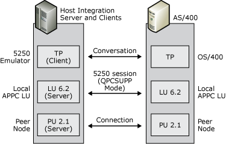

# 5250 Access
If your enterprise contains AS/400 systems, display sessions are provided through APPC using the 5250 data stream. Host Integration Server computers provide APPC access to an AS/400 using 5250 emulation clients. Clients can only communicate with AS/400s using APPC.  
  
 For 5250 services, the local APPC LU acts as an identifier for local Host Integration Server clients; the remote APPC LU identifies the AS/400 system. The following figure shows the local and remote LUs used for this configuration.  
  
   
Diagram showing 5250 access configuration  
  
## See Also  
 [APPC Applications](../HIS2010/appc-applications1.md)