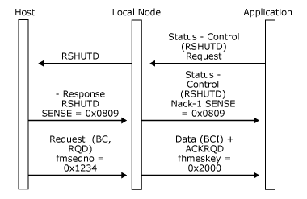

# Application-Initiated Termination
An application on a session with function management (FM) profile 3 or 4 can request termination of the primary logical unit (PLU) session. It should only do so if it has previously ensured that it is in a state where the PLU session can be terminated, that is, between-chain and between-bracket. Terminating the PLU session does not affect the state of the system services control point (SSCP) session.  
  
 Note that an application can issue a character coded or field formatted **LOGOFF** command on the SSCP session or send a [Close(PLU) Request](../HIS2010/close-plu-request1.md) to get the local node to send **TERM-SELF** on the application's behalf. All of these will elicit an **UNBIND**, either immediately or after session clean-up in the host.  
  
 The application requests termination of the PLU session by sending a **Status-Control(RSHUTD) Request** to the local node, which generates an SNA **RSHUTD** request to the host.  
  
 After sending the **Status-Control(RSHUTD) Request**, the application must remain capable of accepting and responding to all outbound data it receives. The application can now expect one of two messages, depending on whether the state of the PLU session allows it to be terminated and whether the host wants to terminate the PLU session:  
  
-   If the state of the PLU session allows it to be terminated, and the host wants to terminate the PLU session, the host generates a positive response to the **RSHUTD** request, which can be followed by an **UNBIND** request. The local node closes the PLU connection. For more information, see [Closing the PLU Connection](../HIS2010/closing-the-plu-connection2.md).  
  
-   If the state of the PLU session does not allow it to be terminated (for example, if the session is in-bracket), or the host does not want to terminate the PLU session at this time, the host generates a negative response to the **RSHUTD** request, which the local node presents to the application as a **Status-Control(RSHUTD) Negative-Acknowledge-1** carrying the sense codes supplied on the negative response. This indicates that the request to terminate the PLU session has been rejected by the host, and communication on the PLU session continues unaffected.  
  
 The following two figures illustrate the application-initiated termination protocol between the local node and the application and how this protocol relates to the underlying SNA protocols.  
  
 In the first figure, the application requests termination of the PLU session, and the host sends **UNBIND**. The local node closes the PLU connection.  
  
   
Application requests termination of the PLU session, and the host sends UNBIND  
  
 In the following figure, the application requests termination of the PLU session, but the session is not in an appropriate state. The host sends a negative response to the **RSHUTD** request, which the local node presents as **Status-Control(RSHUTD) Negative-Acknowledge-1**. Communication continues on the PLU session.  
  
   
Application requests termination of the PLU session, but the session is not in an appropriate state  
  
## See Also  
 [Opening the PLU Connection](../HIS2010/opening-the-plu-connection2.md)   
 [Closing the PLU Connection](../HIS2010/closing-the-plu-connection2.md)   
 [PLU Session](../HIS2010/plu-session1.md)   
 [Outbound Chaining](../HIS2010/outbound-chaining1.md)   
 [Inbound Chaining](../HIS2010/inbound-chaining2.md)   
 [Segment Delivery](../HIS2010/segment-delivery2.md)   
 [Brackets](../HIS2010/brackets2.md)   
 [Direction](../HIS2010/direction2.md)   
 [Pacing and Chunking](../HIS2010/pacing-and-chunking2.md)   
 [Confirmation and Rejection of Data\]](../HIS2010/confirmation-and-rejection-of-data]2.md)   
 [Shutdown and Quiesce](../HIS2010/shutdown-and-quiesce2.md)   
 [Recovery](../HIS2010/recovery2.md)   
 [LUSTATs\]](../HIS2010/lustats]2.md)   
 [Response Time Monitor Data](../HIS2010/response-time-monitor-data2.md)