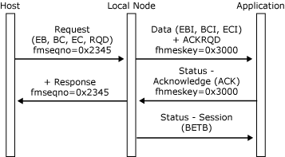

# Bracket Termination
The local node supports bracket termination rule one (conditional) and bracket termination rule two (unconditional), as specified in the **BIND** request. Some sessions only allow bracket termination by one session partner. This is a **BIND** option, supplied in the bind information control block (BICB) on [Open(PLU) OK Confirm](../HIS2010/open-plu-oconfirm2.md)), and it is the application's responsibility to determine if (and when) it should request bracket termination.  
  
 If an application is allowed by its **BIND** to terminate brackets, it does so by setting the End Bracket Indicator (EBI) application flag in an inbound [Data](../HIS2010/data2.md) or **Status-Control(LUSTAT/CHASE/QC/CANCEL)** message. The bracket is only terminated when the application receives a [Status-Session](../HIS2010/status-session1.md) (BETB) from the local node.  
  
 If the host terminates a bracket successfully, the local node sends a **Status-Session(BETB)** to the application. Note that the EBI application flag on outbound messages does not indicate bracket termination, but indicates that the corresponding request/response unit (RU) carried End Bracket (EB). The bracket is only terminated when the application receives **Status-Session(BETB)**.  
  
 Note that if the application queues data, it should also queue **Status-Session(BETB)** messages. They must not be processed as expedited.  
  
 The following two figures illustrate bracket termination protocols between the local node and the application and how those protocols relate to the underlying SNA protocols.  
  
 In the following figure, the application successfully terminates a bracket by sending an EBI data chain when the application's state is in-bracket, which the host accepts. The local node sends a **Status-Session(BETB)** to indicate that the application's state is now between-bracket.  
  
   
Application successfully terminates a bracket by sending an EBI data chain  
  
 In the following figure, the host successfully terminates a bracket by sending an EBI data chain when the application's state is in-bracket, which the application accepts. The local node sends a **Status-Session(BETB)** to indicate that the application's state is now between-bracket.  
  
   
Application successfully terminates a bracket by sending an EBI data chain  
  
## See Also  
 [Opening the PLU Connection](../HIS2010/opening-the-plu-connection2.md)   
 [PLU Session](../HIS2010/plu-session1.md)   
 [Outbound Chaining](../HIS2010/outbound-chaining1.md)   
 [Inbound Chaining](../HIS2010/inbound-chaining2.md)   
 [Segment Delivery](../HIS2010/segment-delivery2.md)   
 [Brackets](../HIS2010/brackets2.md)   
 [Direction](../HIS2010/direction2.md)   
 [Pacing and Chunking](../HIS2010/pacing-and-chunking2.md)   
 [Confirmation and Rejection of Data\]](../HIS2010/confirmation-and-rejection-of-data]2.md)   
 [Shutdown and Quiesce](../HIS2010/shutdown-and-quiesce2.md)   
 [Recovery](../HIS2010/recovery2.md)   
 [Application-Initiated Termination](../HIS2010/application-initiated-termination2.md)   
 [LUSTATs\]](../HIS2010/lustats]2.md)   
 [Response Time Monitor Data](../HIS2010/response-time-monitor-data2.md)