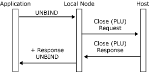

# Closing the PLU Connection
Either the application or the local node can terminate the primary logical unit (PLU) connection. The criteria for closing are:  
  
-   The local node closes the PLU connection if it receives an **UNBIND** request from the host PLU, which terminates the PLU session. If the **UNBIND** type is **BIND forthcoming** (0x02), the local node sets the **BIND**-forthcoming indicator in the [Close(PLU) Request](../HIS2010/close-plu-request1.md), so that the application can reserve any necessary resources.  
  
-   The local node closes the PLU connection if it receives a Deactivate Logical Unit (DACTLU) or Deactivate Physical Unit (DACTPU) request from the system services control point (SSCP).  
  
-   The local node closes the PLU connection if it receives an outage notification from data link control.  
  
-   The local node closes the PLU connection if it detects a critical error in a message from the application, putting the application in a critically failed state. In this case, the local node sends a **TERM-SELF** request to the host to elicit an **UNBIND**.  
  
-   The application should close the PLU connection for logical power-off conditions. For example, if its resources are temporarily unavailable, or when the user finishes using the session.  
  
 When the local node issues a [Close(PLU) Request](../HIS2010/close-plu-request1.md), the application can determine the reason from the **Close** control field. There may be an associated status message on either the PLU connection (a [Status-Acknowledge(Nack-2)](../HIS2010/status-acknowledge-nack-2-1.md)) or the SSCP connection (a [Status-Session](../HIS2010/status-session1.md) message if the LU has been deactivated).  
  
 Whether the local node or the application closes the connection, the message is the same. The initiator of the **Close** sequence sends a **Close(PLU) Request** to its partner, which responds with a **Close(PLU) Response**. The **Close(PLU) Request** is unconditional. The **Close(PLU) Response** always reports that the connection was successfully closed.  
  
 The **Close(PLU) Response** is provided so that the initiator of the **Close** sequence can determine when outstanding data and status messages have been delivered. To avoid possible race conditions, the application should discard all messages it receives on the PLU connection after issuing a **Close(PLU) Request**, including any **Close(PLU) Request** messages from the local node, until it receives the **Close(PLU) Response**.  
  
 Note that, if the application sends a [Close(SSCP) Request](../HIS2010/close-sscp-request1.md) while the PLU session is active, the local node will close the PLU connection (as if **Close(PLU) Request** had been sent) as well as the SSCP connection.  
  
 The message sequence for an application-initiated **Close** is shown in the following figure. The local node sends a **TERM-SELF** request to the host to elicit an **UNBIND**.  
  
 If the host generates an **UNBIND** automatically on receipt of a **TERM-SELF**, the application can view **Close(PLU)** as equivalent to the termination of the PLU-SLU session.  
  
   
Message sequence for an application-initiated Close  
  
 The message flow for a local node-initiated **Close** after receiving an **UNBIND** request from the host is shown in the following figure.  
  
   
Message flow for a local node-initiated Close after receiving an UNBIND request  
  
 When an application is using the logical unit application (LUA) variant of the FMI, issuing a [Close(PLU) Request](../HIS2010/close-plu-request1.md) causes the node to immediately unbind the PLU session by sending an **UNBIND** request to the PLU. The **Close(PLU) Response** is returned to the application on receipt of the **UNBIND** response, as shown in the following figure.  
  
   
Message flow for the Close(PLU) Response  
  
## See Also  
 [Opening the PLU Connection](../HIS2010/opening-the-plu-connection2.md)   
 [PLU Session](../HIS2010/plu-session1.md)   
 [Outbound Chaining](../HIS2010/outbound-chaining1.md)   
 [Inbound Chaining](../HIS2010/inbound-chaining2.md)   
 [Segment Delivery](../HIS2010/segment-delivery2.md)   
 [Brackets](../HIS2010/brackets2.md)   
 [Direction](../HIS2010/direction2.md)   
 [Pacing and Chunking](../HIS2010/pacing-and-chunking2.md)   
 [Confirmation and Rejection of Data\]](../HIS2010/confirmation-and-rejection-of-data]2.md)   
 [Shutdown and Quiesce](../HIS2010/shutdown-and-quiesce2.md)   
 [Recovery](../HIS2010/recovery2.md)   
 [Application-Initiated Termination](../HIS2010/application-initiated-termination2.md)   
 [LUSTATs\]](../HIS2010/lustats]2.md)   
 [Response Time Monitor Data](../HIS2010/response-time-monitor-data2.md)