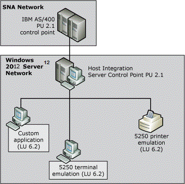

# Host Integration Server 5250 (AS/400) Connectivity
In the peer-oriented SNA network model, all computers on the network can communicate directly with each other. Advanced Peer-to-Peer Networking (APPN) enables distributed data processing, defines how components communicate with each other, and determines the level of network-related services that are supplied by each computer in the network. Although peer-oriented SNA networks are usually associated with an AS/400 host system, mainframe systems can also support peer-to-peer networking.  
  
 IBM AS/400 computers use the 52xx series of devices. In particular, 5250 describes the terminal display data stream. The Advanced Program-to-Program Communications (APPC) protocol is used to support 5250 terminals and other APPN network computers, devices, and programs to communicate with each other. Each device in an APPN network is known as a type 2.1 physical unit (PU 2.1). In addition, the APPC protocol defines associated logical units as APPC LUs (also called LU 6.2).  
  
   
Communications in a peer-oriented network  
  
 In an APPN network, Host Integration Server computers emulate PU 2.1 devices and can connect to an AS/400 using several connection methods:  
  
-   Token Ring  
  
-   Ethernet  
  
-   Fast Ethernet  
  
-   FDDI  
  
-   SDLC  
  
 Frame relay or bridging solutions can also be implemented to transport SNA traffic over wide area network (WAN) connections in branch-based deployment models.  
  
## See Also  
 [APPC](../HIS2010/appc2.md)   
 [AS/400 5250 Terminal Connections](../HIS2010/as-400-5250-terminal-connections2.md)   
 [Understanding Connectivity](../HIS2010/understanding-connectivity2.md)