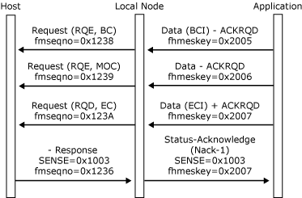
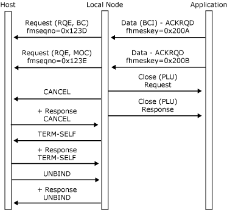

# Inbound Chaining
The division of application data into [Data](../HIS2010/data2.md) messages and the control of inbound chaining are the responsibility of the application.  
  
 The secondary maximum send request unit size for the session is a parameter in the **BIND** from the host and is available in the bind information control block (BICB) on the [Open(PLU) OK Confirm](../HIS2010/open-plu-oconfirm2.md) message. The application should ensure that each inbound **Data** message corresponds to a single request unit. It does not contain more data than the maximum request unit size given in the BICB.  
  
 The application should use the begin chain indicator (BCI) and end chain indicator (ECI) application flags in the **Data** message headers to control chaining. (For more information, see [Application Flags](../HIS2010/application-flags2.md).) The chain is the unit of recovery, and if recoverable errors occur in the chain, the application should assume responsibility for recovery. (For more information, see [Recovery](../HIS2010/recovery2.md).)  
  
 An inbound chain can terminate in the following ways:  
  
-   The complete chain is sent without errors. All the **Data** messages in the chain have been passed to the host. If the session allows the secondary to send definite-response chains, and the application sets the **ACKRQD** field in the last **Data** message of the chain, the application receives a [Status-Acknowledge(Ack)](../HIS2010/status-acknowledge-ack-1.md) from the local node when the host supplies a response.  
  
-   The local node detects a critical error in the format of a **Data** message from the application or in the state of the session. The local node rejects the **Data** message with a [Status-Acknowledge(Nack-2)](../HIS2010/status-acknowledge-nack-2-1.md) containing an error code and closes the PLU connection. Note that the local node will generate an inbound **CANCEL** request before closing the PLU connection. The local node will send a **TERM-SELF** request to the host to elicit an **UNBIND**.  
  
-   The host sends a negative response to a request in the chain. The local node sends a [Status-Acknowledge(Nack-1)](../HIS2010/status-acknowledge-nack-1-2.md) message to the application with the sense codes and sequence number from the negative response. If the host rejects a request that does not carry the ECI application flag, and the application does not specify the application cancel option in the PLU CICB, the local node also generates an inbound CANCEL request. When the application specifies application cancel, it must send EC or **Status-Control(CANCEL)** to terminate the chain. Any subsequent inbound chains are rejected with a noncritical **Status-Acknowledge(Nack-2)**, sense code 0x2002 or 0x2004 (chaining or direction). When the application receives the **Status-Acknowledge(Nack-1)** message, it should stop sending data after this chain for half-duplex flip-flop sessions because the direction has passed to the host. (For more information, see [Direction](../HIS2010/direction2.md).)  
  
-   The application cancels the chain while sending, by sending a **Status-Control(CANCEL)** message to the local node. The local node sends a CANCEL request to the host and sends a **Status-Control(CANCEL)** Acknowledge to the application on receiving a positive response from the host. Responses from the host to requests sent before the **CANCEL** will generate appropriate **Status-Acknowledge** messages to the application if the original [Data](../HIS2010/data2.md) messages had the **ACKRQD** field set.  
  
-   The application closes the PLU connection while sending the chain. The local node sends a **Close(PLU) Response** to the application. Responses from the host to requests sent before the **Close(PLU)** message will not generate **Status-Acknowledge** messages to the application. Note that the local node will also generate an inbound **CANCEL** request and a **TERM-SELF** request to elicit an **UNBIND**.  
  
 If the local node detects a noncritical error in the format of a **Data** message from the application or the state of the session, it does not close the PLU connection. Instead, it rejects the **Data** message in error with a **Status-Acknowledge(Nack-2)** containing an appropriate error code. No data is sent to the host.  
  
 If an inbound chain terminates with an error, when the session uses half-duplex protocols, the application must assume a receive state. (For more information, see [Recovery](../HIS2010/recovery2.md).)  
  
 The following six figures illustrate inbound chaining protocols between the local node and the application, and how those protocols relate to the underlying SNA protocols.  
  
 In the first figure, a complete inbound chain is sent without error and accepted by the host. Note that after receiving **Status-Acknowledge(Ack)** the application relinquishes direction to the host.  
  
   
Inbound chain is sent without error and accepted by the host  
  
 In the following figure, the local node detects a critical error in the format of the second **Data** message in the chain (**ACKRQD** without the ECI application flag), sends a **Status-Acknowledge(Nack-2)** to the application with the appropriate error code, and closes the PLU connection. Note that the local node only generates the **CANCEL** if the session's function management (FM) profile supports **CANCEL**.  
  
   
Local node detects error, sends a Status message, and closes the PLU connection  
  
 In the following figure, a complete inbound chain is sent without error, but is rejected by the host. After the negative response, the application must enter receive state, pending error recovery. (For more information, see [Recovery](../HIS2010/recovery2.md).)  
  
   
Inbound chain is sent without error but is rejected by host  
  
 In the following figure, the application cancels the chain by sending **Status-Control(CANCEL)**. Note that the application still has direction and can start a new chain.  
  
   
Application cancels the chain with a Status-Control(CANCEL)  
  
 In the following figure, the application closes the PLU session while sending the chain. The local node only generates the **CANCEL** if the session's FM profile supports **CANCEL**.  
  
   
Application closes the PLU connection while sending the chain  
  
 In the following figure, the local node detects a noncritical error in the format of the second **Data** message in the chain and sends a **Status-Acknowledge(Nack-2)** to the application with the appropriate error code.  
  
   
Local node detects a noncritical error and sends a Status-Acknowledge(Nack-2)  
  
## See Also  
 [Opening the PLU Connection](../HIS2010/opening-the-plu-connection2.md)   
 [PLU Session](../HIS2010/plu-session1.md)   
 [Outbound Chaining](../HIS2010/outbound-chaining1.md)   
 [Segment Delivery](../HIS2010/segment-delivery2.md)   
 [Brackets](../HIS2010/brackets2.md)   
 [Direction](../HIS2010/direction2.md)   
 [Pacing and Chunking](../HIS2010/pacing-and-chunking2.md)   
 [Confirmation and Rejection of Data\]](../HIS2010/confirmation-and-rejection-of-data]2.md)   
 [Shutdown and Quiesce](../HIS2010/shutdown-and-quiesce2.md)   
 [Recovery](../HIS2010/recovery2.md)   
 [Application-Initiated Termination](../HIS2010/application-initiated-termination2.md)   
 [LUSTATs\]](../HIS2010/lustats]2.md)   
 [Response Time Monitor Data](../HIS2010/response-time-monitor-data2.md)