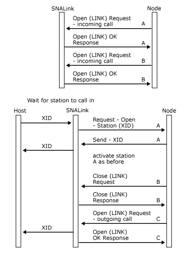

# Incoming Call Support (SNADIS)
The local node allows an SNALink to be set up to support incoming calls. In this mode of operation, the node primes the SNALink by sending an [Open(LINK) Request](../HIS2010/open-link-request2.md), but the SNALink does not attempt to activate the link until it receives an exchange identification (XID) from a remote station.  
  
 The SNALink recognizes an **Open(LINK) Request** for an incoming call by the absence of a connection name in the destination name field (this field is filled with ASCII blanks).  
  
 For incoming calls, **Open(LINK) Request** requires an immediate response from the SNALink, just as in the case of an **Open(LINK) Request** for an outgoing call.  
  
 For a Synchronous Data Link Control (SDLC) SNALink, there can be only one **Open(LINK)** outstanding. However, 802.2 and X.25 allow the possibility of multiple connections being handled through a single SNALink. In these cases, for each configured connection that is primed to await incoming calls, the local node will send an **Open(LINK)** with a blank connection name to the SNALink.  
  
 When an incoming call is received by the SNALink, the received XID should be passed to the local node on any LPI connection that is primed for incoming calls. The LPI connection selected must then be used for all future messages relating to that incoming call.  
  
 It is not necessary for the SNALink to perform validation of incoming calls—this will be performed by the local node. However, if required, the SNALink can choose to validate calls before passing them to the node. A common example of this is to ensure that only X.25 calls with a specific local address are passed through to the local node.  
  
 The following figure shows incoming call support with an SNALink that supports two connections. A remote station calls in and uses connection A. The node sets up connection B for incoming calls but then needs to open connection C. Because the SNALink only supports two connections, connection B is closed.  
  
   
Call support with an SNALink that supports two connections