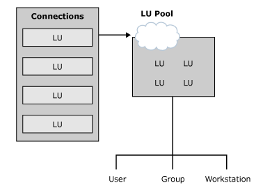

# LU Pools
Although you can create individual LUs and assign them to users and groups, using LU pools to manage and deploy a large number of LUs lets you administer these resources more efficiently. An LU pool is a grouping of LUs that allows you to maximize access to these LUs as shown in the following figure. A user, an application, or a downstream system can access the LUs as long as any LU assigned to the pool is free. If any one of the pooled LUs ceases to function, another available LU in the LU pool is automatically used.  
  
   
Diagram showing LU pools  
  
 LU pools also allow groups of intermittent users to use a limited number of host resources more efficiently. Dedicating LUs to specific users who occasionally require host access wastes host resources. Using a pool, you can assign a smaller number of LUs to a group of users who require sporadic access. For example, if a group of 100 users require host access 25 percent of the time, assigning a pool of 25 LUs to the group may fulfill their needs.  
  
## See Also  
 [APPC Deployment Strategies](../HIS2010/appc-deployment-strategies2.md)