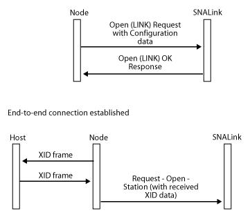

# Opening the LINLPI Connection
The local node attempts to activate a connection:  
  
-   During system initialization if the connection is configured as initially active.  
  
-   If the system administrator manually activates the connection.  
  
-   If a 3270 or logical unit (LU) 6.2 session is requested when there is no active connection to support the LU, and the connection is configured to be activated on demand.  
  
 For each connection to be activated, the local node opens a LINK Locality Partner Index (LPI) connection by sending an [Open(LINK) Request](../HIS2010/open-link-request2.md) to the SNALink. This message contains configuration data such as:  
  
-   Synchronous Data Link Control (SDLC) line type: leased, switched.  
  
-   Operational role: primary, secondary, or negotiable.  
  
-   Time-out values.  
  
-   Retry limit values.  
  
-   Line speed.  
  
-   Half-duplex/full-duplex.  
  
-   802.2 remote service access point (SAP) address.  
  
-   X.25 facility data.  
  
 For incoming calls, the local node primes the SNALink by opening the LINK LPI connection, but does not perform an activation sequence at this stage. For details, see [Incoming Call Support](../HIS2010/incoming-call-support-snadis-1.md).  
  
 The local node also inserts the first XID frame to be used (where applicable) and link connection data to be used on a switched link. The link connection data can be:  
  
-   A telephone number for a manual or autodial modem (in this case, the SNALink software could dial the required number or send a message to the operator specifying the number to be dialed).  
  
-   The media access control (MAC) address of the remote station.  
  
-   The X.25 remote data terminal equipment (DTE) address.  
  
 Finally, the **Open(LINK)** contains various time-out values that should be used by the SNALink when setting up protocol timers. For more information, see [Open(LINK) Request](../HIS2010/open-link-request2.md) and [Open(LINK) Response](../HIS2010/open-link-response1.md).  
  
 The SNALink should return an **Open(LINK) OK Response** if:  
  
-   Its internal control blocks are successfully initialized.  
  
-   Its device driver has installed correctly.  
  
-   Its link hardware is successfully initialized.  
  
 The SNALink should not wait for an end-to-end connection before giving an **Open(LINK) Response**.  
  
 If the SNALink has successfully initialized, it should return an **Open(LINK) OK Response** immediately, supplying the required link-specific configuration information to the node (such as the maximum BTU size it can support). The local node uses this information during XID negotiation with the remote station.  
  
 If the SNALink cannot initialize successfully, it responds with an **Open(LINK) Error Response** containing an error code. The error is logged and the local node notifies the system operator before retrying the link activation.  
  
 If an XID is supplied on the **Open(LINK) Request**, this should be sent when the end-to-end connection is established for a primary or negotiable link. Note that the supplied XID can be a NULL XID, which has a zero length. Hence, it is important that the XID field is examined rather than checking for a zero XID length. An XID will be supplied for all connections except primary leased connections (which could be multipoint).  
  
 When an SNALink receives an XID frame from the remote station, it is passed to the local node in a [Request-Open-Station](../HIS2010/request-open-station1.md) message on the LINK LPI connection.  
  
 If the SNALink fails to receive any frames from the remote station, it generates an [Outage](../HIS2010/outage1.md) message as described in [Closing a Connection](../HIS2010/closing-a-connection-snadis-2.md).  
  
 The following figure shows the **Open(LINK) Request** and **Open(LINK) Response**, followed by an exchange of XIDs.  
  
   
Open(LINK) Request and Open(LINK) Response, followed by an exchange of XIDs