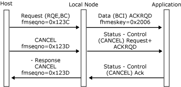

# Outbound Chaining
The local node checks that outbound chains of requests conform to the correct SNA usage, to the chaining usage for the session, and to the current state of the session. The local node will accept valid outbound chains of data from the host if one of the following is true:  
  
-   Data traffic is active on a full-duplex session.  
  
-   The session is in a state where it can receive data.  
  
-   The session is between brackets with neither half-session currently sending, or the session is in contention for a half-duplex contention session. (For more information, see [Brackets](../HIS2010/brackets2.md).)  
  
-   The session is waiting for the host to initiate a recovery procedure. For example, the local node has sent a negative response to an outbound chain. (For more information, see [Recovery](../HIS2010/recovery2.md).)  
  
 The local node sends a [Data](../HIS2010/data2.md) message to the application for each outbound request, but note the effects of the application specifying the segment delivery option in the connection information control block. (For more information, see [Segment Delivery](../HIS2010/segment-delivery2.md).) If the application does not specify segment delivery, the begin chain indicator (BCI) and end chain indicator (ECI) application flags in the message header reflect the chaining indicators in the request header of the request.  
  
 An outbound chain can terminate in several ways:  
  
-   The chain is received complete and without error. All the requests in the chain have been passed to the application as **Data** messages and have been acknowledged where applicable.  
  
-   The application detects an error in a [Data](../HIS2010/data2.md) message while receiving the chain. The application should send a [Status-Acknowledge(Nack-1)](../HIS2010/status-acknowledge-nack-1-2.md) with associated sense data to the local node, which sends a negative response plus the sense data to the host for the request corresponding to the **Data** message in error. The local node will not purge the remainder of the chain, so the application will see End Chain (EC). Alternatively, the host can terminate the chain with a CANCEL, which is delivered to the application as a **Status-Control(CANCEL)** with ACKRQD set.  
  
-   The local node detects an error in a request and presents the application with a system detected error **Data** message to report the premature termination of the chain. This message carries the system detected error indicator (SDI) and ECI application flags, the sense codes for the error, and the ACKRQD indicator. It does not carry user data. When the application responds with [Status-Acknowledge(Ack)](../HIS2010/status-acknowledge-ack-1.md), the local node generates a negative response to the chain using the appropriate sense code. The application can use the reported sense codes to generate diagnostic information for the user. (For example, a 3270 emulator would generate **PROG** check codes.) The local node will purge the remainder of the chain, so the application may not see EC. Alternatively, the host can terminate the chain with a **CANCEL**, which is delivered to the application as a **Status-Control(CANCEL)** with ACKRQD set.  
  
-   The host can cancel the chain while sending, by sending the **CANCEL** request. The local node sends a **Status-Control(CANCEL)** message to the application, which the application must acknowledge.  
  
 If an error occurs while receiving a chain, and the session uses half-duplex flip-flop protocols, the application must assume an error-recovery-pending state. (For more information, see [Recovery](../HIS2010/recovery2.md).)  
  
 For a session using half-duplex flip-flop protocols, if the application flags in the last [Data](../HIS2010/data2.md) message of the chain have the CDI (change direction) flag set:  
  
-   If the chain was received without error, the application has direction.  
  
-   If the application rejected any message in the chain, the host retains direction.  
  
 The following four figures illustrate outbound chaining protocols between the local node and the application and how those protocols relate to the underlying SNA protocols.  
  
 In the first figure, a complete outbound chain is received without error and accepted by the application. Note that after sending **Status-Acknowledge(Ack)**, the application has direction.  
  
   
Outbound chain received without error and accepted by the application  
  
 In the following figure, a complete outbound chain is received without error, but is rejected by the application. Note that even though the chain carried CD, the application does not have direction.  
  
   
Outbound chain received without error, but is rejected by the application  
  
 In the following figure, the local node detects the invalid use of RQD without EC and converts the request to a **Data** message with the SDI application flag set, plus ACKRQD and appropriate sense codes. The application's **Status-Acknowledge(Ack)** drives the negative response to the host. This example assumes that the receive check 4007 has been specified in the CICB on the **Open (SSCP)**.  
  
   
Local node detects invalid use and converts request  
  
 In the following figure, the host cancels the outbound chain.  
  
   
Host canceling the outbound chain  
  
## See Also  
 [Opening the PLU Connection](../HIS2010/opening-the-plu-connection2.md)   
 [PLU Session](../HIS2010/plu-session1.md)   
 [Inbound Chaining](../HIS2010/inbound-chaining2.md)   
 [Segment Delivery](../HIS2010/segment-delivery2.md)   
 [Brackets](../HIS2010/brackets2.md)   
 [Direction](../HIS2010/direction2.md)   
 [Pacing and Chunking](../HIS2010/pacing-and-chunking2.md)   
 [Confirmation and Rejection of Data\]](../HIS2010/confirmation-and-rejection-of-data]2.md)   
 [Shutdown and Quiesce](../HIS2010/shutdown-and-quiesce2.md)   
 [Recovery](../HIS2010/recovery2.md)   
 [Application-Initiated Termination](../HIS2010/application-initiated-termination2.md)   
 [LUSTATs\]](../HIS2010/lustats]2.md)   
 [Response Time Monitor Data](../HIS2010/response-time-monitor-data2.md)