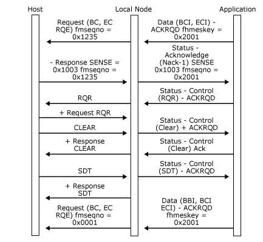

# RQR and CLEAR
An application using Transmission Service profile (TS profile) 4 can request the session to be recovered by sending **Status-Control(RQR)**. The local node presents this to the host as an **RQR** request. Note that, if the application has received a critical [Status-Acknowledge(Nack-2)](../HIS2010/status-acknowledge-nack-2-1.md), this option cannot be taken because the local node will send a [Close(PLU) Request](../HIS2010/close-plu-request1.md) immediately following the **Status-Acknowledge(Nack-2)** to the application, and the primary logical unit (PLU) connection will no longer be valid. The **RQR** message requests the host to reset the session by sending a **CLEAR** request, as shown in the following figure.  
  
 The receipt of **CLEAR** causes the application to reset its session state to that following the **BIND**, the **Open(PLU)**.  
  
 Another way for the application to deal with error conditions is to ask for an **UNBIND** by sending **Status-Control(RSHUTD)**. (For more information, see [Application-Initiated Termination](../HIS2010/application-initiated-termination2.md).) Note that this may not require the host to supply a new **BIND**, depending on the host configuration. A new SSCP request may be required (such as **LOGON**).  
  
 In the following figure, the application requests recovery by issuing **Status-Control(RQR)**. The host sends **CLEAR**, and the application must reset its session to state that it was following the **BIND (Open(PLU)**). In this case, the application is now between brackets and awaiting start data traffic (SDT).  
  
   
Application requests recovery by issuing Status-Control(RQR)  
  
## See Also  
 [Application CANCEL](../HIS2010/application-cancel1.md)   
 [Direction after Receiving a Negative Response](../HIS2010/direction-after-receiving-a-negative-response2.md)   
 [Direction after Sending a Negative Response](../HIS2010/direction-after-sending-a-negative-response1.md)   
 [Critical Failure](../HIS2010/critical-failure1.md)   
 [STSN](../HIS2010/stsn1.md)   
 [Link Service Failure](../HIS2010/link-service-failure2.md)   
 [Local Node Failure](../HIS2010/local-node-failure1.md)   
 [Client Failure](../HIS2010/client-failure2.md)