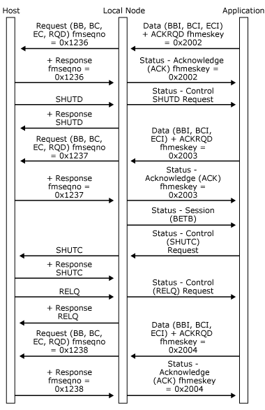

# Shutdown
The shutdown protocol provides a means for the host application to stop the application from sending any further normal flow requests. This protocol is used when the host application wants to end the session in an orderly manner and is only available for sessions using function management (FM) profile 3 or 4.  
  
 If the local node receives a **SHUTD** request from the host, it issues a **Status-Control(SHUTD) Request** (without **ACKRQD**) to request the application to enter a quiesced state at a convenient time. The application determines what is convenient. For example, it could be after a **Status-Session(BETB)** has been received.  
  
 When the application decides it is ready to quiesce, it should issue a **Status-Control(SHUTC) Request** (again without **ACKRQD**) to indicate this transition. The local node will notify the host of this change by sending a **SHUTC** request. The host can continue sending normal flow outbound requests and can subsequently take one of the following actions:  
  
-   The host terminates the primary logical unit (PLU) session by sending an **UNBIND** request. The local node closes the PLU connection by sending a [Close(PLU) Request](../HIS2010/close-plu-request1.md) to the application. The system services control point (SSCP) session remains active.  
  
-   The host abandons the shutdown procedure by sending an **RELQ** request. The local node sends a **Status-Control(RELQ) Request** (with **ACKRQD**) to the application to indicate that it can now resume sending on the PLU session. **RELQ** is only supported on sessions using FM profile 4.  
  
-   The host resets the session by sending **CLEAR**, a Transmission Service profile (TS profile) 3 or 4. One of the effects of this is to release the quiesced state. (For more information, see [Recovery](../HIS2010/recovery2.md).)  
  
 The following two figures illustrate the shutdown protocols between the local node and the application and how those protocols relate to the underlying SNA protocols.  
  
 In the following figure, the host sends **SHUTD** while the application is sending in the in-bracket state. The application completes the bracket, sends **Status-Control(SHUTC) Request**, and the host terminates the PLU session by sending **UNBIND**. The local node closes the PLU connection.  
  
   
Host sends SHUTD while the application is sending in the in-bracket state  
  
 In the following figure, the host sends **SHUTD** while the application is sending in the in-bracket state. The application completes the bracket, sends **Status-Control(SHUTC) Request**, and then the host releases the application from the quiesced state by sending **RELQ**. The local node sends a **Status-Control(RELQ) Request** to the application, which initiates a new bracket.  
  
   
Host sends SHUTD while the application is sending in the in-bracket state  
  
## See Also  
 [Opening the PLU Connection](../HIS2010/opening-the-plu-connection2.md)   
 [PLU Session](../HIS2010/plu-session1.md)   
 [Outbound Chaining](../HIS2010/outbound-chaining1.md)   
 [Inbound Chaining](../HIS2010/inbound-chaining2.md)   
 [Segment Delivery](../HIS2010/segment-delivery2.md)   
 [Brackets](../HIS2010/brackets2.md)   
 [Direction](../HIS2010/direction2.md)   
 [Pacing and Chunking](../HIS2010/pacing-and-chunking2.md)   
 [Confirmation and Rejection of Data\]](../HIS2010/confirmation-and-rejection-of-data]2.md)   
 [Shutdown and Quiesce](../HIS2010/shutdown-and-quiesce2.md)   
 [Recovery](../HIS2010/recovery2.md)   
 [Application-Initiated Termination](../HIS2010/application-initiated-termination2.md)   
 [LUSTATs\]](../HIS2010/lustats]2.md)   
 [Response Time Monitor Data](../HIS2010/response-time-monitor-data2.md)