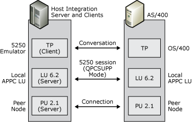

# 5250 Access
If your enterprise contains IBM i systems, display sessions are provided through APPC using the 5250 data stream. Host Integration Server computers provide APPC access to an IBM i using 5250 emulation clients. Clients can only communicate with IBM i using APPC.  
  
 For 5250 services, the local APPC LU acts as an identifier for local Host Integration Server clients; the remote APPC LU identifies the IBM i system. The following figure shows the local and remote LUs used for this configuration.  
  
   
Diagram showing 5250 access configuration  
  
## See Also  
 [APPC Applications](../core/appc-applications2.md)
