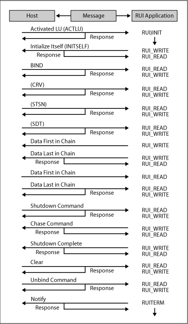
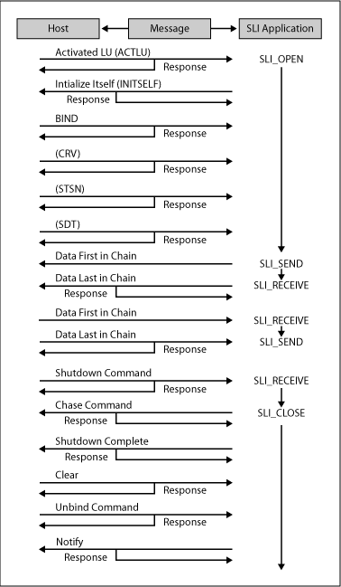

# A Sample LUA Communication Sequence
This section illustrates how Request Unit Interface (RUI) and Session Level Interface (SLI) verbs are used for a logical unit application (LUA) communication sequence. The two figures illustrate the LUA verbs used to start a session, to exchange data, and to end the session, as well as the SNA messages sent and received. The arrows indicate the direction in which SNA messages flow.  
  
## Communication Sequence Using RUI Verbs  
   
SNA components required for LUA communications  
  
 In this example, the application performs the following tasks:  
  
-   Issues an [RUI_INIT](rui-init1.md) verb to establish the system services control point (SSCP) session. (**RUI_INIT** does not complete until the LUA application has received an ACTLU message from the host and sent a positive response. However, these messages are handled by Host Integration Server and are not exposed to the LUA application.)  
  
-   Sends an INITSELF message to the SSCP to request a BIND and reads the response.  
  
-   Reads a BIND message from the host and writes the response. This establishes the LU session.  
  
-   Reads an SDT message from the host, which indicates that initialization is complete and data transfer can begin.  
  
-   Sends a chain of data consisting of three request/response units (RUs) and reads the response. The last RU indicates that a definite response is required.  
  
-   Reads a chain of data consisting of three RUs and writes the response.  
  
-   Reads an UNBIND message from the host and writes the response. This terminates the LU session.  
  
-   Issues [RUI_TERM](rui-term2.md) to terminate the SSCP session. (Host Integration Server sends a NOTIFY message to the host and waits for a positive response. However, these messages are handled by Host Integration Server and are not exposed to the LUA application.)  
  
## Communication Sequence Using SLI Verbs  
   
Communication sequence using SLI verbs  
  
 In the example shown here, the application performs the following tasks:  
  
-   Issues an [SLI_OPEN](../core/sli-open2.md) verb to establish the SSCP session.  
  
-   Sends an INITSELF message to the SSCP to request a BIND and reads the response.  
  
-   Reads a BIND message from the host and writes the response. This establishes the LU session.  
  
-   Reads an SDT message from the host, which indicates that initialization is complete and data transfer can begin.  
  
    > [!NOTE]
    >  INITSELF, BIND, and SDT messages are handled by Host Integration Server if the application is using SLI. The **SLI_OPEN** does not return until Host Integration Server has sent an SDT and response.  
  
-   Issues [SLI_SEND](sli-send2.md) and [SLI_RECEIVE](sli-receive2.md) to transfer data, SNA commands, or SNA responses between the host and the application.  
  
-   Issues [SLI_CLOSE](sli-close1.md) to terminate the SSCP session. (Host Integration Server sends a NOTIFY message to the host and waits for a positive response. However, these messages are handled by Host Integration Server and are not exposed to the LUA application.)
