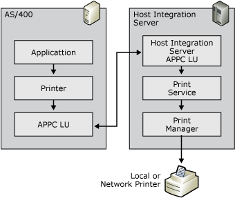

# AS/400 (APPC) Printing
APPC printing, like LU 1 printing, uses SCS control codes in the data stream. The set of SCS control codes available for use in APPC printing is more extensive, and allows more formatting options than the set described for LU 1 printing. The IBM AS/400 also provides an additional method for formatting print jobs called Host Print Transform (HPT). With HPT enabled, the AS/400 takes responsibility for rendering the print job into data the printer can understand.  
  
   
APPC connection between AS/400 and Host Integration Server to send print job to local printer  
  
## Host Print Transform (HPT)  
 When SCS control codes are used by the host to format the print output, a print emulator is responsible for translating the SCS codes and characters into data that the printer can understand, through the Windows printer driver and Windows Print system. With HPT enabled, the AS/400 converts the data to printer control codes before sending the data to Host Integration Server. This output from the host requires no further processing after it leaves the AS/400. The print emulator's only responsibility is submitting the data to the printer.  
  
 HPT is enabled on the AS/400 in the Device description for the print session. When HPT is enabled, pre-rendered print jobs are sent to the Host Integration Server in marked ASCII Transparent (ATRN) sections using the SCS control code '0x03.' The ATRN control code provides the same function as the Transparent (TRN) control code detailed in the LU 1 printing section. In addition to indicating that the block of data that should be dealt with as transparent, ATRN also indicates that the data is ASCII; therefore it is not converted from EBCDIC to ASCII.  
  
#### Enable the host transform feature using the default 5224 print device  
  
1. Stop the print writer associated with the print device.  
  
2. Vary off the print device.  
  
3. Issue the following command:  
  
   ```  
   chgdevprt devd(<print device>) transform(*YES) mfrtypmdl(<LAN printer type>)  
  
   ```  
  
    Common LAN printer types include: *HP4, \*HPIII, \*HPII, \*IBM4039. To see a complete list of available options, prompt (F4) on the MFRTYPMDL parameter.  
  
4. Vary on the print device.  
  
5. Start the print writer.  
  
   For more details on the Host Print Transform feature, see the "OS/400 Printer device programming" manual (SC41-3713), or the "AS/400 Printing IV" redbook (GG24-4389). Both are available from IBM.  
  
## SCS Codes  
 The SCS control codes are fully documented in the *IBM Host Print Guide* (document number SC31-7145). All of the SCS control codes fall within the range of '0x00'–'0x3F.' These codes range from single-byte codes, such as Subscript '0x38' to multiple-byte codes followed by several parameters, such as Set Horizontal Format '0x2BC1...'  
  
 The following are some of the more common SCS control codes used.  
  
> [!NOTE]
>  [L]=length and **(Abv)** represents one-byte parameters in the SCS control code  
  
 **ASCII Transparency (ATRN) — '0x03[L](P1\)(. . .)(Pn)'**  
  
 This SCS control code indicates a section of data that is not scanned for SCS codes, but passed to the print output untouched. In addition, this control code indicates that the data is ASCII. The extent of the section of data is denoted by the length byte. With HPT jobs, the length byte will commonly be '0xFF'.  
  
 **Example**  
  
 030441424344  
  
 03 — ATRN  
  
 04 — length of 4  
  
 41424344 — ASCII hexadecimal values for ABCD  
  
 **SCS Control Code Formatted (Non-HPT)**  
  
 If HPT is disabled in the Device description for the print session, SCS control codes will be used for the formatting of the print job. The SCS control codes, SHF, SVF, SLD, and SPD detailed earlier for LU 1 printing are also supported in APPC printing. Also commonly used in APPC printing is the SCS control code Presentation Position (PP) '0x34.' This control code allows the print position to be moved either horizontally or vertically, relative to the previous position or to an absolute position.  
  
 The following are the four forms of the Presentation Position SCS control code.  
  
 **Absolute Horizontal Presentation Position (AHPP) '0x34C0(nn)'**  
  
 nn — column number the print position is set to.  
  
 **Example**  
  
 34C00F  
  
 34C0 — AHPP  
  
 0F — column number 15  
  
 **Relative Horizontal Presentation Position (RHPP) '0x34C8(nn)'**  
  
 nn — number of columns to move from the current print position.  
  
 **Example**  
  
 34C80F  
  
 34C8 — RHPP  
  
 0F — 15 columns  
  
 **Absolute Vertical Presentation Position (AVPP) '0x34C4(nn)'**  
  
 nn — line number the print position is set to.  
  
 **Example**  
  
 34C40F  
  
 34C4 — AVPP  
  
 0F — line number 15  
  
 **Relative Vertical Presentation Position (RVPP) '0x344C(nn)'**  
  
 nn — number of lines to move from the current print position.  
  
 **Example**  
  
 344C0F  
  
 344C — RVPP  
  
 0F — 15 lines  
  
## Sample Host Data  
 Following is sample data from a host along with an explanation of the data and resulting printout.  
  
```  
2BC10684 01840542 2BC20642 04420A21   
34C404 C1C2C3C4 344C01 34C004 E6E7E8E9  
  
```  
  
|Data|Interpretation|  
|----------|--------------------|  
|2BC1068401840542|SHF, 132 characters per line, LM 1, RM 132|  
|2BC2064204420A21|SVF, 66 lines per page, TM 4, BM 66|  
|34C404|AVPP sets print position to line 4|  
|C1C2C3C4|EBCDIC hex values for ABCD|  
|344C01|RVPP sets print position down one line|  
|34C004|AHPP sets print position to column 4|  
|E6E7E8E9|EBCDIC hex values for WXYZ|  
  
Print output from data in preceding table. ABCD on top print line and WXYZ indented on lower line.  
  
## See Also  
 [Host Print Service (Operations)](host-print-service-operations-2.md)