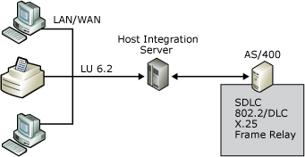

# IBM System i connection summary

In the peer-oriented SNA network model, all computers on the network can communicate directly with each other. Advanced Peer-to-Peer Networking (APPN) is the architecture developed by IBM that enables distributed data processing. APPN defines how components communicate with each other and the level of network-related services, such as routing sessions, that are supplied by each computer in the network.

The following diagram shows Host Integration Server connecting to an IBM System i using several connection methods:

In an APPN network, Host Integration Server emulates a type 2.1 physical unit device (PU 2.1). Host Integration Server computers can connect to an IBM System i computer using several connection methods:  

- Token Ring  

- Ethernet  

- FDDI  

- SDLC  

Frame relay or bridging solutions can also be implemented to transport SNA traffic over wide area network (WAN) connections in branch-based deployment models. Host Integration Server operates as an APPN low-entry networking (LEN) node and communicates with other APPN nodes using the Advanced Program-to-Program Communications (APPC) or LU 6.2 protocol.  

## See also

[Choosing Server-to-Host Connections](../core/choosing-server-to-host-connections1.md)
[Mainframe Connection Summary](../core/mainframe-connection-summary1.md)
