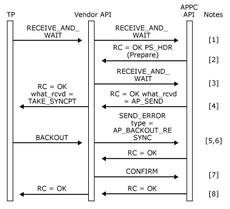

# BACKOUT Verb Issued Locally
  
BACKOUT verb issued locally.  
  
1.  The local transaction program issues a [RECEIVE_AND_WAIT](./receive-and-wait2.md) or [MC_RECEIVE_AND_WAIT](./mc-receive-and-wait2.md) verb (depending on whether a basic or mapped conversation is being used) to receive data from the remote transaction program. The vendor API passes the verb transparently to Host Integration Server.  
  
2.  The **RECEIVE_AND_WAIT** or **MC_RECEIVE_AND_WAIT** verb completes with the **what_rcvd** field of the VCB set to AP_PS_HEADER. The data buffer contains a PREPARE PS header.  
  
3.  Another **RECEIVE_AND_WAIT** or **MC_RECEIVE_AND_WAIT** verb is issued by the vendor API to receive the send indication from the remote TP.  
  
4.  The vendor API returns the transaction program's **RECEIVE_AND_WAIT** or **MC_RECEIVE_AND_WAIT** verb with the **what_rcvd** field of the VCB set to **TAKE_SYNCPT**.  
  
5.  The transaction program issues a **BACKOUT** verb to back out the transaction.  
  
6.  The vendor API generates a [SEND_ERROR](./send-error2.md) or [MC_SEND_ERROR](./mc-send-error2.md) verb of type BACKOUT_RESYNC to send the Backout sense code 0x08240001.  
  
7.  The vendor API then issues a [CONFIRM](./confirm2.md) or [MC_CONFIRM](./mc-confirm2.md) verb to flush the **SEND_ERROR** or **MC_SEND_ERROR** verb and request a response from the remote transaction program.  
  
8.  The [CONFIRM](./confirm2.md) or [MC_CONFIRM](./mc-confirm2.md) verb completes when the remote transaction program issues a [CONFIRMED](./confirmed1.md) or [MC_CONFIRMED](./mc-confirmed1.md) verb. The vendor API then returns the **BACKOUT** verb to the local transaction program.
