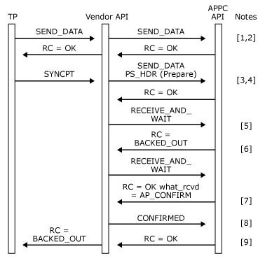

# BACKOUT Verb Issued Remotely
  
BACKOUT verb issued remotely.  
  
1.  The transaction program issues a [SEND_DATA](./send-data1.md) or [MC_SEND_DATA](./mc-send-data1.md)verb depending on whether a basic or mapped conversation is being used.  
  
2.  The **SEND_DATA** or **MC_SEND_DATA** VCB is passed transparently through the vendor API to Host Integration Server. When the verb completes the return code from Host Integration Server is returned to the transaction program.  
  
3.  The transaction program issues a **SYNCPT** verb to the vendor API.  
  
4.  The vendor API creates a PREPARE PS header and transmits it by issuing a **SEND_DATA** or **MC_SEND_DATA** verb. For a mapped conversation, the data_type field of the **MC_SEND_DATA** VCB must be set to AP_PS_HEADER.  
  
5.  On completion of the **SEND_DATA** or **MC_SEND_DATA** verb, the vendor API issues a [RECEIVE_AND_WAIT](./receive-and-wait2.md) or [MC_RECEIVE_AND_WAIT](./mc-receive-and-wait2.md) verb.  
  
6.  The **RECEIVE_AND_WAIT** or **MC_RECEIVE_AND_WAIT** verb returns with a return code of AP_BACKED_OUT, indicating that the remote transaction program issued a **BACKOUT** verb.  
  
7.  The vendor API issues another **RECEIVE_AND_WAIT** or **MC_RECEIVE_AND_WAIT** verb to receive the Confirm indication.  
  
8.  When the verb completes with the **what_rcvd** field of the VCB set to AP_CONFIRM, the vendor API issues a [CONFIRMED](./confirmed1.md) or [MC_CONFIRMED](./mc-confirmed1.md) verb to acknowledge the **BACKOUT** verb.  
  
9. The **SYNCPT** verb is returned to the transaction program with a BACKED_OUT return code when the **CONFIRMED** or **MC_CONFIRMED** verb completes.
