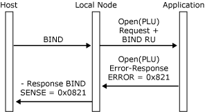
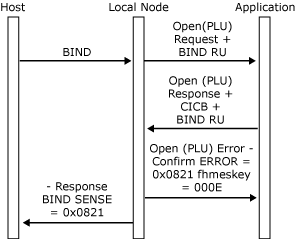

# BIND Checking
The [Open(PLU) OK Response](./open-plu-oresponse2.md) contains the connection information control block (CICB), which enables the application to customize certain characteristics of the connection and contains information used in **BIND** verification. Note that the local node verifies the **BIND** parameters carried on the **Open(PLU) OK Response**. It does not maintain a copy of the original **BIND** request/response unit (RU) from the host. If the **BIND** is negotiable, the application is permitted to modify the parameters in the **BIND** RU, but if it is nonnegotiable the application should return the **BIND** RU unmodified. A negotiable **BIND** flag is provided in the [Open(PLU) Request](./open-plu-request2.md).  

 Although many characteristics of the PLU session are determined by the **BIND** parameters, the application can select certain characteristics by specifying fields in the CICB. For more information, see the following table. More detailed information about CICB usage and the effect on the PLU session of selecting various CICB options is given in context in the topics of this section that deal with PLU session characteristics such as chaining and pacing.  

 The **BIND** is verified using a **BIND** check table entry (whose index is specified in the CICB). The entries in this correspond to the various fields in the **BIND**. The **BIND** check table entries are stored in the configuration file. For example, the **BIND** check table entry can specify that the **BIND** be accepted if the secondary chain response protocol is either "definite response" or "definite or exception response" (byte 5 bits 2 and 3 = B10 or B11). This would be appropriate if the application did not want to send Request Exception (RQE) chains.  

 Connection information control block usage is shown in the following table.  

|Field|Explanation|  
|-----------|-----------------|  
|Segment delivery option|A value of 0x00 indicates that the local node should perform outbound segment assembly and only deliver complete RUs. A value of 0x01 indicates that the application wants the local node to deliver RU segments. For more information, see [Segment Delivery](../core/segment-delivery1.md).|  
|Application pacing option|A value of 0x00 indicates that the application requires the local node to handle pacing. A value of 0x01 indicates that the application needs to be involved with outbound pacing through [Status-Resource](./status-resource1.md) messages. For more information, see [Pacing and Chunking](../core/pacing-and-chunking1.md).|  
|Application cancel option|A value of 0x00 indicates that the local node should automatically generate CANCEL. A value of 0x01 indicates that the application will generate CANCEL. For more information, see [Inbound Chaining](../core/inbound-chaining1.md).|  
|Application transaction numbers option|A value of 0x00 indicates that the application does not support transaction numbers. A value of 0x01 indicates that the application does support transaction numbers. For more information, see [Recovery](../core/recovery1.md).|  
|**BIND** check index|Gives the index of the **BIND** check table entry against which the BIND parameters should be verified. One of the following values should be used:   -   0x01 —3270 printer session -   0x02 —3270 display session -   0x10 —LUA (LU type 0) application|  

 The **Open(PLU) Confirm** from the local node to the application indicates whether the **BIND** verification was successful, and if so, supplies the bind information control block (BICB). The BICB summarizes the session **BIND** parameters in a format suitable for high-level languages and effectively defines the characteristics of the PLU session. The application not negotiating the **BIND** should usually not require to examine the **BIND** on the [Open(PLU) Request](./open-plu-request2.md) and should use the BICB on the [Open(PLU) OK Confirm](./open-plu-oconfirm1.md).  

 The following table summarizes the fields in the BICB and their correspondence to the parameters in the **BIND** RU. For more detailed information, see the IBM manual *Systems Network Architecture: Formats,* (GA27-3136).  

| Position on Open(PLU) OK Confirm | Position in Bind RU [byte,bit] |                             Description                             |
|----------------------------------|--------------------------------|---------------------------------------------------------------------|
|          **dataru[0]**           |           [ 2,    ]            |                  Function management (FM) profile                   |
|          **dataru[1]**           |           [ 3,    ]            |                    Transmission Service profile                     |
|          **dataru[2]**           |           [ 4,   0]            |                        Primary chaining use                         |
|          **dataru[3]**           |           [ 4,   1]            |                    Primary request control mode                     |
|          **dataru[4]**           |            [ 4,2-3]            |                   Primary chain response protocol                   |
|          **dataru[5]**           |           [ 4,   4]            |                      Primary two-phase commit                       |
|          **dataru[6]**           |           [ 4,   6]            |                    Primary compression indicator                    |
|          **dataru[7]**           |           [ 4,   7]            |               Primary send End Bracket (EB) indicator               |
|          **dataru[8]**           |           [ 5,   0]            |                       Secondary chaining use                        |
|          **dataru[9]**           |           [ 5,   1]            |                   Secondary request control mode                    |
|          **dataru[10]**          |            [ 5,2-3]            |                  Secondary chain response protocol                  |
|          ataru[11]\*\*           |           [ 5,   4]            |                     Secondary two-phase commit                      |
|          **dataru[12]**          |           [ 5,   6]            |                   Secondary compression indicator                   |
|          **dataru[13]**          |           [ 5,   7]            |                     Secondary send EB indicator                     |
|          **dataru[14]**          |           [ 6,   1]            |                           FM header usage                           |
|          **dataru[15]**          |           [ 6,   2]            |                           Bracket usage1                            |
|          **dataru[16]**          |           [ 6,   2]            |                        Bracket reset state2                         |
|          **dataru[17]**          |           [ 6,   3]            |                      Bracket termination rule                       |
|          **dataru[18]**          |           [ 6,   4]            |                    Alternate code set indicator                     |
|          **dataru[19]**          |           [ 6,   5]            |                    Sequence number availability                     |
|          **dataru[20]**          |            [ 7,0-1]            |                    Normal-flow send/receive mode                    |
|          **dataru[21]**          |           [ 7,   7]            |                     Half-duplex flip-flop reset                     |
|          **dataru[22]**          |            [ 8,2-7]            |                    Secondary pacing send window                     |
|          ataru[23]\*\*           |            [ 9,2-7]            |                   Secondary pacing receive window                   |
|      **dataru[24-25]\\**\*       |           [10,    ]            |              Secondary send maximum request unit size               |
|      **dataru[26-27]\\**\*       |           [11,    ]            |               Primary send maximum request unit size                |
|          **dataru[28]**          |            [14,1-7]            |                         LU-LU session type                          |
|          **dataru[29]**          |           [27,    ]            |                            PLU name size                            |
|        **dataru[30-37]**         |           [28,    ]            | PLU name in Extended Binary Coded Decimal Interchange Code (EBCDIC) |
|          **dataru[38]**          |            [15,0-3]            |      Session type 1: PS Function Management Header (FMH) type       |
|          **dataru[39]**          |            [15,4-7]            |                       PS data stream profile                        |
|          **dataru[40]**          |           [16,   0]            |                 Number of outstanding destinations                  |
|          **dataru[41]**          |           [16,   1]            |                      Compacted data indicator                       |
|          ataru[42]\*\*           |           [16,   2]            |    Peripheral Device Information Record (PDIR) allowed indicator    |
|          **dataru[43]**          |           [15,   0]            |                 Session type 2 or 3: query support                  |
|          **dataru[44]**          |            [24,1-7]            |                         Dynamic screen size                         |
|          **dataru[45]**          |           [20,    ]            |                           Basic row size                            |
|          **dataru[46]**          |           [21,    ]            |                          Basic column size                          |
|          **dataru[47]**          |           [22,    ]            |                         Alternate row size                          |
|          **dataru[48]**          |           [23,    ]            |                        Alternate column size                        |

> [!NOTE]
>  10x00 = Brackets not used. 0x01 = Brackets used.  

> [!NOTE]
>  20x01 = Bracket reset state is BETB (between-brackets). 0x02 = Bracket reset state is INB (in-bracket).  

> [!NOTE]
>  These values are of type INTEGER (all others are of type CHAR).  

 The opening PLU sequence can fail if the application rejects the [Open(PLU) Request](./open-plu-request2.md) (for example, if the **BIND** parameters are unacceptable on a nonnegotiable **BIND**) by sending [Open(PLU) Error Response](./open-plu-error-response2.md) and appropriate sense codes. The local node sends to the host a negative response to the **BIND** request containing the supplied sense codes. The PLU connection is considered to be closed after an **Open(PLU) Error Response**, and the local node does not generate an **Open(PLU) Confirm**. The following figure shows a failure to open the PLU connection (for a nonnegotiable **BIND**), due to the application rejecting the **Open(PLU) Request**.  

   
Failure to open the PLU connection  

- The opening PLU sequence can also fail if the **BIND** verification against the **BIND** check table entry specified by the application fails. In this case, the local node does the following: Sends to the host a negative response to the **BIND** request with appropriate sense codes.  

- Sends to the application an [Open(PLU) Error Confirm](./open-plu-error-confirm2.md) with the first word of the sense codes as the first error code and the index of the **BIND** parameter in error as the second error code.  

  The PLU connection is considered to be closed after the **Open(PLU) Error Confirm**. The following figure shows failure to open the PLU connection due to **BIND** verification failure. Note that error code 2 gives the index in the RU of the **BIND** parameter in error.  

    
  Failure to open the PLU connection due to BIND verification failure