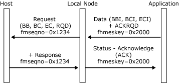
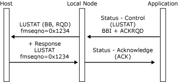
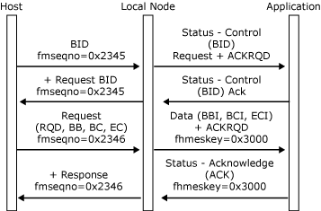
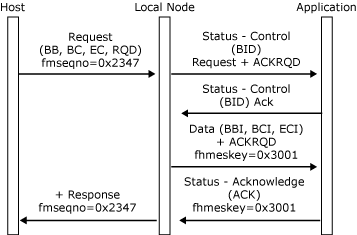
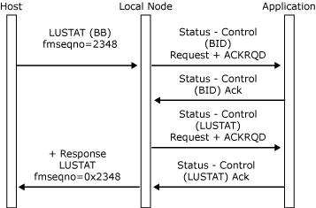
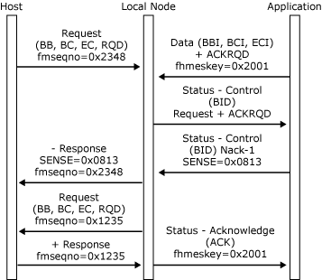

# Bracket Initiation
While a session is in the between-bracket state, contention exists. Either the application or the host primary logical unit (PLU) can attempt to initiate a bracket, as follows:  
  
- The application initiates a bracket by sending a [Data](./data1.md) message with the begin bracket indicator (BBI) application flag and **ACKRQD** set while in the between-bracket state. The local node sends a request corresponding to the **Data** message to the host PLU. The application has successfully initiated a bracket and is in the in-bracket state. Flip-flop protocols are now in force until the bracket is terminated.  
  
- The application initiates a bracket by sending a **Status-Control(LUSTAT)** with the BBI application flag set while in the between-bracket state. The local node sends an **LUSTAT** request to the host PLU. The application has successfully initiated a bracket and is in the in-bracket state. Flip-flop protocols are now in force until the bracket is terminated.  
  
- The host PLU sends a **BID** request while in the between-bracket state. The local node sends a **Status-Control(BID)** with **ACKRQD** to the application. (For more information, see [Status-Control Message](../core/status-control-message1.md).) The application replies with a **Status-Control(BID) Acknowledge**, to indicate that it is willing to accept a bracket. The local node sends a positive response to the **BID** request. The host PLU has successfully initiated a bracket, and the application's state is in-bracket, with flip-flop protocols applying until the bracket is terminated.  
  
- The host PLU sends data in an RU carrying the BB indicator in the RH while in the between-bracket state. The local node presents this method of initiating a bracket in the same way as if the host PLU had initiated the bracket with **BID**. The local node sends a **Status-Control(BID)** with **ACKRQD** to the application. The application replies with a **Status-Control(BID) Acknowledge** to indicate that it is willing to accept the bracket. The local node sends the [Data](./data1.md) message corresponding to the RU to the application and sends a positive response to the data RU. The host PLU has successfully initiated a bracket, and the application's state is in-bracket, with flip-flop protocols applying until the bracket is terminated.  
  
- The host PLU sends an **LUSTAT** request carrying the BB indicator in the RH. The local node presents this method of initiating a bracket in the same way as if the host PLU had initiated the bracket with **BID**. The local node sends a **Status-Control(BID)** with **ACKRQD** to the application. The application replies with a **Status-Control(BID) Acknowledge** to indicate that it is willing to accept the bracket. The local node sends a **Status-Control(LUSTAT)** to the application, which requires an acknowledgment. The host PLU has successfully initiated a bracket, and the application's state is in-bracket, with flip-flop protocols applying until the bracket is terminated.  
  
- The host attempts to initiate a bracket using a **BID** request or an RU carrying BB, which the local node sends to the application as a **Status-Control(BID)**, but the application cannot accept the bracket. The application should send a negative **Status-Control(BID)** response with an appropriate sense code. The local node sends a negative response to the BID carrying the sense code supplied by the application. The application's state is still between-bracket. The application should use one of the following sense codes:  
  
  -   0x081B if it has already committed resources for an inbound transfer. For example, a terminal operator has begun typing.  
  
  -   0x0814 if it currently cannot begin a bracket but will notify the host when resources become available. For example, a 3270 printer is being used for local copy in between-bracket printer sharing mode. At a later stage when the resources become available, the application should temporarily reserve the resources and send a **Status-Control(RTR)** to the local node. If the host rejects the **RTR**, the local node returns a **Status-Control(RTR) Negative-Acknowledge-1** response, and the application can release the resources. Otherwise, the host attempts to initiate a bracket that the application must now accept.  
  
- If the application has successfully initiated a bracket, a bracket race may occur due to the host PLU attempting to initiate a bracket. The application gets a **Status-Control(BID) Request**, which it should reject with 0x080B or 0x0813. The application retains direction after race negative responses. (For more information, see [Recovery](../core/recovery1.md).) The application's bracket state remains as in-bracket.  
  
  The application needs to be aware of one further complication in bracket initiation. All the cases relate to sessions whose bracket reset state is between-bracket. A state of contention exists, and either half-session can attempt to begin a bracket.  
  
  However, the **BIND** parameters for the session can specify a bracket reset state of in-bracket. If the bracket reset state is in-bracket, one half-session is considered to have already successfully initiated a bracket. Flip-flop protocols will then apply until a **Status-Session(BETB)** is received, at which time the session reverts to a contention state and bracket initiation proceeds as described earlier.  
  
  The application must set its bracket state when the PLU connection is opened (on receipt of the [Open(PLU) OK Confirm](./open-plu-oconfirm1.md) message) and reset it each time the session is reset (after receipt of a **Status-Control(CLEAR) Request**). The appropriate bracket reset state for the session is supplied to the application in the BICB on the [Open(PLU) OK Confirm](./open-plu-oconfirm1.md) message.  
  
  The following six figures illustrate bracket initiation protocols between the local node and the application and how those protocols relate to the underlying SNA protocols.  
  
  In the first figure, the application initiates a bracket by sending an inbound chain with the BBI application flag set when its state is between-bracket. The application's state is in-bracket until it receives a **Status-Session(BETB)**. (If the application can send RQE chains, a bracket can be opened by sending an RQE chain.)  
  
    
  Application initiates a bracket by sending an inbound chain  
  
  In the following figure, the application initiates a bracket by sending a **Status-Control(LUSTAT)** with the begin bracket indicator (BBI) application flag set when its state is between-bracket. The application's state is in-bracket until it receives a **Status-Session(BETB)**. The **LUSTAT** can be sent **NOACKRQD** (RQE) if required.  
  
    
  Application initiates a bracket by sending a Status-Control(LUSTAT)  
  
  In the following figure, the host initiates a bracket by sending **BID**, which the application accepts. The application's state is in-bracket and the host can send.  
  
    
  Host initiates a bracket by sending BID  
  
  In the following figure, the host PLU initiates a bracket by sending a request with begin bracket (BB), which the application accepts. The application's state is in-bracket, and the host can send.  
  
    
  Host PLU initiates a bracket by sending a request with BB  
  
  In the following figure, the host initiates a bracket by sending an **LUSTAT** with BB, which the application accepts. The application's state is in-bracket, and the host can send.  
  
    
  Host initiates a bracket by sending an LUSTAT with BB  
  
  In the following figure, the host and application both attempt to initiate a bracket in between-bracket state. The application rejects the host bids with sense code 0x0813, and the local node delivers the application's data. After sending the data, the application's state is in-bracket, and the application can send.  
  
    
  Host and application both attempt to initiate a bracket in between-bracket state  
  
## See Also  
 [Opening the PLU Connection](../core/opening-the-plu-connection1.md)   
 [PLU Session](../core/plu-session2.md)   
 [Outbound Chaining](../core/outbound-chaining2.md)   
 [Inbound Chaining](../core/inbound-chaining1.md)   
 [Segment Delivery](../core/segment-delivery1.md)   
 [Brackets](../core/brackets1.md)   
 [Direction](../core/direction1.md)   
 [Pacing and Chunking](../core/pacing-and-chunking1.md)   
 [Confirmation and Rejection of Data\]](../core/confirmation-and-rejection-of-data]1.md)   
 [Shutdown and Quiesce](../core/shutdown-and-quiesce1.md)   
 [Recovery](../core/recovery1.md)   
 [Application-Initiated Termination](../core/application-initiated-termination1.md)   
 [LUSTATs\]](../core/lustats]1.md)   
 [Response Time Monitor Data](../core/response-time-monitor-data1.md)