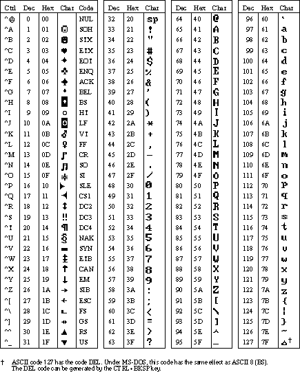

# Character Tables

## Character sets
This section provides tables that show the ASCII, ANSI, and IBM extended character sets.  

ASCII Character Set:    
   

ASCII Character Set (continued): 
   

ANSI Character Set:   
   

IBM Extended Character Set: 
   
 
  
## See Also  
 [Host Print Service Character Translation Table Format](../Topic/Host%20Print%20Service%20Character%20Translation%20Table%20Format2.md)   
 [3270 Session](../core/3270-session.md)