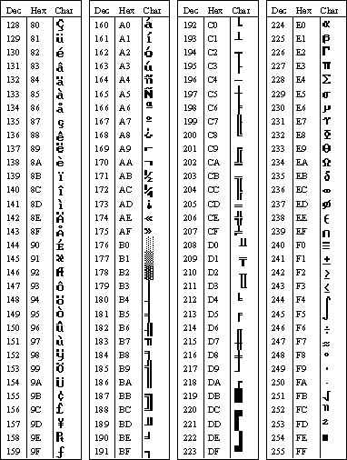

# Character Tables
This section provides tables that show the ASCII, ANSI, and IBM extended character sets.  
  
   
ASCII Character Set  
  
   
ASCII Character Set (continued)  
  
   
ANSI Character Set  
  
   
IBM Extended Character Set  
  
## See Also  
 [Host Print Service Character Translation Table Format](../core/host-print-service-character-translation-table-format2.md)   
 [3270 Session](../core/3270-session2.md)