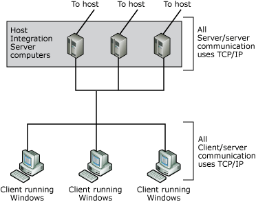
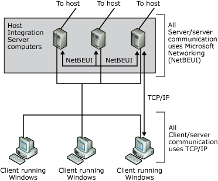

# Choosing Network Protocols for Host Integration Server
After you determine the server-to-host connection, you must choose the protocols to use for two additional [!INCLUDE[hisHostIntServNoVersion](../includes/hishostintservnoversion-md.md)] communication paths: client/server communication and server/server communication. You can use one protocol for both, or you can use a combination of different protocols, if all servers share at least one client/server protocol and use it for server/server communication.  
  
 Deploying a single protocol across your wide area network (WAN) is the easiest way to manage your communications. The following figure shows a network in which TCP/IP is used for all types of communication involving Host Integration Server computers and clients.  
  
   
Diagram of network using TCP/IP for both server-to-server and server-to-client communication  
  
 You may decide to gradually implement Host Integration Server throughout your enterprise, in which case you may need to use existing protocols for certain connections.  
  
   
Diagram of network using NetBEUI for server-to-server communication and for server-to-client communication  
  
## In This Section  
 [Choosing Client/Server Network Protocols](../core/choosing-client-server-network-protocols2.md)  
  
 [Choosing Server/Server Network Protocols](../core/choosing-server-server-network-protocols2.md)  
  
## See Also  
 [Connecting Servers](../core/connecting-servers2.md)
