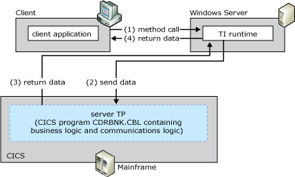

# CICS LU6.2 Link
The CICS LU6.2 Link programming model is one of the simplest models that you can use to implement TI functionality.  
  
 The following figure summarizes the workflow occurring between the client, the default CICS Mirror Transaction, and the mainframe transaction program. The numbers in parentheses indicate the approximate order in which events occur. A more detailed description of the events follows the figure.  
  
   
Transaction Integrator sending and receiving parameters with DPL information from a CICS Mirror Transaction  
  
## Summary workflow diagram for the CICS LU6.2 Link programming model  
 The CICS LU6.2 Link programming model works as follows:  
  
1. An application invokes a method in a TI.  
  
2. The TI runtime calls the TI proxy.  
  
3. The TI proxy does the following:  
  
   1. Reads in the assembly and metadata created previously by the TI Designer.  
  
   2. Maps the .NET Framework data types to COBOL data types.  
  
      The TI proxy then:  
  
   3. Calls the conversion routines to convert the application data to mainframe COBOL types.  
  
   4. Builds the flattened data stream buffer that represents the COBOL declaration or copybook.  
  
   5. Passes the message to the SNA transport component.  
  
4. TI sends the TP Name CSMI request specified by the TI component method to the CICS Mirror Transaction using DPL information and the LU6.2 protocol. (IBM provides CSMI with CICS on the TI prerequisite systems.)  
  
    The CICS Mirror Transaction is a special CICS TP that acts as a gateway between TPs running in different CICS regions, thereby allowing them to exchange data through the COMMAREA. TI takes advantage of this standard method of communication between CICS TPs to access mainframe TPs. CSMI handles all APPC and transactional properties required on the communication. The TRANID for this TP is CSMI.  
  
    The Distributed Program Link (DPL) is the protocol used when communicating with CSMI. TI uses DPL to communicate with CSMI.  
  
5. CSMI (the CICS Mirror Transaction) takes control and issues an EXEC CICS Link command to the requested server TP in CICS. (The name of this program can be associated the remote environment (RE) and with the method name in TI Designer.)  
  
6. The CICS Mirror transaction passes the COMMAREA that contains the input fields to the server TP.  
  
    The COMMAREA is a communication area of up to 32 KB containing all of the data that is passed to and from the mainframe program. Many CICS TPs, written in COBOL, use this area of the mainframe transaction code to exchange data. When using the CICS Link using LU6.2 programming model, TI appears to the mainframe TP as just another CICS TP exchanging data through the COMMAREA.  
  
    The Server TP is the TP that TI invokes on behalf of the client application. It contains the business logic being executed and is identified by its TRANID in the method call of the client application.  
  
   > [!NOTE]
   >  The term server TP is used to identify the TP that TI is accessing. This clarification is necessary because access to mainframe applications may and typically does involve a number of TPs.  
  
7. When the server TP is finished processing, it issues an EXEC CICS RETURN command, which returns the data in the COMMAREA to the CICS Mirror transaction with all output fields updated.  
  
8. The CICS Mirror transaction returns the output data, if any is required, to TI.  
  
9. The TI proxy receives the reply data and processes the reply. The TI Automation proxy:  
  
   1. receives the message from the SNA transport component.  
  
   2. reads the message buffer  
  
      The TI Automation proxy:  
  
   3. maps the COBOL data types to the .NET Framework data types  
  
   4. calls the conversion routines to convert the mainframe COBOL types to the application data  
  
10. The TI runtime sends the converted data back to the COM or .NET Framework application that invoked the method.  
  
    Only the flow model is supported with CICS Link, so unbounded recordsets are not supported for this class of TP. Fixed-sized recordsets (that is, bounded recordsets) are supported.  
  
    CSMI also handles any Sync Level 2 interactions with TI, and thus transparently provides the 2PC capability for programs in this class.  
  
    Existing CICS programs may already be structured this way. Instead of TI issuing the LU 6.2 request, another CICS TP might already issue an EXEC CICS Link to run the CICS program shown in the previous illustration. In that case, both the existing CICS TP and the TI component can coexist and run the same CICS program.  
  
> [!NOTE]
>  CSMI is the default mirror transaction name, but you can specify a different name<strong>.</strong>  
  
 [!INCLUDE[hisHostIntServNoVersion](../includes/hishostintservnoversion-md.md)] includes sample code showing how to implement the CICS LU6.2 Link programming model. The sample code is located at \installation directory\SDK\Samples\AppInt. Start Microsoft Visual Studio, open the tutorial you want to use, and follow the instructions in the Readme.  
  
## See Also  
 [Transaction Integrator Components](../core/transaction-integrator-components1.md)   
 [Converting Data Types from Automation to OS/390 COBOL\]](./converting-data-types-from-automation-to-os-390-cobol]2.md)   
 [Converting Data Types from OS/390 COBOL to Automation](./converting-data-types-from-os-390-cobol-to-automation2.md)   
 [CICS Components](../core/cics-components1.md)   
 [TI Runtime](../core/ti-runtime2.md)   
 [Choosing the Appropriate Programming Model](../core/choosing-the-appropriate-programming-model1.md)   
 [Programming Models](../core/programming-models2.md)