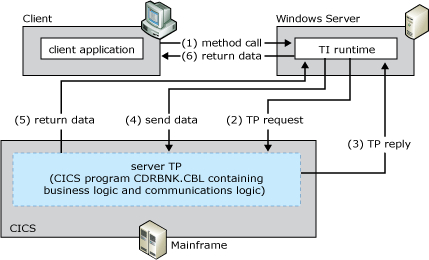

# CICS LU6.2 User Data
The CICS LU6.2 User Data programming model provides direct invocations and data exchanges between TI and the server TP. No other communication components are required with this model.  
  
 The following figure summarizes the workflow occurring between the client, the default CICS Mirror Transaction, and the mainframe transaction program. The numbers in parentheses indicate the approximate order in which events occur. A more detailed description of the events follows the figure.  
  
   
Transaction Integrator sending and receiving LU 6.2 or TCP/IP from the mainframe transaction program  
  
## Summary workflow diagram for the CICS LU6.2 User Data programming model  
 The CICS LU6.2 User Data programming model works as follows:  
  
1. An application invokes a method in a TI component configured in either Component Services or the .NET Framework.  
  
2. The TI runtime calls the TI Automation proxy.  
  
3. If the application is a COM+ component, the TI Automation proxy:  
  
   1. Reads in the type library created previously by the TI Designer.  
  
   2. Maps the automation data types to COBOL data types.  
  
      If the application is a .NET assembly, the TI Automation proxy:  
  
   3. Reads in the assembly and metadata created previously by the TI Designer.  
  
   4. Maps the .NET Framework data types to COBOL data types.  
  
      The TI Automation proxy then:  
  
   5. Calls the conversion routines to convert the application data to mainframe COBOL types.  
  
   6. Builds the flattened data stream buffer that represents the COBOL declaration or copybook.  
  
   7. Passes the message to the SNA transport component.  
  
4. The TI proxy sends the TP invocation request specified by the TI component method to the server TP by using the LU6.2 protocol. In this message, TI sends the TRANID of the server TP that the method is invoking.  
  
5. TI and the server TP communicate directly by issuing APPC or Common Programming Interface for Communications (CPI-C) verbs to receive and send the input and output fields, respectively.  
  
6. If necessary, the server TP issues the appropriate verbs to implement Sync Level 2 properties and 2 phase commit.  
  
7. The mainframe TP closes the socket.  
  
8. The TI Automation proxy receives the reply data and processes the reply. The TI Automation proxy:  
  
   1. Receives the message from the SNA transport component.  
  
   2. Reads the message buffer  
  
      If the application is a COM+ component, the TI Automation proxy:  
  
   3. Maps the COBOL data types to the automation data.  
  
   4. Calls the conversion routines to convert the mainframe COBOL types to the application data.  
  
      If the application is a .NET assembly, the TI Automation proxy:  
  
   5. Maps the COBOL data types to the .NET Framework data types.  
  
   6. Calls the conversion routines to convert the mainframe COBOL types to the application data.  
  
9. The TI runtime sends the converted data back to the COM or .NET Framework application that invoked the method.  
  
   [!INCLUDE[hisHostIntServNoVersion](../includes/hishostintservnoversion-md.md)] includes sample code showing how to implement the CICS LU6.2 User Data programming model. The sample code is located at **\\**<em>installation directory</em>**\SDK\Samples\AppInt**. Start Microsoft Visual Studio, open the tutorial you want to use, and follow the instructions in the **Readme**.  
  
## See Also  
 [Transaction Integrator Components](../core/transaction-integrator-components1.md)    
 [Converting Data Types from Automation to OS/390 COBOL\]](./converting-data-types-from-automation-to-os-390-cobol]2.md)   
 [Converting Data Types from OS/390 COBOL to Automation](./converting-data-types-from-os-390-cobol-to-automation2.md)   
 [CICS Components](../core/cics-components1.md)   
 [TI Runtime](../core/ti-runtime2.md)   
 [Choosing the Appropriate Programming Model](../core/choosing-the-appropriate-programming-model1.md)   
 [Programming Models](../core/programming-models2.md)