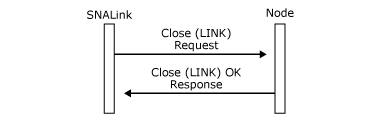

# Closing a Connection (SNADIS)

## Overview
The local node closes a connection to a remote station:  
  
-   If the system administrator manually deactivates the connection.  
  
-   If the connection is configured as on-demand and no 3270 or LU 6.2 sessions are active.  
  
-   If an outage has been reported by the SNALink.  
  
 The local node closes a connection by sending a [Close(LINK)](../Topic/Close\(LINK\)2.md) message. The SNALink then takes some action, such as lowering Data Terminal Ready (DTR) on an Synchronous Data Link Control (SDLC) link or issuing a DLC_CLOSE_STATION on a 802.2 connection. It then replies with a **Close(LINK) OK Response** as shown in the following figure.  
  
 The case of multipoint connections is slightly different and is considered in [SDLC Multipoint Connections](../core/sdlc-multipoint-connections.md). The following topics discuss point-to-point connections.  

Local node receiving a Close(LINK) and replying with a Close(LINK) OK Response:  
   

  
## Next 
  
-   [Outages](../core/outages-snadis.md)  
  
-   [Connection Retries](../core/connection-retries-snadis.md)